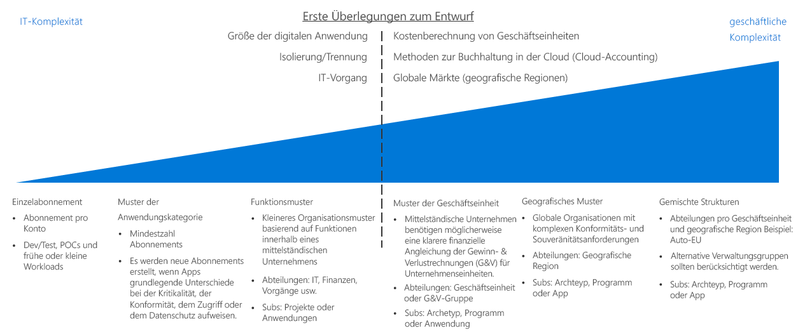
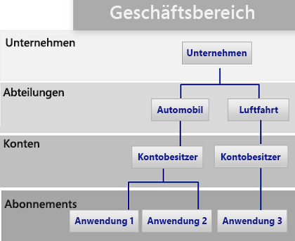
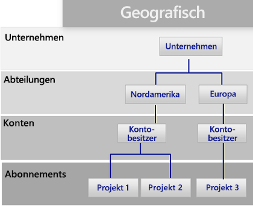

# Leitfaden zur Entscheidungsfindung für Abonnements

Alle Cloudplattformen beruhen im Wesentlichen auf einem Besitzmodell, das Organisationen zahlreiche Optionen zur Abrechnungs- und Ressourcenverwaltung bereitstellt. Die von Azure verwendete Struktur unterscheidet sich von der anderer Cloudanbieter, weil sie verschiedene Supportoptionen für die Organisationshierarchie und Abonnementbesitzgruppen enthält. Unabhängig davon gibt es in der Regel eine Person, die für die Abrechnung verantwortlich ist, und eine andere, die als Besitzer oberster Ebene für die Verwaltung von Ressourcen festgelegt wird.

Wechseln Sie zu: [Abonnemententwurf und Azure Enterprise Agreements](#subscriptions-design-and-azure-enterprise-agreements) | [Abonnemententwurfsmuster](#subscription-design-patterns) | [Verwaltungsgruppen](#management-groups) | [Organisation auf Abonnementebene](#organization-at-the-subscription-level)

Der Abonnemententwurf ist eine der gängigsten Strategien, die Unternehmen bei der Cloudeinführung zum Einrichten einer Struktur oder zum Organisieren von Ressourcen verwenden.

**Abonnementhierarchie**: Ein *Abonnement* ist eine logische Sammlung von Azure-Diensten (z.B. virtuelle Computer, SQL-Datenbank, App Services oder Container). Jede Ressource in Azure wird in einem einzigen Abonnement bereitgestellt. Jedes Abonnement gehört einem *Konto*. Dieses Konto ist ein Benutzerkonto (oder vorzugsweise ein Dienstkonto), das im gesamten Abonnement Zugriff auf Abrechnungs- und Administratoraufgaben bereitstellt. Für Kunden, die sich dazu verpflichtet haben, im Rahmen eines Enterprise Agreement (EA) eine bestimmte Menge in Azure zu nutzen, wird eine weitere Steuerungsebene hinzugefügt: eine *Abteilung*. Im EA-Portal können Abonnements, Konten und Abteilungen zum Erstellen einer Hierarchie zu Abrechnungs- und Verwaltungszwecken eingesetzt werden.

Die Komplexität des Abonnements kann variieren. Entscheidungen in Bezug auf eine Entwurfsstrategie beinhalten individuelle Wendepunkte, weil sie in der Regel sowohl geschäftliche als auch IT-bezogene Einschränkungen berücksichtigen. Bevor sie technische Entscheidungen treffen, müssen IT-Architekten und Entscheidungsträger mit den Projektbeteiligten des Unternehmens und dem Team für Cloudstrategien zusammenarbeiten, um den gewünschten Ansatz für die Cloudabrechnung, die Kostenrechnungsmethoden in Ihren Unternehmenseinheiten sowie die globalen Marktanforderungen für Ihre Organisation zu verstehen.

**Wendepunkt**: Die gestrichelte Linie in der obigen Abbildung zeigt einen Wendepunkt zwischen einfachen und komplexeren Mustern für den Abonnemententwurf. Weitere technische Entscheidungspunkte, die auf der Größe der digitalen Umgebung in Relation zu Azure-Abonnementeinschränkungen, auf Isolations- und Trennungsrichtlinien und auf operativen IT-Abteilungen beruhen, haben in der Regel erhebliche Auswirkungen auf den Abonnemententwurf.

**Weitere Überlegungen**: Ein wichtiger Punkt bei der Auswahl eines Abonnemententwurfs ist, dass Abonnements nicht die einzige Möglichkeit zum Gruppieren von Ressourcen oder Bereitstellungen darstellen. Abonnements wurden in den Anfängen von Azure erstellt, daher weisen sie Einschränkungen im Zusammenhang mit vorherigen Azure-Lösungen wie Azure Service Manager auf.

Bereitstellungsstruktur, Automatisierung und neue Ansätze für das Gruppieren von Ressourcen können sich auf Ihren Strukturabonnemententwurf auswirken. Berücksichtigen Sie vor dem Abschließen eines Abonnemententwurfs, wie Entscheidungen zur [Ressourcenkonsistenz](../resource-consistency/overview.md) Ihre Entwurfsentscheidungen beeinflussen können. Beispiel: Ein großes internationales Unternehmen zieht zunächst ein komplexes Muster für die Abonnementverwaltung in Betracht. Dasselbe Unternehmen kann allerdings größere Vorteile bei einem einfacheren Unternehmenseinheitsmuster feststellen, indem es eine Verwaltungsgruppenhierarchie hinzufügt.

## Abonnemententwurf und Azure Enterprise Agreements

Alle Azure-Abonnements sind einem Konto zugeordnet, das mit der Abrechnung und der Zugriffssteuerung der obersten Ebene für die einzelnen Abonnements verbunden ist. Ein einzelnes Konto kann mehrere Abonnements besitzen und ein Minimum an Abonnementorganisation bereitstellen.

Bei kleinen Azure-Bereitstellungen kann ein einzelnes Abonnement oder eine kleine Sammlung von Abonnements die gesamte Cloudumgebung darstellen. Große Azure-Bereitstellungen müssen jedoch wahrscheinlich mehrere Abonnements umfassen, um die Organisationsstruktur zu unterstützen und [Abonnementkontingente und -limits](/azure/azure-subscription-service-limits) zu umgehen.

Jedes Azure Enterprise Agreement bietet eine weitere Möglichkeit zum Organisieren von Abonnements und Konten in Hierarchien, die Ihre organisatorische Prioritäten widerspiegeln. Die Unternehmensregistrierung definiert die Form und die Nutzung der Azure-Dienste in Ihrem Unternehmen unter vertraglichen Aspekten. Im Rahmen der einzelnen Enterprise Agreements können Sie die Umgebung weiter in Abteilungen, Konten und Abonnements unterteilen, um Ihre Organisationsstruktur abzubilden.

## Abonnemententwurfsmuster

Jedes Unternehmen ist anders. Aus diesem Grund ermöglicht die Hierarchie aus Abteilungen, Konten und Abonnement im Rahmen eines Azure Enterprise Agreements eine erhebliche Flexibilität im Aufbau von Azure. Die Modellierung der Hierarchie Ihrer Organisation anhand der Anforderungen Ihres Unternehmens hinsichtlich Abrechnung, Ressourcenverwaltung und Ressourcenzugriff ist die erste – und wichtigste – Entscheidung, die Sie beim Einstieg in die öffentliche Cloud treffen müssen.

Die folgenden Abonnementmuster zeigen eine allgemeine erhöhte Komplexität beim Abonnemententwurf, um potenzielle organisatorische Prioritäten zu unterstützen:

### Ein Abonnement

Ein einzelnes Abonnement pro Konto kann für Organisationen ausreichen, die eine kleine Anzahl von in der Cloud gehosteten Ressourcen bereitstellen müssen. Dies ist häufig das erste Abonnementmuster, das Sie zu Beginn Ihres Cloudeinführungsprozesses implementieren. So können kleine experimentelle oder Proof of Concept-Bereitstellungen die Funktionen einer Cloudplattform erkunden.

Es kann jedoch technische Einschränkungen bei der Anzahl von Ressourcen geben, die von einem einzigen Abonnement unterstützt werden. Wächst die Größe Ihrer Cloudumgebung, möchten Sie wahrscheinlich auch die Strukturierung Ihrer Ressourcen unterstützen, um Richtlinien und Zugriffssteuerung besser zu organisieren, als es mit einem einzigen Abonnement möglich ist.

### Anwendungskategoriemuster

Wenn der Cloudspeicherbedarf einer Organisation steigt, wird die Verwendung mehrerer Abonnements zunehmend wahrscheinlich. In diesem Szenario werden Abonnements im Allgemeinen zur Unterstützung von Anwendungen erstellt, die grundlegende Unterschiede in der Bedeutung für das Unternehmen, in Konformitätsanforderungen, in der Zugriffssteuerung oder in den Datenschutzanforderungen aufweisen. Die Abonnements und Konten, die diese Anwendungskategorien unterstützen, sind alle unter einer einzigen Abteilung organisiert, die den Mitarbeitern der zentralen IT-Abteilung gehört und von diesen verwaltet wird.

Jede Organisation wählt eine andere Kategorisierung für ihre Anwendungen. Oft werden Abonnements basierend auf bestimmten Anwendungen oder Diensten oder nach den Anwendungsarchetypen getrennt. Hier sind einige Workloads aufgeführt, die ein separates Abonnement im Rahmen dieses Musters rechtfertigen:

- Experimentelle Anwendungen oder Anwendungen mit niedrigem Risiko
- Anwendungen mit geschützten Daten
- Unternehmenskritische Workloads
- Anwendungen, die behördlichen Anforderungen unterliegen (z.B. HIPAA oder FedRAMP)
- Batchworkloads
- Big Data-Workloads wie Hadoop
- Containerworkloads mit Bereitstellungsorchestratoren wie Kubernetes
- Analyseworkloads

Dieses Muster unterstützt mehrere Kontobesitzer, die für bestimmte Workloads zuständig sind. Da auf der Abteilungsebene der Enterprise Agreement-Hierarchie eine komplexere Struktur fehlt, ist für die Implementierung dieses Musters kein Azure Enterprise Agreement erforderlich.

### Auf Funktionen basierendes Muster

Dieses Muster organisiert Abonnements und Konten anhand von Geschäftsbereichen wie Finanzen, Vertrieb oder IT-Support. Hierbei wird die Hierarchie aus Unternehmen, Abteilungen, Konten und Abonnements verwendet, die für Azure Enterprise Agreement-Kunden bereitgestellt wird.

### Auf Unternehmenseinheiten basierendes Muster

Dieses Muster gruppiert Abonnements und Konten basierend auf Kategorien wie Gewinn und Verlust, Geschäftseinheiten, Abteilungen, Profitcenter oder ähnlichen Geschäftsstrukturen anhand der Azure Enterprise Agreement-Hierarchie.

### Auf geografischen Regionen basierendes Muster

Für global agierende Organisationen gruppiert dieses Muster Abonnements und Konten auf der Grundlage geografischer Regionen anhand der Azure Enterprise Agreement-Hierarchie.

### Gemischte Muster

Hierarchie aus Unternehmen, Abteilungen, Konten und Abonnements. Sie können jedoch Muster wie geografische Regionen und Geschäftseinheiten kombinieren, um komplexere Abrechnungs- und Organisationsstrukturen innerhalb Ihres Unternehmens abzubilden. Darüber hinaus kann die Governance- und Organisationsstruktur des Abonnemententwurfs durch den [Ressourcenkonsistenzentwurf](../resource-consistency/overview.md) erweitert werden.

Verwaltungsgruppen, die im folgenden Abschnitt erläutert werden, können kompliziertere Organisationsstrukturen unterstützen.

Verwaltungsgruppen, die im folgenden Abschnitt erläutert werden, können kompliziertere Organisationsstrukturen unterstützen.

## Verwaltungsgruppen

Zusätzlich zur Abteilungs- und Unternehmensstruktur, die über Enterprise Agreements bereitgestellt wird, bieten [Azure-Verwaltungsgruppen](/azure/governance/management-groups/index) zusätzliche Flexibilität beim abonnementübergreifenden Organisieren von Richtlinien, Zugriffssteuerung und Konformität. Verwaltungsgruppen können in bis zu sechs Ebenen geschachtelt werden, sodass Sie eine Hierarchie erstellen können, die von Ihrer Abrechnungshierarchie getrennt ist. Diese kann ausschließlich zur effizienten Verwaltung von Ressourcen dienen.

Verwaltungsgruppen können Ihre Abrechnungshierarchie spiegeln, und viele Unternehmen beginnen auf diese Weise. Die eigentliche Stärke von Verwaltungsgruppen zeigt sich aber erst, wenn Sie damit Ihre Organisation so modellieren, dass miteinander in Beziehung stehende Abonnements – unabhängig davon, auf welcher Ebene der Abrechnungshierarchie sie sich befinden – gruppiert und ihnen gemeinsame Rollen sowie Richtlinien und Initiativen zugewiesen werden.

Beispiele:

- Produktionsbezogen/nicht produktionsbezogen: Einige Unternehmen erstellen Verwaltungsgruppen, um Abonnements danach zu trennen, ob sie produktionsbezogen sind oder nicht. Diese Kunden können Rollen und Richtlinien mithilfe von Verwaltungsgruppen einfacher verwalten. Ein Beispiel: Entwickler können auf nicht produktionsbezogene Abonnements als „Mitwirkender“ zugreifen, auf Produktionsabonnements dagegen haben sie nur Zugriff als „Leser“.
- Interne Dienste/externe Dienste: Ähnlich wie bei der Unterscheidung zwischen „produktionsbezogen“ und „nicht produktionsbezogen“ gibt es in vielen Unternehmen unterschiedliche Anforderungen, Richtlinien und Rollen für interne und externe kundenorientierte Dienste.

## Organisation auf Abonnementebene

Wenn Sie Ihre Abteilungen und Konten (bzw. Verwaltungsgruppen) festlegen, müssen Sie hauptsächlich entscheiden, wie Sie Ihre Azure-Umgebung Ihrer Organisation entsprechend aufteilen. In den Abonnements dagegen findet die eigentliche Arbeit statt – daher wirken sich diese Entscheidungen auf Sicherheit, Skalierbarkeit und Abrechnung aus.

Beachten Sie die folgenden Muster als Richtlinien:

- **Anwendung/Dienst**: Abonnements stellen eine Anwendung oder einen Dienst dar (Anwendungsportfolio).

- **Lebenszyklus:** Abonnements stellen einen Lebenszyklus eines Diensts dar (beispielsweise Produktion oder Entwicklung).

- **Abteilung:** Abonnements stellen Abteilungen in der Organisation dar.

Die ersten beiden Muster werden am häufigsten verwendet und sind sehr empfehlenswert. Der Lebenszyklusansatz eignet sich für die meisten Organisationen. In diesem Fall wird allgemein empfohlen, zwei Standardabonnements zu verwenden: ein produktionsbezogenes und ein nicht produktionsbezogenes. Verwenden Sie anschließend Ressourcengruppen zum weiteren Aufteilen der Umgebungen.

Eine allgemeine Beschreibung zur Verwendung von Azure-Abonnements und Ressourcengruppen zum Gruppieren und Verwalten von Ressourcen finden Sie unter [Ressourcenzugriffsverwaltung in Azure](../../getting-started/azure-resource-access.md).

## Nächste Schritte

Erfahren Sie, wie Identitätsdienste für die Zugriffssteuerung und Verwaltung in der Cloud verwendet werden.

> [!div class="nextstepaction"]
> [Identität](../identity/overview.md)
