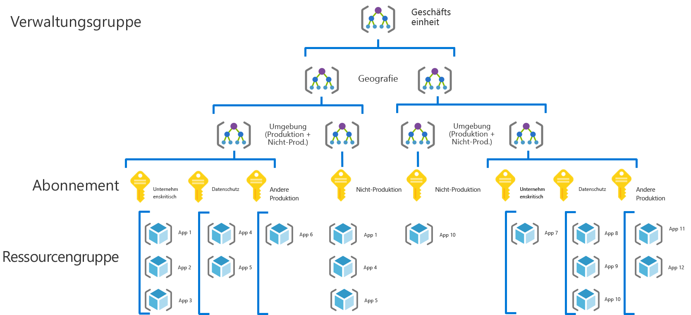
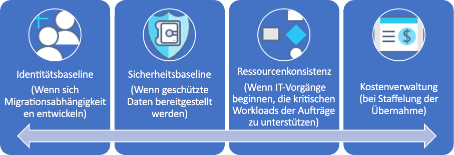

# CAF: Governance Journey für große Unternehmen

## Übersicht über bewährte Methoden

Diese Governance Journey folgt den Erfahrungen eines fiktiven Unternehmens in verschiedenen Phasen der Governancereife. Sie basiert auf echten Kundenlösungen. Die empfohlenen bewährten Methoden basieren auf den Einschränkungen und Anforderungen des fiktiven Unternehmens.

Als Schnellstartpunkt definiert diese Übersicht ein auf bewährten Methoden basierendes Minimum Viable Product (MVP) für die Governance. Sie enthält außerdem Links zu einigen Governanceentwicklungen, die weitere bewährte Methoden hinzufügen, wenn neue Geschäfts- oder technische Risiken entstehen.

> [!WARNING]
> Dieses MVP ist ein Baselineausgangspunkt, der auf einer Reihe von Annahmen basiert. Auch dieser minimale Satz bewährter Methoden basiert auf Unternehmensrichtlinien, die von beispiellosen geschäftlichen Risiken und Risikotoleranzen bestimmt werden. Um festzustellen, ob diese Annahmen auf Sie zutreffen, lesen Sie die [längere Schilderung](./narrative.md), die diesem Artikel folgt.

### Bewährte Governancemethode

Diese bewährte Methode dient als Grundlage, auf der eine Organisation schnell und konsistent Governancesicherungen für mehrere Azure-Abonnements hinzufügen kann.

### Ressourcenorganisation

Die folgende Abbildung zeigt die Governance-MVP-Hierarchie zum Organisieren von Ressourcen.

Jede Anwendung sollte im richtigen Bereich der Verwaltungsgruppen-, Abonnement- und Ressourcengruppenhierarchie bereitgestellt werden. Während der Bereitstellungsplanung erstellt das Cloudgovernanceteam die erforderlichen Knoten in der Hierarchie, um die für die Cloudeinführung zuständigen Teams die Arbeit zu ermöglichen.

1. Eine Verwaltungsgruppe für die einzelnen Geschäftseinheiten mit einer detaillierten Hierarchie, die die Geografie und dann den Umgebungstyp (Produktion, nicht Produktion) wiedergibt.
2. Ein Abonnement für jede eindeutige Kombination von Geschäftseinheit, Geografie, Umgebung und „Kategorisierung der Anwendung“.
3. Eine separate Ressourcengruppe für jede Anwendung.
4. Konsistente Benennung sollte auf jeder Ebene dieser Gruppierungshierarchie angewendet werden.

Diese Muster bieten Raum für Wachstum, ohne die Hierarchie unnötig zu verkomplizieren.

[!INCLUDE [governance-of-resources](../../../../../includes/cloud-adoption/governance/governance-of-resources.md)]

## Governanceentwicklungen

Sobald dieses MVP bereitgestellt ist, können zusätzliche Ebenen der Governance schnell in die Umgebung integriert werden. Einige Möglichkeiten, das MVP zu entwickeln, sind:

- [Sicherheitsbaseline für geschützte Daten](./security-baseline-evolution.md)
- [Ressourcenkonfigurationen für unternehmenskritische Anwendungen](./resource-consistency-evolution.md)
- [Steuerelemente für das Kostenmanagement](./cost-management-evolution.md)
- [Steuerelemente für die Multi-Cloud-Entwicklung](./multi-cloud-evolution.md)

<!-- markdownlint-disable MD026 -->

## Wozu dient diese bewährte Methode?

Im MVP sind Methoden und Tools für die Disziplin der [Beschleunigung der Bereitstellung](../../deployment-acceleration/overview.md) festgelegt, um schnell Unternehmensrichtlinien anzuwenden. Insbesondere verwendet das MVP Azure Blueprints, Azure Policy und Azure-Verwaltungsgruppen, um einige grundlegende Unternehmensrichtlinien anzuwenden, wie in der Schilderung für das fiktive Unternehmen definiert. Diese Unternehmensrichtlinien werden mithilfe von Azure Resource Manager-Vorlagen und Azure-Richtlinien angewandt, um eine sehr kleine Baseline für Identität und Sicherheit festzulegen.

## Weiterentwicklung der bewährten Methode

Im Lauf der Zeit wird dieses Governance-MVP verwendet, um die Governancemethoden weiterzuentwickeln. Mit fortschreitender Einführung wächst das geschäftliche Risiko. Verschiedene Disziplinen im CAF-Governancemodell werden zur Verringerung dieser Risiken weiterentwickelt. Spätere Artikel dieser Reihe erläutern die Weiterentwicklung der Unternehmensrichtlinie, die sich auf das fiktive Unternehmen auswirkt. Diese Weiterentwicklung erfolgt drei Disziplinen übergreifend:

- Identitätsbaseline, indem Migrationsabhängigkeiten in der Schilderung weiterentwickelt werden.
- Kostenmanagement, wenn die Einführung skaliert wird.
- Sicherheitsbaseline, indem geschützte Daten bereitgestellt werden.
- Ressourcenkonsistenz, indem die IT-Abteilung beginnt, unternehmenskritische Workloads zu unterstützen.

## Nächste Schritte

Da Sie jetzt mit dem Governance-MVP vertraut sind und eine Vorstellung von zukünftigen Weiterentwicklungen der Governance haben, lesen Sie die unterstützende Lösung, um zusätzliche Kontextinformationen zu erhalten.

> [!div class="nextstepaction"]
> [Lesen Sie die unterstützende Lösung](./narrative.md)
