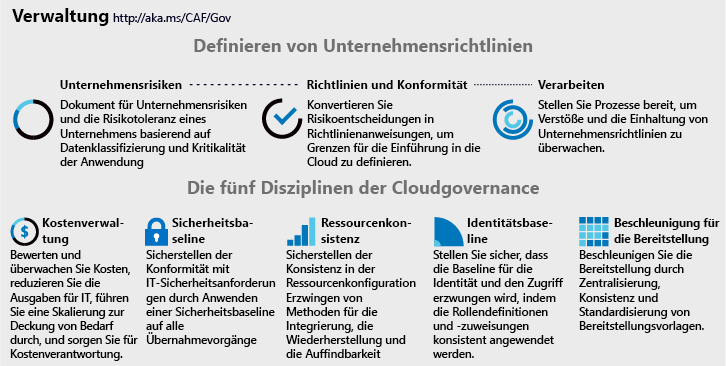
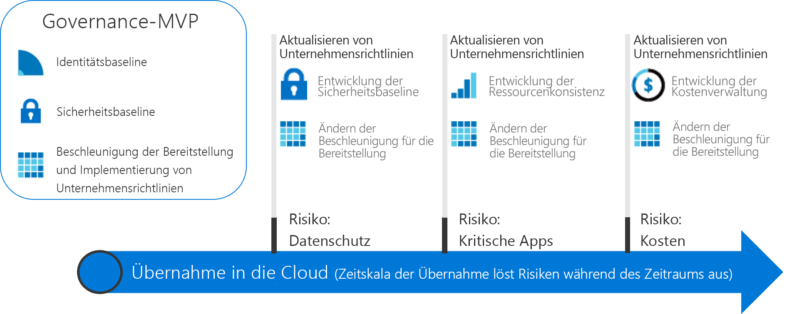

# Nützliche Governance-Vorgehensweisen

Die Governancelösungen in diesem Abschnitt veranschaulichen den inkrementellen Ansatz des CAF-Governancemodells. Sie können eine agile Governanceplattform einrichten, die sich weiterentwickelt, um den Anforderungen jedes Cloud Governance-Szenarios gerecht zu werden.

## Überprüfen und Einführen bewährter Methoden für Cloud Governance

Um eine der Einführungsmöglickeiten zu untersuchen, wählen Sie eine der folgenden Lösungen aus. Jede Lösung beschreibt eine Reihe bewährter Methoden, die auf einer Sammlung von fiktiven Kundenerfahrungen basieren. Lesern, für die der inkrementelle Ansatz des CAF-Governancemodells neu ist, wird empfohlen, die Einführung in die Theorie von Governance weiter unten zu lesen, bevor Sie eine der bewährten Methoden übernehmen.

<!-- markdownlint-disable MD033 -->

<ul class="panelContent cardsZ">
<li style="display: flex; flex-direction: column;">
    <a href="./small-to-medium-enterprise/overview.md" style="display: flex; flex-direction: column; flex: 1 0 auto;">
        

            

                

                    

                        <h3>Kleines bis mittleres Unternehmen</h3>
                        
Eine Governancelösung für Unternehmen, die weniger als fünf Datencenter besitzen und Kosten durch ein zentrales IT- oder Showbackmodell verwalten.

                    

                

            

        

    </a>
</li>
<li style="display: flex; flex-direction: column;">
    <a href="./large-enterprise/overview.md" style="display: flex; flex-direction: column; flex: 1 0 auto;">
        

            

                

                    

                        <h3>Großes Unternehmen</h3>
                        
Eine Governancelösung für Unternehmen, die mehr als fünf Datencenter besitzen und Kosten über mehrere Geschäftseinheiten hinweg verwalten.

                    

                

            

        

    </a>
</li>
</ul>

<!-- markdownlint-enable MD033 -->

## Ein inkrementeller Ansatzes für Cloud Governance

Die Einführung der Cloud ist eine Reise und nicht ein Ziel. Auf dem Weg dorthin gibt es klare Meilensteine und konkrete Geschäftsvorteile. Der endgültige Zustand der Cloudeinführung ist jedoch in der Regel unbekannt, wenn ein Unternehmen diese Reise beginnt. Cloud Governance schafft Absicherungen, die das Unternehmen während der gesamten Reise auf einem sicheren Weg halten.

Diese Governancelösungen beschreiben die Erfahrungen von fiktiven Unternehmen basierend auf den Lösungen echter Kunden. Jede Lösung folgt dem Kunden durch die Governanceaspekte seiner Cloudeinführung.

### Einrichten eines Endzustands

Eine Reise ohne Zielort ist nur eine Wanderung. Es ist wichtig, eine grobe Vorstellung vom Endzustand zu bekommen, bevor man den ersten Schritt macht. Die folgende Infografik stellt einen Bezugsrahmen für den Endzustand dar. Dies ist nicht Ihr Ausgangspunkt, zeigt aber Ihr potentielles Ziel.

Das CAF-Governancemodell identifiziert wichtige Bereiche von Bedeutung während der Reise. Jeder Bereich bezieht sich auf verschiedene Arten von Risiken, denen sich das Unternehmen bei der Einführung weiterer Clouddienste stellen muss. Innerhalb dieses Framework identifiziert die Governancelösung erforderliche Aktionen für das Cloud Governance-Team. Dabei wird jedes Prinzip des CAF-Governancemodells näher beschrieben. Dazu gehören im Allgemeinen:

**Unternehmensrichtlinien**. Unternehmensrichtlinien steuern die Cloud Governance. Die Governancelösung konzentriert sich auf bestimmte Aspekte der Unternehmensrichtlinie:

- Geschäftsrisiken: Identifizieren und Verstehen von Unternehmensrisiken.
- Richtlinie und Compliance: Konvertieren von Risiken in Richtlinienanweisungen, die beliebige Compliancevorgaben unterstützen.
- Prozesse: Sicherstellen der Befolgung der angegebenen Richtlinien.

**Fünf Disziplinen von Cloud Governance**. Diese Disziplinen unterstützen die Unternehmensrichtlinien. Jede Disziplin schützt das Unternehmen vor potenziellen Fallstricken:

- Cost Management
- Sicherheitsbaseline
- Ressourcenkonsistenz
- Identitätsbaseline
- Beschleunigung der Bereitstellung

Unternehmensrichtlinien dienen im Wesentlichen als Frühwarnsystem zur Erkennung potenzieller Probleme. Die Disziplinen helfen dem Unternehmen, Risiken zu minimieren und Absicherungen zu erstellen.

### Wachsen bis zum Endzustand

Da sich die Governanceanforderungen im Lauf der Cloudeinführung weiterentwickeln, ist ein anderer Ansatz für Governance erforderlich. Unternehmen können nicht länger warten, bis ein kleines Team bildlich gesprochen auf jeder Autobahn Leitplanken anbringt und Landkarten erstellt, *bevor sie den ersten Schritt machen*. Geschäftsergebnisse werden schneller und reibungsloser erwartet. Die IT-Governance muss sich zudem schnell weiterentwickeln und mit den Geschäftsanforderungen Schritt halten, um bei der Einführung der Cloud relevant zu bleiben und „Schatten-IT“ zu vermeiden.

Ein **inkrementeller Governance**ansatz stärkt diese Eigenschaften. Inkrementelle Governance basiert auf einer kleinen Sammlung von Unternehmensrichtlinien, -prozessen und -tools, um eine Grundlage für die Einführung und Governance zu schaffen. Diese Grundlage wird als **Minimum Viable Product (MVP)** bezeichnet. Ein MVP ermöglicht es dem Governance-Team, Governance schnell in Implementierungen während des gesamten Einführungszyklus zu integrieren. Ein MVP kann zu jedem Zeitpunkt während des Cloudeinführungsprozesses eingerichtet werden. Es ist allerdings eine bewährte Methode, ein MVP so früh wie möglich einzuführen.

Die Fähigkeit, schnell auf sich ändernde Risiken zu reagieren, befähigt das Cloud Governance-Team, neue Wege einzuschlagen. Das Cloud Governance-Team kann sich dem Cloudstrategieteam als Scouts anschließen und den Cloudeinführungsteams vorauspreschen, Routen planen und schnell Absicherungen einrichten, um Risiken im Zusammenhang mit den Einführungsplänen zu minimieren. Diese Just-in-time-Governanceebenen werden als **Governanceweiterentwicklungen** bezeichnet. Mit diesem Ansatz ist die Governancestrategie den Cloudeinführungsteams einen Schritt voraus.

Die folgende Abbildung zeigt ein einfaches Governance-MVP und drei Governanceentwicklungen. Im Lauf der Entwicklungen werden zusätzliche Unternehmensrichtlinien definiert, um neue Risiken zu minimieren. Die Bereitstellungsbeschleunigungsdisziplin wendet diese Änderungen dann bei jeder Bereitstellung an.

> [!NOTE]
> Governance ist kein Ersatz für Schlüsselfunktionen wie Sicherheit, Netzwerk, Identität, Finanzen, DevOps oder Betrieb. Auf dem Weg dorthin wird es Interaktionen mit und Abhängigkeiten von Mitgliedern aus jeder Funktion geben. Diese Mitglieder sollten in das Cloud Governance-Team aufgenommen werden, um Entscheidungen und Maßnahmen zu beschleunigen.

## Auswählen einer Governancelösung

Die Lösungen veranschaulichen, wie ein Governance-MVP implementiert wird. Von dort aus zeigt jede Lösung, wie das Cloud Governance-Team als Partner vor den Cloudeinführungsteams arbeiten kann, um die Einführungsbemühungen zu beschleunigen. Das CAF-Governancemodell steuert die Anwendung von Governance von der Grundlage bis hin zu nachfolgenden Weiterentwicklungen.

Um mit einer Governancelösung zu beginnen, wählen Sie eine der beiden folgenden Optionen aus. Die Optionen basieren auf synthetisierten Kundenerfahrungen. Die Titel basieren auf der Größe des Unternehmens zur Vereinfachung der Navigation. Die Entscheidung des Lesers kann jedoch komplexer sein. Die folgenden Tabellen zeigen die Unterschiede zwischen den beiden Optionen.

> [!NOTE]
> Es ist unwahrscheinlich, dass eine der beiden Lösungen vollständig auf Ihre Situation abgestimmt ist. Wählen Sie die Lösung aus, die Ihrer Situation am nächsten kommt, und nutzen Sie sie als Ausgangspunkt. Während des gesamten Wegs werden zusätzliche Informationen bereitgestellt, die Ihnen helfen, Entscheidungen an bestimmte Kriterien anzupassen.

### Geschäftsmerkmale

|                                            | Kleines bis mittleres Unternehmen                                                                              | Großes Unternehmen                                                                                               |
|--------------------------------------------|---------------------------------------------------------------------------------------------------------|----------------------------------------------------------------------------------------------------------------|
| Geografie (Land oder geopolitische Region) | Kunden oder Mitarbeiter befinden sich hauptsächlich an einem geografischen Standort                                                      | Kunden oder Mitarbeiter befinden sich an mehreren geografischen Standorten                                                              |
| Betroffene Geschäftseinheiten                    | Einzelne Geschäftseinheit                                                                                    | Mehrere Geschäftseinheiten                                                                                        |
| IT-Budget                                  | Einzelnes IT-Budget                                                                                        | Budget verteilt auf Geschäftseinheiten                                                                         |
| IT-Investitionen                             | Kapitalkostengesteuerte (CapEx) Investitionen werden jährlich geplant und decken in der Regel nur die Grundwartung ab. | CapEx-gesteuerte Investitionen werden jährlich geplant und beinhalten oft Wartung und einen Aktualisierungszyklus von 3 bis 5 Jahren. |

### Aktueller Status vor der Einführung von Cloud Governance

|                                             | Kleines bis mittleres Unternehmen                                                                               | Großes Unternehmen                                                                                                          |
|---------------------------------------------|----------------------------------------------------------------------------------------------------------|---------------------------------------------------------------------------------------------------------------------------|
| Datencenter oder Drittanbieter-Hostinganbieter | Weniger als fünf Datencenter                                                                                  | Mehr als fünf Datencenter                                                                                                   |
| Netzwerk                                  | Kein WAN oder 1 &ndash; 2 WAN-Anbieter                                                                             | Komplexes Netzwerk oder globales WAN                                                                                             |
| Identity                                    | Einzelne Gesamtstruktur, einzelne Domäne. Es gelten keine Anforderungen für anspruchsbasierte Authentifizierung oder MFA-Geräte von Drittanbietern. | Komplex, mehrere Gesamtstrukturen, mehrere Domänen. Anwendungen erfordern anspruchsbasierte Authentifizierung oder MFA-Geräte von Drittanbietern. |

### Gewünschter zukünftiger Status nach der Weiterentwicklung von Cloud Governance

|                                              | Kleines bis mittleres Unternehmen                                                                        | Großes Unternehmen                                                                                        |
|----------------------------------------------|---------------------------------------------------------------------------------------------------|---------------------------------------------------------------------------------------------------------|
| Kostenverwaltung – Cloudabrechnung           | Showbackmodell Abrechnung wird über IT zentralisiert.                                                | Chargebackmodell Die Abrechnung kann durch IT-Beschaffung verteilt werden.                                  |
| Sicherheitsbaseline – geschützte Daten           | Unternehmensfinanzdaten und IP. Eingeschränkte Kundendaten. Keine Complianceanforderungen von Drittanbietern.     | Mehrere Sammlungen von Finanz- und PII-Daten von Kunden. Möglicherweise muss Drittanbietercompliance berücksichtigt werden. |
| Ressourcenkonsistenz – unternehmenskritische Anwendungen | Ausfälle sind schmerzhaft, aber nicht finanziell bedenklich. Vorhandene IT-Vorgänge sind relativ unausgereift. | Ausfälle haben definierte und überwachte finanzielle Auswirkungen. IT-Vorgänge sind etabliert und ausgereift.         |

Diese beiden Lösungen stellen zwei Extreme an Erfahrung für Kunden dar, die in Cloud Governance investieren. Die meisten Unternehmen spiegeln eine Kombination der beiden oben genannten Szenarien wider. Nach der Durchsicht der Lösung können Sie mit dem CAF-Governancemodell die Governancekommunikation beginnen und die Basislösungen weiter an Ihre Bedürfnisse anpassen.

## Nächste Schritte

Wählen Sie eine dieser Lösungen aus:

> [!div class="nextstepaction"]
> [Governancelösung für kleine bis mittlere Unternehmen](./small-to-medium-enterprise/overview.md)
>
> [Governancelösung für große Unternehmen](./large-enterprise/overview.md)
