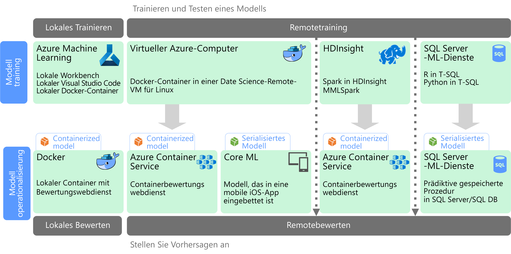

# Bedarfsorientiertes Machine Learning

Machine Learning (ML) ist ein Verfahren, das zum Trainieren von Vorhersagemodellen basierend auf mathematischen Algorithmen eingesetzt wird. Beim Machine Learning werden die Beziehungen zwischen Datenfeldern analysiert, um unbekannte Werte vorherzusagen.

Die Erstellung und Bereitstellung eines Machine Learning-Modells ist ein iterativer Prozess:

* Data Scientists untersuchen die Quelldaten, um Beziehungen zwischen *Features* und vorhergesagten *Bezeichnungen* zu ermitteln.
* Die Data Scientists trainieren und überprüfen Modelle anhand von geeigneten Algorithmen, um das optimale Modell für die Vorhersage zu finden.
* Das optimale Modell wird in der Produktion als Webdienst oder als eine andere gekapselte Funktion bereitgestellt.
* Wenn neue Daten gesammelt werden, wird das Modell regelmäßig neu trainiert, um die Effektivität zu verbessern.

Mit dem bedarfsorientierten Machine Learning werden zwei verschiedene Skalierbarkeitsziele erreicht. Das erste Ziel ist das Trainieren eines Modells basierend auf großen Datasets, für die zum Trainieren die Funktionen zum horizontalen Hochskalieren eines Clusters benötigt werden. Beim zweiten Ziel geht es um die Operationalisierung des Lernmodells mit einem Ansatz, bei dem eine Skalierung vorgenommen werden kann, um die Anforderungen der Consumeranwendungen zu erfüllen. Normalerweise wird dies erreicht, indem die Vorhersagefunktionen als Webdienst bereitgestellt werden, der dann horizontal hochskaliert werden kann.

Das bedarfsorientierte Machine Learning hat den Vorteil, dass leistungsstarke Vorhersagefunktionen produziert werden können, da bessere Modelle in der Regel das Ergebnis der Verwendung einer größeren Datenmenge sind. Nachdem ein Modell trainiert wurde, kann es als zustandsloser, hoch performanter Webdienst mit der Möglichkeit zum horizontalen Hochskalieren bereitgestellt werden. 

## Modellvorbereitung und -training

Während der Phase für die Modellvorbereitung und das Training untersuchen Data Scientists die Daten interaktiv, indem sie Sprachen wie Python und R für folgende Zwecke nutzen:

* Extrahieren von Stichproben aus Datenspeichern mit großen Datenmengen
* Suchen und Behandeln von Ausreißern, Duplikaten und fehlenden Werten zum Bereinigen der Daten
* Ermitteln von Korrelationen und Beziehungen in den Daten per statistischer Analyse und Visualisierung
* Generieren neuer berechneter Features zur Verbesserung der Vorhersagbarkeit von statistischen Beziehungen
* Trainieren von ML-Modellen basierend auf Vorhersagealgorithmen
* Überprüfen von trainierten Modellen anhand von Daten, die während des Trainingsschritts zurückgehalten wurden

Zur Unterstützung dieser Phase für die interaktive Analyse und Modellierung müssen für Data Scientists auf der Datenplattform verschiedene Tools zum Untersuchen der Daten verfügbar sein. Außerdem können für das Trainieren eines komplexen Machine Learning-Modells viele intensive Schritte zur Verarbeitung großer Datenmengen erforderlich sein, sodass es wichtig ist, dass genügend Ressourcen für das horizontale Hochskalieren des Modelltrainings vorhanden sind.

## Modellbereitstellung und -nutzung

Wenn ein Modell bereit für die Bereitstellung ist, kann es als Webdienst gekapselt und in der Cloud, auf einem Edgegerät oder in einer ML-Ausführungsumgebung für Unternehmen bereitgestellt werden. Der Bereitstellungsprozess wird als Operationalisierung bezeichnet.

## Herausforderungen

Bedarfsorientiertes Machine Learning ist mit einigen Herausforderungen verbunden:

- Normalerweise benötigen Sie zum Trainieren eines Modells viele Daten – vor allem für Deep Learning-Modelle.
- Sie müssen diese großen Datasets zunächst vorbereiten, bevor Sie mit dem Trainieren Ihres Modells beginnen können.
- In der Phase des Modelltrainings muss auf die Big Data-Speicher zugegriffen werden. Häufig wird für das Modelltraining derselbe Big Data-Cluster verwendet, z.B. Spark, der auch für die Datenvorbereitung genutzt wird. 
- Für Szenarien wie das Deep Learning benötigen Sie nicht nur einen Cluster, der Ihnen das horizontale Hochskalieren für CPUs ermöglicht, sondern Ihr Cluster muss auch aus GPU-fähigen Knoten bestehen.

## Bedarfsorientiertes Machine Learning in Azure

Bevor Sie die Entscheidung treffen, welche ML-Dienste für das Training und die Operationalisierung verwendet werden, sollten Sie sich die folgende Frage stellen: Muss überhaupt ein Modell trainiert werden, oder erfüllt auch ein vordefiniertes Modell Ihre Anforderungen? In vielen Fällen muss für die Verwendung eines vordefinierten Modells lediglich ein Webdienst aufgerufen oder eine ML-Bibliothek verwendet werden, um ein vorhandenes Modell zu laden. Beispiele für Optionen sind: 

- Verwenden Sie die Webdienste, die über Microsoft Cognitive Services bereitgestellt werden.
- Verwenden Sie die vortrainierten neuronalen Netzwerkmodelle des Cognitive Toolkit.
- Betten Sie die serialisierten Modelle ein, die von Core ML für iOS-Apps bereitgestellt werden. 

Falls ein vordefiniertes Modell für Ihre Daten oder Ihr Szenario nicht geeignet ist, können Sie in Azure die Optionen Azure Machine Learning, HDInsight mit Spark MLlib und MMLSpark, Cognitive Toolkit und SQL Machine Learning Services verwenden. Falls Sie sich für die Nutzung eines benutzerdefinierten Modells entscheiden, müssen Sie eine Pipeline entwerfen, die das Modelltraining und die Operationalisierung umfasst. 

Eine Liste mit Technologieoptionen für ML in Azure finden Sie unter den folgenden Themen:

- [Auswählen einer Cognitive Services-Technologie](../technology-choices/cognitive-services.md)
- [Auswählen einer Machine Learning-Technologie](../technology-choices/data-science-and-machine-learning.md)
- [Auswählen einer Technologie zur Verarbeitung von natürlicher Sprache](../technology-choices/natural-language-processing.md)
