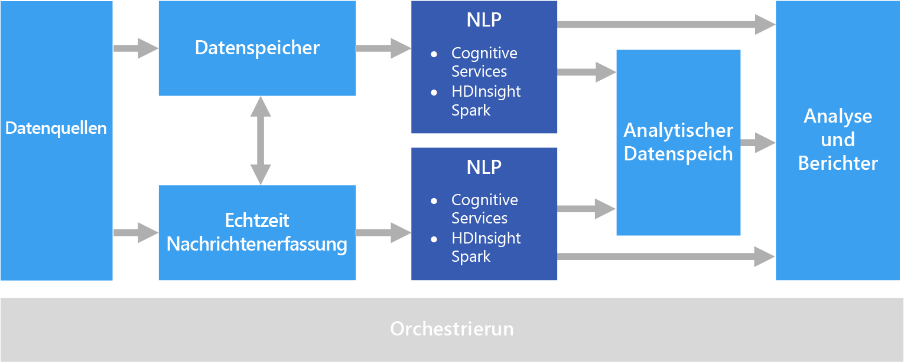

# Verarbeitung natürlicher SpracheNatural language processing

Die Verarbeitung natürlicher Sprache (Natural Language Processing, NLP) wird für Aufgaben wie die Standpunktanalyse, Textgegenstandserkennung, Sprachenerkennung, Schlüsselbegriffserkennung und Dokumentkategorisierung verwendet.Natural language processing (NLP) is used for tasks such as sentiment analysis, topic detection, language detection, key phrase extraction, and document categorization.

## Verwendung dieser LösungWhen to use this solution

NLP kann zum Klassifizieren von Dokumenten verwendet werden, beispielsweise zur Kennzeichnung von Dokumenten als „vertraulich“ oder „Spam“.NLP can be use to classify documents, such as labeling documents as sensitive or spam. Die Ausgabe der NLP kann zur anschließenden Verarbeitung oder Suche verwendet werden.The output of NLP can be used for subsequent processing or search. Eine weitere Verwendungsmöglichkeit der NLP ist die Zusammenfassung von Text durch Identifizieren der im Dokument vorhandenen Entitäten.Another use for NLP is to summarize text by identifying the entities present in the document. Diese Entitäten können auch verwendet werden, um Dokumente mit Schlüsselwörtern zu markieren, sodass sie anhand des Inhalts gesucht und abgerufen werden können.These entities can also be used to tag documents with keywords, which enables search and retrieval based on content. Entitäten können zu Themen kombiniert und mit Zusammenfassungen versehen werden, in denen die wichtigen Themen in jedem Dokument beschrieben werden.Entities might be combined into topics, with summaries that describe the important topics present in each document. Anhand der erkannten Themen können die Dokumente zur Navigation kategorisiert oder verwandte Dokumente für ein ausgewähltes Thema aufgelistet werden.The detected topics may be used to categorize the documents for navigation, or to enumerate related documents given a selected topic. Ein weiterer Verwendungszweck für die NLP ist die Standpunktbewertung von Texten, um die positive oder negative Stimmung eines Dokuments zu bewerten.Another use for NLP is to score text for sentiment, to assess the positive or negative tone of a document. Bei diesen Ansätzen werden viele Techniken der Verarbeitung natürlicher Sprache verwendet, beispielsweise:These approaches use many techniques from natural language processing, such as: 

- **Tokenizer**.**Tokenizer**. Aufteilung des Textes in Wörter oder Ausdrücke.Splitting the text into words or phrases.
- **Wortstammerkennung und Lemmatisierung**.**Stemming and lemmatization**. Normalisierung von Wörtern, sodass unterschiedliche Formen dem kanonischen Wort mit der gleichen Bedeutung entsprechen.Normalizing words so that that different forms map to the canonical word with the same meaning. Beispielweise werden „Ausführung“ und „ausgeführt“ dem Wort „ausführen“ zugeordnet.For example, "running" and "ran" map to "run." 
- **Entitätsextraktion**.**Entity extraction**. Identifizieren von Themen im Text.Identifying subjects in the text.
- **Wortarterkennung**.**Part of speech detection**. Erkennung von Text als Verb, Nomen, Partizip, Verbalphrase usw.Identifying text as a verb, noun, participle, verb phrase, and so on.
- **Erkennung von Satzgrenzen**.**Sentence boundary detection**. Erkennung von vollständigen Sätzen innerhalb von Textabschnitten.Detecting complete sentences within paragraphs of text.

Bei der Verwendung der NLP zum Extrahieren von Informationen und Einblicken aus Freitext sind meist die in Objektspeicher wie Azure Storage oder Azure Data Lake Store gespeicherten unformatierten Dokumente der Ausgangspunkt.When using NLP to extract information and insight from free-form text, the starting point is typically the raw documents stored in object storage such as Azure Storage or Azure Data Lake Store. 

## HerausforderungenChallenges

- Die Verarbeitung einer Sammlung von Freitextdokumenten ist in der Regel rechen-, ressourcen- und zeitintensiv.Processing a collection of free-form text documents is typically computationally resource intensive, as well as being time intensive.
- Ohne ein standardisiertes Dokumentformat kann es sehr schwierig sein, durchweg genaue Ergebnisse zu erzielen, wenn die Freitextverarbeitung zum Extrahieren bestimmter Fakten aus einem Dokument verwendet wird.Without a standardized document format, it can be very difficult to achieve consistently accurate results using free-form text processing to extract specific facts from a document. Wenn Sie beispielsweise eine Textdarstellung einer Rechnung haben, kann es schwierig sein, einen Prozess zu erstellen, der die Rechnungsnummer und das Rechnungsdatum für Rechnungen von einer beliebigen Anzahl von Lieferanten korrekt extrahiert.For example, think of a text representation of an invoice&mdash;it can be difficult to build a process that correctly extracts the invoice number and invoice date for invoices across any number of vendors.

## ArchitectureArchitecture

In einer NLP-Lösung wird die Freitextverarbeitung für Dokumente ausgeführt, die Textabschnitte enthalten.In an NLP solution, free-form text processing is performed against documents containing paragraphs of text. Die allgemeine Architektur kann auf [Batchverarbeitung](../big-data/batch-processing.md) oder [Echtzeit-Datenstromverarbeitung](../big-data/real-time-processing.md) beruhen.The overall architecture can be a [batch processing](../big-data/batch-processing.md) or [real-time stream processing](../big-data/real-time-processing.md) architecture.

Die tatsächliche Verarbeitung variiert je nach gewünschtem Ergebnis. Im Hinblick auf die Pipeline kann die NLP jedoch in einem Batch oder in Echtzeit angewendet werden kann.The actual processing varies based on the desired outcome, but in terms of the pipeline, NLP may be applied in a batch or real-time fashion. Beispielsweise kann die Standpunktanalyse für Textblöcke verwendet werden, um eine Stimmungspunktzahl zu erhalten.For example, sentiment analysis can be used against blocks of text to produce a sentiment score. Die Verarbeitung kann in diesem Fall durch Ausführen eines Batchprozesses für Daten im Speicher oder in Echtzeit anhand von kleineren, durch einen Messagingdienst übermittelten Datenblöcken erfolgen.This can could be done by running a batch process against data in storage, or in real time using smaller chunks of data flowing through a messaging service.

## Auswahl der TechnologieTechnology choices

- [Verarbeitung natürlicher SpracheNatural language processing](../technology-choices/natural-language-processing.md)