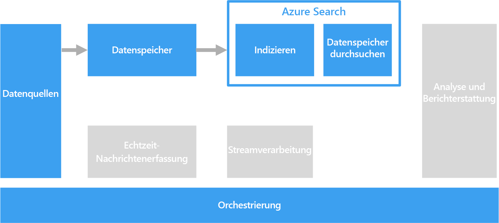

# Verarbeiten von Freitext für die SucheProcessing free-form text for search

Zur Unterstützung der Suche kann für Dokumente, die Textabschnitte enthalten, eine Freitextverarbeitung ausgeführt werden.To support search, free-form text processing can be performed against documents containing paragraphs of text.

Die Textsuche erstellt einen speziellen Index, der anhand einer Sammlung von Dokumenten vorausberechnet wird.Text search works by constructing a specialized index that is precomputed against a collection of documents. Eine Clientanwendung sendet eine Abfrage, die die Suchbegriffe enthält.A client application submits a query that contains the search terms. Die Abfrage gibt als Resultset eine Liste von Dokumenten zurück, die nach der Übereinstimmung der einzelnen Dokumente mit den Suchkriterien sortiert ist.The query returns a result set, consisting of a list of documents sorted by how well each document matches the search criteria. Das Resultset kann auch den Kontext enthalten, in dem das Dokument den Kriterien entspricht, sodass die Anwendung den übereinstimmenden Ausdruck im Dokument hervorheben kann.The result set may also include the context in which the document matches the criteria, which enables the application to highlight the matching phrase in the document. 

Die Freitextverarbeitung kann aus großen Mengen von Textdaten, die viele irrelevante Informationen enthalten, nützliche, handlungsrelevante Daten erzeugen.Free-form text processing can produce useful, actionable data from large amounts of noisy text data. Die Ergebnisse können unstrukturierte Dokumente sowie eine klar definierte und abfragbare Struktur liefern.The results can give unstructured documents a well-defined and queryable structure.

## HerausforderungenChallenges

- Die Verarbeitung einer Sammlung von Freitextdokumenten ist in der Regel sowohl rechen- als auch zeitintensiv.Processing a collection of free-form text documents is typically computationally intensive, as well as time intensive.
- Um eine effektive Suche in Freitext zu ermöglichen, muss der Suchindex die Fuzzysuche anhand von Begriffen mit ähnlicher Struktur unterstützen.In order to search free-form text effectively, the search index should support fuzzy search based on terms that have a similar construction. Suchindizes werden beispielsweise mit Lemmatisierung und Wortstammerkennung erstellt, sodass bei Abfragen nach „ausführen“ Dokumente gefunden werden, die „ausgeführt“ und „Ausführung“ enthalten.For example, search indexes are built with lemmatization and linguistic stemming, so that queries for "run" will match documents that contain "ran" and "running."

## ArchitectureArchitecture

In den meisten Szenarien werden die Quelltextdokumente in den Objektspeicher geladen, beispielsweise Azure Storage oder Azure Data Lake Store.In most scenarios, the source text documents are loaded into object storage such as Azure Storage or Azure Data Lake Store. Eine Ausnahme ist die Verwendung der Volltextsuche in SQL Server oder Azure SQL-Datenbank.An exception is using full text search within SQL Server or Azure SQL Database. In diesem Fall werden die Dokumentdaten in Tabellen geladen, die von der Datenbank verwaltet werden.In this case, the document data is loaded into tables managed by the database. Nach dem Speichern werden die Dokumente in einem Batch verarbeitet, um den Index zu erstellen.Once stored, the documents are processed in a batch to create the index.

## Auswahl der TechnologieTechnology choices

Zu den Optionen für die Erstellung eines Suchindex zählen Azure Search, Elasticsearch und HDInsight mit Solr.Options for creating a search index include Azure Search, Elasticsearch, and HDInsight with Solr. Jede dieser Technologien kann einen Suchindex aus einer Sammlung von Dokumenten auffüllen.Each of these technologies can populate a search index from a collection of documents. Azure Search bietet Indexer, die den Index für unterschiedlichste Dokumente automatisch auffüllen können, angefangen bei Nur-Text in Excel bis hin zu PDF-Formaten.Azure Search provides indexers that can automatically populate the index for documents ranging from plain text to Excel and PDF formats. Für HDInsight kann Apache Solr Binärdateien vieler Typen indizieren, einschließlich Nur-Text-, Word- und PDF-Dateien.On HDInsight, Apache Solr can index binary files of many types, including plain text, Word, and PDF. Nachdem der Index erstellt wurde, können Clients über eine REST-API auf die Suchschnittstelle zugreifen.Once the index is constructed, clients can access the search interface by means of a REST API. 

Falls Ihre Textdaten in SQL Server oder Azure SQL-Datenbank gespeichert sind, können Sie die integrierte Volltextsuche der Datenbank verwenden.If your text data is stored in SQL Server or Azure SQL Database, you can use the full-text search that is built into the database. Die Datenbank füllt den Index aus Text-, Binär- oder XML-Daten auf, die in derselben Datenbank gespeichert sind.The database populates the index from text, binary, or XML data stored within the same database. Clients führen die Suche mithilfe von T-SQL-Abfragen durch.Clients search by using T-SQL queries. 

Weitere Informationen finden Sie unter [Search data stores](../technology-choices/search-options.md) (Datenspeicher für die Suche).For more information, see [Search data stores](../technology-choices/search-options.md).
