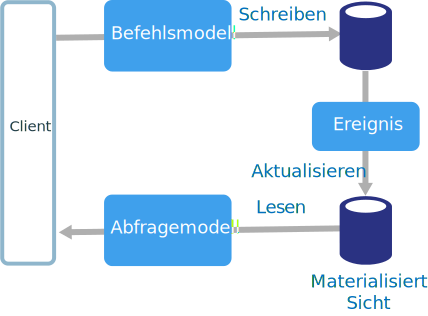
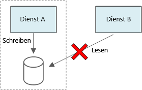

# Architekturstil „CQRS“CQRS architecture style

CQRS (Command and Query Responsibility Segregation, Befehlsabfrage-Zuständigkeitstrennung) ist ein Architekturstil, bei dem Lesevorgänge von Schreibvorgängen getrennt werden.Command and Query Responsibility Segregation (CQRS) is an architecture style that separates read operations from write operations. 

In herkömmlichen Architekturen wird zum Abfragen und Aktualisieren einer Datenbank das gleiche Datenmodell verwendet.In traditional architectures, the same data model is used to query and update a database. Dies ist eine einfache Vorgehensweise, die für grundlegende CRUD-Vorgänge gut geeignet ist.That's simple and works well for basic CRUD operations. Bei komplexeren Anwendungen kann dieser Ansatz aber zu Problemen führen.In more complex applications, however, this approach can become unwieldy. Beispielsweise werden von der Anwendung auf Leseseite unter Umständen unterschiedliche Abfragen durchgeführt und Datenübertragungsobjekte (Data Transfer Objects, DTOs) mit uneinheitlichen Formen zurückgegeben.For example, on the read side, the application may perform many different queries, returning data transfer objects (DTOs) with different shapes. Die Objektzuordnung kann kompliziert werden.Object mapping can become complicated. Auf der Schreibseite werden für das Modell ggf. eine komplexe Überprüfung und Geschäftslogik implementiert.On the write side, the model may implement complex validation and business logic. Hieraus kann sich ein Modell mit zu hoher Komplexität ergeben, das überdimensioniert ist.As a result, you can end up with an overly complex model that does too much.

Ein anderes potenzielles Problem ist, dass Lese- und Schreibworkloads häufig asymmetrisch sind und über sehr unterschiedliche Leistungs- und Skalierungsanforderungen verfügen.Another potential problem is that read and write workloads are often asymmetrical, with very different performance and scale requirements. 

CQRS löst diese Probleme, indem Lese- und Schreibvorgänge in separate Modelle unterteilt werden. Hierfür werden **Befehle** zum Aktualisieren von Daten und **Abfragen** zum Lesen von Daten verwendet.CQRS addresses these problems by separating reads and writes into separate models, using **commands** to update data, and **queries** to read data.

- Die Befehle sollten nicht datenzentriert, sondern aufgabenbasiert sein.Commands should be task based, rather than data centric. (Beispiel: „Hotelzimmer buchen“, nicht „Reservierungsstatus auf ‚Reserviert‘ festlegen“.) Befehle können in eine Warteschlange für die asynchrone Verarbeitung eingereiht werden, anstatt synchron verarbeitet zu werden.("Book hotel room," not "set ReservationStatus to Reserved.") Commands may be placed on a queue for asynchronous processing, rather than being processed synchronously.

- Mit Abfragen wird die Datenbank niemals geändert.Queries never modify the database. Eine Abfrage gibt ein DTO zurück, in dem kein Domänenwissen gekapselt ist.A query returns a DTO that does not encapsulate any domain knowledge.

Eine stärkere Isolation erzielen Sie, indem Sie die Lesedaten physisch von den Schreibdaten trennen.For greater isolation, you can physically separate the read data from the write data. In diesem Fall kann die Lesedatenbank ihr eigenes Datenschema verwenden, das für Abfragen optimiert ist.In that case, the read database can use its own data schema that is optimized for queries. Beispielsweise kann eine [materialisierte Sicht][materialized-view] der Daten gespeichert werden, um komplexe Verknüpfungen oder O/RM-Zuordnungen zu vermeiden.For example, it can store a [materialized view][materialized-view] of the data, in order to avoid complex joins or complex O/RM mappings. Es kann sogar ein anderer Typ von Datenspeicher verwendet werden.It might even use a different type of data store. Die Schreibdatenbank kann beispielsweise relational sein, während es sich bei der Lesedatenbank um eine Dokumentdatenbank handelt.For example, the write database might be relational, while the read database is a document database.

Wenn separate Lese- und Schreibdatenbanken verwendet werden, müssen sie synchron gehalten werden. Dies wird normalerweise erreicht, indem das Schreibmodell jeweils ein Ereignis veröffentlicht, wenn es die Datenbank aktualisiert.If separate read and write databases are used, they must be kept in sync. Typically this is accomplished by  having the write model publish an event whenever it updates the database. Die Aktualisierung der Datenbank und die Veröffentlichung des Ereignisses müssen in einer einzelnen Transaktion durchgeführt werden.Updating the database and publishing the event must occur in a single transaction. 

Für einige Implementierungen von CQRS wird das [Muster für die Ereignisherkunftsermittlung][event-sourcing] verwendet.Some implementations of CQRS use the [Event Sourcing pattern][event-sourcing]. Bei diesem Muster wird der Anwendungsstatus als Ereignissequenz gespeichert.With this pattern, application state is stored as a sequence of events. Jedes Ereignis umfasst eine Reihe von Änderungen der Daten.Each event represents a set of changes to the data. Der aktuelle Zustand wird hergestellt, indem die Ereignisse erneut durchgeführt werden.The current state is constructed by replaying the events. In einem CQRS-Kontext besteht ein Vorteil der Ereignisherkunftsermittlung darin, dass dieselben Ereignisse verwendet werden können, um andere Komponenten zu benachrichtigen, z.B. vor allem das Lesemodell.In a CQRS context, one benefit of Event Sourcing is that the same events can be used to notify other components &mdash; in particular, to notify the read model. Im Lesemodell werden die Ereignisse genutzt, um eine Momentaufnahme des aktuellen Zustands zu erstellen, da dies für Abfragen effizienter ist.The read model uses the events to create a snapshot of the current state, which is more efficient for queries. Mit der Ereignisherkunftsermittlung erhöht sich aber auch die Komplexität des Designs.However, Event Sourcing adds complexity to the design.

## Einsatzmöglichkeiten für diese ArchitekturWhen to use this architecture

Erwägen Sie den Einsatz von CQRS für Kollaborationsdomänen, in denen viele Benutzer auf die gleichen Daten zugreifen – vor allem, wenn die Lese- und Schreibworkloads asymmetrisch sind.Consider CQRS for collaborative domains where many users access the same data, especially when the read and write workloads are asymmetrical.

CQRS ist keine Architektur der obersten Ebene, die für ein gesamtes System gilt.CQRS is not a top-level architecture that applies to an entire system. Wenden Sie CQRS nur auf die Subsysteme an, wenn das Trennen von Lese- und Schreibvorgängen einen eindeutigen Nutzen hat.Apply CQRS only to those subsystems where there is clear value in separating reads and writes. Andernfalls erhöhen Sie die Komplexität, ohne dass sich daraus ein Vorteil ergibt.Otherwise, you are creating additional complexity for no benefit.

## VorteileBenefits

- **Unabhängige Skalierung**:**Independently scaling**. CQRS ermöglicht das unabhängige Skalieren der Lese- und Schreibworkloads und kann zu einer Verringerung von Sperrkonflikten führen.CQRS allows the read and write workloads to scale independently, and may result in fewer lock contentions.
- **Optimierte Datenschemas**:**Optimized data schemas.**  Auf der Leseseite kann ein Schema verwendet werden, das für Abfragen optimiert ist, während auf der Schreibseite ein Schema verwendet wird, das für Updates optimiert ist.The read side can use a schema that is optimized for queries, while the write side uses a schema that is optimized for updates.  
- **Sicherheit**.**Security**. Es ist einfacher sicherzustellen, dass nur die richtigen Domänenentitäten Schreibvorgänge für die Daten durchführen.It's easier to ensure that only the right domain entities are performing writes on the data.
- **Trennung von Zuständigkeiten**:**Separation of concerns**. Das Trennen der Lese- und Schreibseite kann zu Modellen führen, die besser gewartet werden können und flexibler sind.Segregating the read and write sides can result in models that are more maintainable and flexible. Der größte Teil der komplexen Geschäftslogik betrifft das Schreibmodell.Most of the complex business logic goes into the write model. Das Lesemodell kann relativ einfach gestaltet sein.The read model can be relatively simple.
- **Einfachere Abfragen**:**Simpler queries**. Indem eine materialisierte Sicht in der Lesedatenbank gespeichert wird, kann die Anwendung beim Durchführen von Abfragen komplexe Verknüpfungen vermeiden.By storing a materialized view in the read database, the application can avoid complex joins when querying.

## HerausforderungenChallenges

- **Komplexität**:**Complexity**. Die Grundidee von CQRS ist einfach.The basic idea of CQRS is simple. Es kann sich aber auch ein komplexeres Anwendungsdesign ergeben, z.B. bei Verwendung des Musters für die Ereignisherkunftsermittlung.But it can lead to a more complex application design, especially if they include the Event Sourcing pattern.

- **Messaging**:**Messaging**. Für CQRS wird zwar kein Messaging benötigt, aber es wird trotzdem häufig genutzt, um Befehle zu verarbeiten und Aktualisierungsereignisse zu veröffentlichen.Although CQRS does not require messaging, it's common to use messaging to process commands and publish update events. In diesem Fall muss die Anwendung Nachrichtenfehler oder doppelte Nachrichten verarbeiten können.In that case, the application must handle message failures or duplicate messages. 

- **Letztliche Konsistenz**:**Eventual consistency**. Wenn Sie die Lese- und Schreibdatenbanken trennen, kann es sein, dass die Lesedaten veraltet sind.If you separate the read and write databases, the read data may be stale. 

## Bewährte MethodenBest practices

- Weitere Informationen zur Implementierung von CQRS finden Sie unter [CQRS-Muster][cqrs-pattern].For more information about implementing CQRS, see [CQRS Pattern][cqrs-pattern].

- Erwägen Sie die Verwendung des Musters für die [Ereignisherkunftsermittlung][event-sourcing], um Aktualisierungskonflikte zu vermeiden.Consider using the [Event Sourcing][event-sourcing] pattern to avoid update conflicts.

- Erwägen Sie die Verwendung des [Musters für materialisierte Sichten][materialized-view] für das Lesemodell, um das Schema für Abfragen zu optimieren.Consider using the [Materialized View pattern][materialized-view] for the read model, to optimize the schema for queries.

## CQRS in MicroservicesCQRS in microservices

CQRS kann in einer [Microservices-Architektur][microservices] besonders nützlich sein.CQRS can be especially useful in a [microservices architecture][microservices]. Eines der Grundprinzipien von Microservices ist, dass ein Dienst nicht direkt auf den Datenspeicher eines anderen Diensts zugreifen kann.One of the principles of microservices is that a service cannot directly access another service's data store.

Im folgenden Diagramm schreibt Dienst A in einen Datenspeicher, und Dienst B erstellt eine materialisierte Sicht der Daten.In the following diagram, Service A writes to a data store, and Service B keeps a materialized view of the data. Dienst A veröffentlicht jeweils ein Ereignis, wenn ein Schreibvorgang in den Datenspeicher durchgeführt wird.Service A publishes an event whenever it writes to the data store. Dienst B abonniert das Ereignis.Service B subscribes to the event.

<!-- links -->

[cqrs-pattern]: ../../patterns/cqrs.md
[event-sourcing]: ../../patterns/event-sourcing.md
[materialized-view]: ../../patterns/materialized-view.md
[microservices]: ./microservices.md
