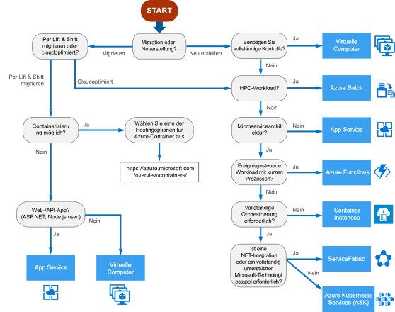

# Entscheidungsstruktur für Azure-Computedienste

Azure bietet eine Vielzahl von Möglichkeiten zum Hosten Ihres Anwendungscodes. Der Begriff *Compute* bezieht sich auf das Hostingmodell für die Computeressourcen, auf denen Ihre Anwendung ausgeführt wird. Das folgende Flussdiagramm unterstützt Sie bei der Auswahl eines Computediensts für Ihre Anwendung.
 

Das Flussdiagramm führt Sie durch eine Reihe wichtiger Entscheidungskriterien, um eine Empfehlung zu erzielen. Da jede Anwendung besondere Anforderungen aufweist, sollten Sie die Empfehlung als Ausgangspunkt betrachten. Führen Sie dann eine ausführlichere Analyse durch, bei der Sie z.B. folgende Aspekte betrachten:
 
- Funktionsumfang
- [Diensteinschränkungen](/azure/azure-subscription-service-limits)
- [Kosten](https://azure.microsoft.com/pricing/)
- [SLA](https://azure.microsoft.com/support/legal/sla/)
- [Regionale Verfügbarkeit](https://azure.microsoft.com/global-infrastructure/services/)
- Entwicklerökosystem und Teamkenntnisse
- [Kriterien für die Auswahl einer Azure-Compute-Option](./compute-comparison.md)

Wenn Ihre Anwendung aus mehreren Workloads besteht, bewerten Sie jede Workload getrennt. Eine vollständige Lösung kann zwei oder mehr Computedienste umfassen.

