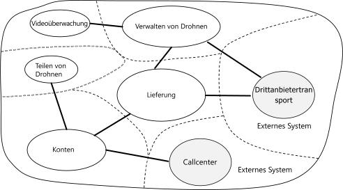
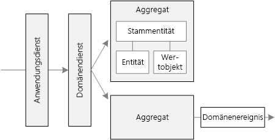

# Entwerfen von Microservices: Domänenanalyse

Eine der größten Herausforderungen in Bezug auf Microservices besteht darin, die Grenzen der einzelnen Dienste zu definieren. Eine allgemeine Regel besagt, dass ein Dienst nur einem Zweck dienen soll. Die Umsetzung dieser Regel in die Praxis bedarf jedoch sorgfältiger Überlegung. Es gibt keinen mechanischen Prozess, mit dem das „richtige“ Design erzielt werden kann. Es ist erforderlich, dass Sie sich eingehend mit Ihrer Geschäftsdomäne und den dazugehörigen Anforderungen und Zielen beschäftigen. Andernfalls erhalten Sie unter Umständen ein planloses Design mit einigen unerwünschten Merkmalen, z.B. versteckten Abhängigkeiten zwischen Diensten, zu enger Kopplung oder schlecht entworfenen Schnittstellen. In diesem Kapitel verwenden wir einen am Geschäftsbereich ausgerichteten Ansatz für den Entwurf von Microservices.

Microservices sollten basierend auf den geschäftlichen Funktionen entworfen werden, nicht auf horizontalen Ebenen wie dem Datenzugriff oder Messaging. Außerdem sollten sie eine lose Kopplung und eine hohe funktionsbezogene Kohäsion aufweisen. Microservices sind *lose gekoppelt*, wenn Sie einen Dienst ändern können, ohne dass gleichzeitig andere Dienste aktualisiert werden müssen. Ein Microservice ist *kohäsiv*, wenn er einem einzelnen, klar definierten Zweck dient, z.B. der Verwaltung von Benutzerkonten oder der Nachverfolgung des Lieferverlaufs. Ein Dienst sollte das Wissen des Geschäftsbereichs umfassen und dieses Wissen von den Clients abstrahieren. Ein Client sollte beispielsweise dazu in der Lage sein, eine Drohne zu planen, ohne die Details des Planungsalgorithmus oder der Drohnenflottenverwaltung zu kennen.

Bei dem am Geschäftsbereich ausgerichteten Entwurf (Domain-Driven Design, DDD) wird ein Framework bereitgestellt, mit dem Sie die meisten Voraussetzungen auf dem Weg zu einem guten Entwurf der Microservices bereits erfüllen können. DDD verfügt über zwei separate Phasen: eine strategische und eine taktische Phase. In der strategischen DDD-Phase definieren Sie die übergeordnete Struktur des Systems. In dieser Phase können Sie sicherstellen, dass Ihre Architektur klar auf die geschäftlichen Funktionen ausgerichtet ist. In der taktischen DDD-Phase wird eine Gruppe von Entwurfsmustern bereitgestellt, die Sie zum Erstellen des Domänenmodells verwenden können. Zu diesen Mustern gehören Entitäten, Aggregate und Domänendienste. Diese taktischen Muster sind hilfreich beim Entwerfen von Microservices, die sowohl lose gekoppelt als auch kohäsiv sind.

In diesem und im nächsten Kapitel werden die folgenden Schritte beschrieben und auf die Anwendung für die Drohnenlieferung (Drone Delivery) angewendet:

1. Zunächst analysieren wir die Geschäftsdomäne, um die funktionsbezogenen Anforderungen der Anwendung zu verstehen. Das Ergebnis dieses Schritts ist eine informelle Beschreibung des Geschäftsbereichs, die zu einer formelleren Gruppe von Domänenmodellen verfeinert werden kann.

2. Als Nächstes definieren wir die *Kontextgrenzen* der Domäne. Jeder Kontextgrenzenbereich enthält ein Domänenmodell, das eine bestimmte Unterdomäne der übergeordneten Anwendung darstellt.

3. Wenden Sie innerhalb einer Kontextgrenze taktische DDD-Muster an, um Entitäten, Aggregate und Domänendienste zu definieren.

4. Verwenden Sie die Ergebnisse des vorherigen Schritts, um die Microservices Ihrer Anwendung zu identifizieren.

In diesem Kapitel werden die ersten drei Schritte behandelt, in denen es hauptsächlich um DDD geht. Im nächsten Kapitel identifizieren wir dann die Microservices. Hierbei sollte aber unbedingt beachtet werden, dass DDD ein iterativer, fortlaufender Prozess ist. Dienstgrenzen sind nicht in Stein gemeißelt. Wenn sich eine Anwendung weiterentwickelt, treffen Sie unter Umständen die Entscheidung, dass ein Dienst in mehrere kleinere Dienste unterteilt werden soll.

> [!NOTE]
> In diesem Kapitel soll keine vollständige und umfassende Domänenanalyse bereitgestellt werden. Wir haben das Beispiel absichtlich kurz gehalten, um die wichtigsten Punkte besser verdeutlichen zu können. Weitere Hintergrundinformationen zu DDD finden Sie im Buch *Domain-Driven Design* von Eric Evans, in dem dieser Begriff zuerst verwendet wurde. Eine andere gute Quelle ist *Implementing Domain-Driven Design* von Vaughn Vernon.

## Analysieren der Domäne

Bei der Nutzung eines DDD-Ansatzes können Sie Microservices so entwerfen, dass jeder Dienst auf natürliche Weise zu einer funktionsbezogenen Geschäftsanforderung passt. Auf diese Weise können Sie es vermeiden, dass Ihr Entwurf durch organisatorische Grenzen oder die ausgewählte Technologie bestimmt wird.

Bevor Sie Code schreiben, müssen Sie sich einen allgemeinen Überblick über das zu erstellende System verschaffen. Beim DDD-Ansatz wird zuerst die Geschäftsdomäne modelliert und ein *Domänenmodell* erstellt. Das Domänenmodell ist ein abstraktes Modell der Geschäftsdomäne. Hiermit wird das Domänenwissen zusammengefasst und organisiert und eine gemeinsame Sprache für Entwickler und Domänenexperten gefunden.

Beginnen Sie, indem Sie alle Geschäftsfunktionen und ihre Verbindungen zuordnen. Dies ist normalerweise ein Vorgang, der von Domänenexperten, Softwarearchitekten und anderen Projektbeteiligten gemeinsam durchgeführt wird. Es muss kein bestimmter Formalismus eingehalten werden.  Skizzieren Sie ein Diagramm, oder verwenden Sie ein Whiteboard.

Beim Erstellen des Diagramms können Sie damit beginnen, einzelne Unterdomänen zu identifizieren. Welche Funktionen sind eng verwandt? Welche Funktionen sind für das Geschäft besonders wichtig, und welche Funktionen erfüllen Hilfszwecke? Was ist das Abhängigkeitsdiagramm? Während dieser ersten Phase geht es nicht um Technologien oder Implementierungsdetails. Sie sollten sich aber darüber bewusst sein, an welchen Stellen die Anwendung in externe Systeme integriert werden muss, z.B. Systeme für CRM, Zahlungsverarbeitung oder Abrechnung.

## Drohnenlieferung: Analysieren der Geschäftsdomäne

Nach der ersten Domänenanalyse hat das Fabrikam-Team eine grobe Skizze erstellt, in der die Domäne der Drohnenlieferung dargestellt ist.

- **Lieferung** ist in der Mitte des Diagramms angeordnet, weil dies der Kern des Geschäfts ist. Alle anderen Elemente des Diagramms dienen der Ermöglichung dieser Funktionalität.
- Die **Drohnenverwaltung** ist auch ein wichtiger Teil des Geschäfts. Funktionen, die eng mit der Drohnenverwaltung verbunden sind, sind die **Drohnenreparatur** und der Einsatz von **Predictive Analysis**, um vorherzusagen, wann für Drohnen Wartungsarbeiten durchgeführt werden müssen.
- Mit der **ETA-Analyse** werden Schätzungen für den Zeitpunkt der Abholung und Lieferung bereitgestellt.
- Mit dem **Drittanbietertransport** wird die Anwendung in die Lage versetzt, alternative Transportmethoden zu planen, falls ein Paket nicht vollständig per Drohne ausgeliefert werden kann.
- Die **Drohnenvermietung** ist eine mögliche Erweiterung des Kerngeschäfts. Unter Umständen verfügt das Unternehmen zu bestimmten Zeiten über überschüssige Drohnenkapazität, sodass Drohnen vermietet werden können, die andernfalls ungenutzt bleiben würden. Dieses Feature ist nicht Teil der ersten Releaseversion.
- Die **Videoüberwachung** ist ein weiterer Bereich, in den das Unternehmen später expandieren kann.
- **Benutzerkonten**, **Rechnungsstellung** und **Callcenter** sind Unterdomänen zur Unterstützung des Kerngeschäfts.

Beachten Sie, dass wir an diesem Punkt des Prozesses noch keinerlei Entscheidungen zur Implementierung oder zur Technologie getroffen haben. Einige Untersysteme können externe Softwaresysteme oder Drittanbieterdienste betreffen. Trotzdem muss die Anwendung mit diesen Systemen und Diensten interagieren, und es ist wichtig, sie in das Domänenmodell einzubinden.

> [!NOTE]
> Wenn eine Anwendung von einem externen System abhängig ist, besteht das Risiko, dass das Datenschema oder die API des externen Systems in Ihre Anwendung hineinreicht und letztendlich den Entwurf der Architektur kompromittiert. Dies gilt besonders für ältere Systeme, bei denen ggf. keine modernen bewährten Methoden befolgt und verworrene Datenschemas oder veraltete APIs verwendet werden. In diesem Fall ist es wichtig, eine klar definierte Grenze zwischen diesen externen Systemen und der Anwendung einzurichten. Erwägen Sie zu diesem Zweck die Verwendung des [Einschnürungsmusters](../patterns/strangler.md) oder des [Musters „Antibeschädigungsebene“](../patterns/anti-corruption-layer.md).

## Definieren von Kontextgrenzen

Das Domänenmodell enthält Darstellungen von realen Dingen: Benutzer, Drohnen, Pakete usw. Dies bedeutet aber nicht, dass jeder Teil des Systems für dieselben Dinge die gleichen Darstellungen verwenden muss.

Beispielsweise müssen Subsysteme, die für die Drohnenreparatur und Predictive Analytics zuständig sind, viele physische Merkmale von Drohnen darstellen, z.B. den Wartungsverlauf, Kilometerleistung, Alter, Modellnummer, Leistungsmerkmale usw. Wenn es aber um die Planung einer Lieferung geht, kümmern wir uns nicht um diese Dinge. Das Subsystem für die Planung muss nur wissen, ob eine Drohne verfügbar ist und welcher geschätzte Zeitpunkt für die Abholung und die Lieferung gilt.

Wenn wir versuchen würden, ein gemeinsames Modell für beide Subsysteme zu erstellen, wäre dies ein unnötig komplexer Vorgang. Außerdem wäre es schwieriger, das Modell im Laufe der Zeit weiterzuentwickeln, da alle Änderungen die Zustimmung mehrerer Teams erhalten müssen, die an separaten Subsystemen arbeiten. Daher ist es häufig besser, separate Modelle zu entwerfen, bei denen die gleiche reale Entität (in diesem Fall eine Drohne) in zwei unterschiedlichen Kontexten dargestellt wird. Jedes Modell enthält nur die Features und Attribute, die im jeweiligen Kontext relevant sind.

An dieser Stelle wird auf das DDD-Konzept der *Kontextgrenzen* zurückgegriffen. Eine Kontextgrenze bezeichnet einfach den abgegrenzten Bereich innerhalb einer Domäne, in dem ein bestimmtes Domänenmodell gilt. Wenn wir uns das obige Diagramm ansehen, können wir die Funktionalität danach gruppieren, ob von den einzelnen Funktionen ein Domänenmodell gemeinsam genutzt wird.

Kontextgrenzen bedeuten nicht unbedingt, dass Kontexte voneinander isoliert sind. In diesem Diagramm zeigen die durchgehenden Verbindungslinien zwischen den Kontextgrenzen die Stellen an, an denen die Kontexte zweier Kontextgrenzen interagieren. Beispielsweise ist „Lieferung“ von „Benutzerkonten“ abhängig, um Informationen zu Kunden zu erhalten, und von „Drohnenverwaltung“, um die Drohnen der Flotte einplanen zu können.

In seinem Buch *Domain Driven Design* beschreibt Eric Evans mehrere Muster zur Wahrung der Integrität eines Domänenmodells, wenn es mit dem Kontext einer anderen Kontextgrenze interagiert. Eines der wichtigsten Prinzipien von Microservices ist die Kommunikation der Dienste über klar definierte APIs. Dieser Ansatz entspricht zwei Mustern, die von Eric Evans als „Open Host Service“ (Offener Hostdienst) und „Published Language“ (Veröffentlichte Sprache) bezeichnet werden. Bei „Open Host Service“ definiert ein Subsystem ein formelles Protokoll (API) für die Kommunikation mit anderen Subsystemen. Mit „Published Language“ wird dieser Ansatz erweitert, indem die API in einer Form veröffentlicht wird, die von anderen Teams zum Schreiben von Clients genutzt werden kann. Im Kapitel zum [API-Design](./api-design.md) wird die Verwendung der [OpenAPI-Spezifikation](https://www.openapis.org/specification/repo) (früher als Swagger bezeichnet) beschrieben. Sie wird zum Definieren von sprachunabhängigen Schnittstellenbeschreibungen für REST-APIs genutzt, die im JSON- oder YAML-Format ausgedrückt werden.

Im restlichen Teil dieser Vorgehensweise konzentrieren wir uns auf die Kontextgrenze „Lieferung“.

## Taktische DDD-Phase

Während der strategischen DDD-Phase entwerfen Sie die Geschäftsdomäne und definieren Kontextgrenzen für Ihre Domänenmodelle. In der taktischen DDD-Phase definieren Sie Ihre Domänenmodelle mit größerer Genauigkeit. Die taktischen Muster werden nur in einem Kontextgrenzenbereich angewendet. Bei einer Microservices-Architektur sind wir vor allem an den Entitäts- und Aggregatmustern interessiert. Die Anwendung dieser Muster hilft uns dabei, natürliche Grenzen für die Dienste in unserer Anwendung zu identifizieren (siehe [nächste Kapitel](./microservice-boundaries.md)). Es gilt das allgemeine Prinzip, dass ein Microservice nicht kleiner als ein Aggregat und nicht größer als eine Kontextgrenze sein sollte. Zuerst überprüfen wir die taktischen Muster. Anschließend wenden wir sie auf die Kontextgrenze „Lieferung“ in der Anwendung für die Drohnenlieferung an.

### Übersicht über die taktischen Muster

Dieser Abschnitt enthält eine kurze Zusammenfassung der taktischen DDD-Muster. Unter Umständen können Sie diesen Abschnitt also überspringen, falls Sie mit DDD bereits vertraut sind. Die Muster werden im Buch von Eric Evans (Kapitel 5 und 6) und in *Implementing Domain-Driven Design* von Vaughn Vernon ausführlicher beschrieben.

**Entitäten**: Eine Entität ist ein Objekt mit einer eindeutigen Identität, die bestehen bleibt. In einer Anwendung für Bankgeschäfte sind Kunden und Konten beispielsweise Entitäten.

- Eine Entität verfügt im System über einen eindeutigen Bezeichner, mit dem die Entität nachgeschlagen bzw. abgerufen werden kann. Dies bedeutet nicht, dass der Bezeichner immer direkt für Benutzer verfügbar gemacht wird. Es kann sich um eine GUID oder einen Primärschlüssel in einer Datenbank handeln.
- Eine Identität kann übergreifend für mehrere Kontextgrenzenbereiche gelten und auch über die Lebensdauer der Anwendung hinaus beibehalten werden. Beispielsweise sind Bankkontonummern oder von Behörden ausgestellte IDs nicht an die Lebensdauer einer bestimmten Anwendung gebunden.
- Die Attribute einer Entität können sich im Laufe der Zeit ändern. Beispielsweise können sich Name oder Adresse einer Person ändern, während sich die Person nicht ändert.
- Eine Entität kann Verweise auf andere Entitäten enthalten.

**Wertobjekte**: Ein Wertobjekt hat keine Identität. Es wird allein durch die Werte seiner Attribute definiert. Außerdem sind Wertobjekte unveränderlich. Für die Aktualisierung eines Wertobjekts erstellen Sie immer eine neue Instanz, um die alte zu ersetzen. Wertobjekte können über Methoden verfügen, in denen die Domänenlogik gekapselt ist, aber diese Methoden sollten nicht mit Nebenwirkungen in Bezug auf den Status des Objekts verbunden sein. Typische Beispiele für Wertobjekte sind Farben, Datum und Uhrzeit und Währungswerte.

**Aggregate**: Ein Aggregat definiert eine Konsistenzgrenze für eine oder mehrere Entitäten. Eine bestimmte Entität in einem Aggregat ist die Stammentität. Die Suche wird anhand des Bezeichners der Stammentität durchgeführt. Alle anderen Entitäten im Aggregat sind untergeordnete Elemente der Stammentität, und es wird darauf verwiesen, indem den Zeigern der Stammentität gefolgt wird.

Der Zweck eines Aggregats ist die Modellierung von Transaktionsinvarianten. Reale Dinge weisen komplexe Beziehungsgeflechte auf. Kunden geben Bestellungen auf, Bestellungen enthalten Produkte, Produkte haben Lieferanten usw. Wenn von der Anwendung mehrere zusammengehörige Objekte geändert werden, wie kann dann die Konsistenz gewährleistet werden? Wie können Invarianten nachverfolgt und erzwungen werden?  

In herkömmlichen Anwendungen wurden häufig Datenbanktransaktionen eingesetzt, um Konsistenz zu erzwingen. In einer verteilten Anwendung ist dies aber oftmals nicht möglich. Eine einzelne Geschäftstransaktion kann sich unter Umständen über mehrere Datenspeicher erstrecken, eine lange Ausführungsdauer aufweisen oder Drittanbieterdienste umfassen. Letztendlich liegt es an der Anwendung und nicht an der Datenschicht, die für die Domäne erforderlichen Invarianten zu erzwingen. Für die Durchführung dieser Modellierung sind Aggregate bestimmt.

> [!NOTE]
> Ein Aggregat kann ggf. aus einer einzelnen Entität ohne untergeordnete Entitäten bestehen. Durch die Transaktionsgrenze wird dies zu einem Aggregat.

**Domänen- und Anwendungsdienste**: In der DDD-Terminologie ist ein Dienst ein Objekt, mit dem Logik implementiert wird, ohne dass ein Zustand vorgehalten wird. Evans unterscheidet zwischen *Domänendiensten*, in denen die Domänenlogik gekapselt ist, und *Anwendungsdiensten*, mit denen die technische Funktionalität bereitgestellt wird, z.B. die Benutzerauthentifizierung oder das Senden einer SMS-Nachricht. Domänendienste werden häufig zum Modellieren von Verhalten verwendet, das mehrere Entitäten umfasst.

> [!NOTE]
> Der Begriff *Dienst* ist im Bereich der Softwareentwicklung mehrfach besetzt. Die Definition bezieht sich in diesem Fall nicht direkt auf Microservices.

**Domänenereignisse**: Domänenereignisse können verwendet werden, um andere Teile des Systems zu benachrichtigen, wenn etwas passiert. Wie der Name bereits vermuten lässt, sollten Domänenereignisse eine bestimmte Bedeutung innerhalb der Domäne haben. Der Vorgang „Datensatz wurde in eine Tabelle eingefügt“ ist beispielsweise kein Domänenereignis. Der Vorgang „Lieferung wurde storniert“ ist ein Domänenereignis. Domänenereignisse sind besonders in einer Microservices-Architektur relevant. Da Microservices verteilt vorliegen und keine Datenspeicher gemeinsam nutzen, stellen Domänenereignisse eine Möglichkeit dar, wie sich Microservices untereinander koordinieren können. Im Kapitel zur [Kommunikation zwischen Diensten](./interservice-communication.md) wird das asynchrone Messaging ausführlicher beschrieben.

Es gibt noch einige andere DDD-Muster, die hier nicht aufgeführt sind, z.B. Factorys, Repositorys und Module. Dies können nützliche Muster für die Implementierung eines Microservice sein, aber sie sind weniger relevant, wenn es um das Entwerfen von Grenzen zwischen Microservices geht.

## Drohnenlieferung: Anwenden der Muster

Wir beginnen mit den Szenarien, die vom Kontextgrenzenbereich „Lieferung“ verarbeitet werden müssen.

- Ein Kunde kann eine Drohne anfordern, um Waren von einem Unternehmen abzuholen, das beim Dienst für die Drohnenlieferung registriert ist.
- Der Absender generiert eine Kennzeichnung per Tag (Strichcode oder RFID) für das Paket.
- Eine Drohne holt ein Paket ab und liefert es vom Ausgangsort an den Zielort.
- Wenn ein Kunde eine Lieferung plant, wird vom System eine geschätzte Ankunftszeit angegeben, die auf den Routeninformationen, Wetterbedingungen und Verlaufsdaten basiert.
- Wenn eine Drohne in der Luft ist, kann ein Benutzer den aktuellen Standort und die zuletzt ermittelte geschätzte Ankunftszeit nachverfolgen.
- Der Kunde kann eine Lieferung stornieren, bis eine Drohne das Paket abgeholt hat.
- Der Kunde wird benachrichtigt, wenn die Lieferung abgeschlossen ist.
- Der Absender kann vom Kunden eine Bestätigung der Lieferung in Form einer Signatur oder eines Fingerabdrucks anfordern.
- Benutzer können den Verlauf einer abgeschlossenen Lieferung anzeigen.

Anhand dieser Szenarien hat das Entwicklungsteam die folgenden **Entitäten** identifiziert.

- Lieferung
- Paket
- Drohne
- Konto
- Bestätigung
- Benachrichtigung
- Tag

Die ersten vier Entitäten (Lieferung, Paket, Drohne und Konto) sind allesamt **Aggregate**, die für die Grenzen der Transaktionskonsistenz stehen. Bestätigungen und Benachrichtigungen sind untergeordnete Elemente von Lieferungen, und Tags sind untergeordnete Elemente von Paketen.

Zu den **Wertobjekten** dieses Entwurfs gehören Standort, geschätzte Ankunftszeit, Paketgewicht und Paketgröße (Location, ETA, PackageWeight und PackageSize).

Zur besseren Veranschaulichung ist hier ein UML-Diagramm des Aggregats für die Lieferung (Delivery) angegeben. Beachten Sie, dass es Verweise auf andere Aggregate enthält, z.B. Konto (Account), Paket (Package) und Drohne (Drone).

Es sind zwei Domänenereignisse vorhanden:

- Während eine Drohne in der Luft ist, sendet die Drone-Entität DroneStatus-Ereignisse, mit denen der Standort und Status (Flug, Gelandet) der Drohne beschrieben werden.

- Die Delivery-Entität sendet jeweils DeliveryTracking-Ereignisse, wenn sich die Phase einer Lieferung ändert. Beispiele hierfür sind DeliveryCreated, DeliveryRescheduled, DeliveryHeadedToDropoff und DeliveryCompleted.

Beachten Sie, dass diese Ereignisse Dinge beschreiben, die innerhalb des Domänenmodells eine Bedeutung haben. Sie beschreiben einen Aspekt der Domäne und sind nicht an ein Konstrukt einer bestimmten Programmiersprache gebunden.

Das Entwicklungsteam hat noch einen weiteren Funktionalitätsbereich identifiziert, der nicht ohne Weiteres einer der bisher beschriebenen Entitäten zugeordnet werden kann. Ein Teil des Systems muss alle Schritte koordinieren, die an der Planung oder Aktualisierung einer Lieferung beteiligt sind. Aus diesem Grund hat das Entwicklungsteam dem Entwurf zwei **Domänendienste** hinzugefügt: einen *Scheduler* zum Koordinieren der Schritte und einen *Supervisor*, mit dem der Status der einzelnen Schritte überwacht und erkannt werden soll, ob für Schritte ein Fehler oder eine Zeitüberschreitung aufgetreten ist. Dies ist eine Variante des [Musters „Scheduler-Agent-Supervisor“](../patterns/scheduler-agent-supervisor.md).

> [!div class="nextstepaction"]
> [Identifizieren von Microservice-Grenzen](./microservice-boundaries.md)
