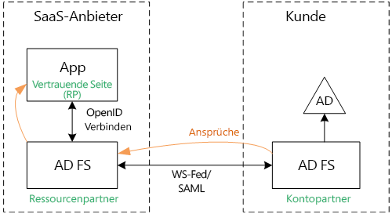
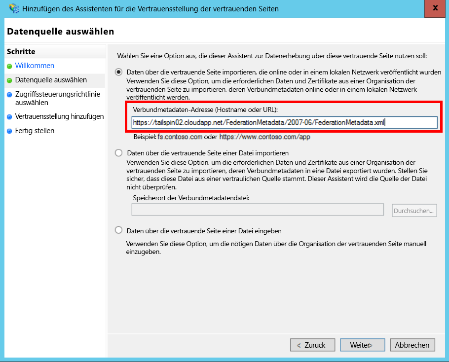
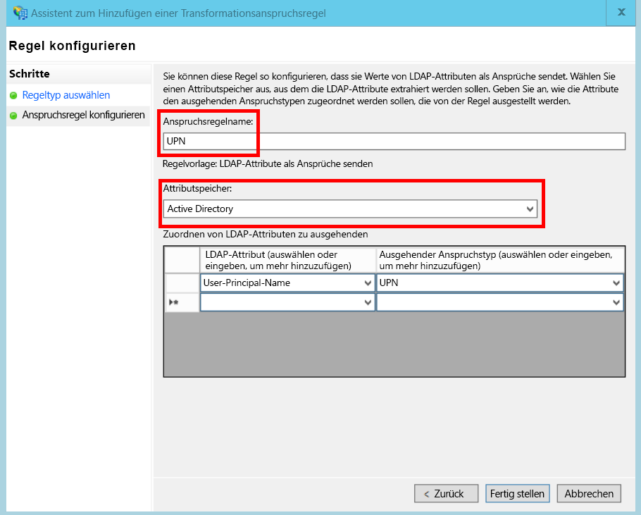
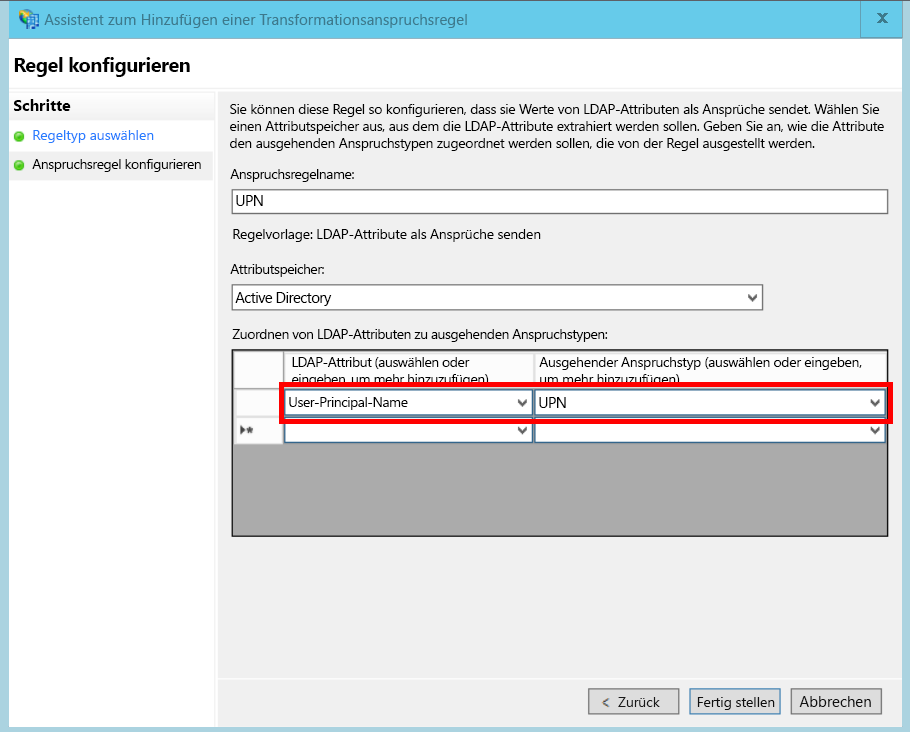

# <a name="federate-with-a-customers-ad-fs"></a>Einrichten eines Verbunds mit der AD FS-Instanz eines Kunden

In diesem Artikel wird beschrieben, wie eine SaaS-Anwendung mit mehreren Mandanten eine Authentifizierung über Active Directory-Verbunddienste (AD FS) unterstützen kann, um einen Verbund mit den AD FS eines Kunden einzugehen.

## <a name="overview"></a>Übersicht
Azure Active Directory (Azure AD) vereinfacht das Anmelden von Benutzern von Azure AD-Mandanten sowie Kunden von Office 365 und Dynamics CRM Online. Doch wie sieht es mit Kunden aus, die ein lokales Active Directory in einem Unternehmensintranet nutzen?

Eine Möglichkeit für diese Kunden ist die Synchronisierung ihres lokalen AD mit Azure AD unter Verwendung von [Azure AD Connect]. Einigen Kunden ist es eventuell aufgrund IT-Unternehmensrichtlinien oder anderen Gründen nicht möglich, diese Methode zu nutzen. In diesem Fall wäre eine weitere Möglichkeit, einen Verbund über Active Directory-Verbunddienste (AD FS) einzurichten.

Aktivieren dieses Szenarios:

* Der Kunde muss eine AD FS-Farm mit Internetanbindung besitzen.
* Der SaaS-Anbieter stellt seine eigene AD FS-Farm bereit.
* Der Kunde und der SaaS-Anbieter müssen eine [Verbundvertrauensstellung]einrichten. Dies ist ein manueller Prozess.

Die Vertrauensbeziehung umfasst drei wichtige Rollen:

* Die AD FS des Kunden sind der [Kontopartner], der für die Authentifizierung der Benutzer aus dem Active Directory des Kunden und die Erstellung von Sicherheitstoken mit Benutzeransprüchen zuständig ist.
* Der AD FS des SaaS-Anbieters sind die [Ressourcenpartner], die den Kontopartnern vertrauen und die Benutzeransprüche empfangen.
* Die Anwendung wird als eine vertrauende Seite (RP) in den AD FS des SaaS-Anbieters konfiguriert.
  
  

> [!NOTE]
> In diesem Artikel wird davon ausgegangen, dass die Anwendung OpenID Connect als Authentifizierungsprotokoll verwendet. Eine andere Möglichkeit ist die Verwendung von WS-Verbund.
> 
> Für OpenID Connect muss der SaaS-Anbieter AD FS 2016 unter Windows Server 2016 verwenden. OpenID Connect wird von AD FS 3.0 nicht unterstützt.
> 
> ASP.NET Core bietet keine integrierte Unterstützung für WS-Verbund.
> 
> 

Eine Beispielverwendung von WS-Verbund mit ASP.NET 4 finden Sie im Beispiel [active-directory-dotnet-webapp-wsfederation][active-directory-dotnet-webapp-wsfederation].

## <a name="authentication-flow"></a>Authentifizierungsfluss
1. Klickt der Benutzer auf „Anmelden“, leitet die Anwendung diesen an einen OpenID Connect-Endpunkt der AD FS des SaaS-Anbieters weiter.
2. Der Benutzer/die Benutzerin gibt seinen/ihren Organisationsbenutzernamen ein („`alice@corp.contoso.com`“). AD FS verwenden Startbereichserkennung, um zu den AD FS des Kunden umzuleiten, wo Benutzer ihre Anmeldeinformationen eingeben.
3. Die AD FS des Kunden senden mithilfe des WF-Verbunds (oder SAML) Benutzeransprüche an die AD FS des SaaS-Anbieters.
4. Ansprüche werden von den AD FS mithilfe von OpenID Connect an die App übertragen. Dies erfordert einen Protokollübergang von WS-Verbund.

## <a name="limitations"></a>Einschränkungen
Standardmäßig empfängt die Anwendung der vertrauenden Seite nur einen festgelegten Satz an Ansprüchen, der in „id_token“ verfügbar ist, wie in der folgenden Tabelle gezeigt. In AD FS 2016 können Sie „id_token“ in OpenID Connect-Szenarien anpassen. Weitere Informationen finden Sie unter [Benutzerdefinierte ID-Token in AD FS](/windows-server/identity/ad-fs/development/customize-id-token-ad-fs-2016).

| Anspruch | BESCHREIBUNG |
| --- | --- |
| aud |Zielgruppe. Die Anwendung, für die die Ansprüche ausgegeben wurden |
| authenticationinstant |[Authentifizierungszeitpunkt]. Der Zeitpunkt, zu dem die Authentifizierung erfolgt ist. |
| c_hash |Codehashwert. Dies ist ein Hash der Tokeninhalte. |
| exp |[Ablaufzeit]. Der Zeitpunkt, nach dem das Token nicht mehr akzeptiert wird. |
| iat |Ausgestellt um. Der Zeitpunkt, zu dem das Token ausgestellt wurde. |
| iss |Aussteller. Der Wert dieses Anspruchs ist immer die AD FS-Instanz des Ressourcenpartners. |
| name |Benutzername. Beispiel: `john@corp.fabrikam.com` |
| nameidentifier |[Namensbezeichner]. Der Bezeichner für den Namen der Entität, für die das Token ausgestellt wurde. |
| nonce |Sitzungsnonce. Ein eindeutiger Wert, der von AD FS generiert wird, um Replayangriffe zu verhindern. |
| upn |Benutzerprinzipalname (User Principal Name, UPN). Beispiel: `john@corp.fabrikam.com` |
| pwd_exp |Ablaufzeitraum für Kennwort. Die Anzahl von Sekunden, bis das Kennwort oder ein entsprechendes Authentifizierungsgeheimnis – z.B. eine PIN – des Benutzers abläuft. |

> [!NOTE]
> Der Anspruch „iss“ enthält die AD FS des Partners (dieser Anspruch identifiziert typischerweise den SaaS-Anbieter als Aussteller). Er identifiziert nicht die AD FS des Kunden. Die Domäne des Kunden ist Bestandteil des Benutzerprinzipalnamens.
> 
> 

Im restlichen Artikel wird das Einrichten der Vertrauensstellung zwischen der Anwendung der RP (der App) und dem Kontopartner (dem Kunden) beschrieben.

## <a name="ad-fs-deployment"></a>AD FS-Bereitstellung
Der SaaS-Anbieter kann AD FS lokal oder auf Azure-VMs bereitstellen. Für die Sicherheit und Verfügbarkeit sind die folgenden Richtlinien zu beachten:

* Stellen Sie mindestens zwei AD FS-Server und zwei AD FS-Proxyserver bereit, um die beste Verfügbarkeit der Active Directory-Verbunddienste zu gewährleisten.
* Domänencontroller und AD FS-Server sollten nie direkt mit dem Internet verbunden sein, und sie sollten sich in einem virtuellem Netzwerk mit direktem Zugriff auf diese befinden.
* Webanwendungsproxys (zuvor AD FS-Proxys) müssen verwendet werden, um AD FS-Server im Internet zu veröffentlichen.

Das Einrichten einer ähnlichen Topologie in Azure erfordert die Verwendung von virtuellen Netzwerken, NSGs, Azure VMs und Verfügbarkeitsgruppen. Weitere Informationen finden Sie unter [Richtlinien für die Bereitstellung von Windows Server Active Directory auf virtuellen Computern in Azure][active-directory-on-azure].

## <a name="configure-openid-connect-authentication-with-ad-fs"></a>Konfigurieren der OpenID Connect-Authentifizierung mit AD FS
Der SaaS-Anbieter muss OpenID Connect zwischen der Anwendung und den AD FS aktivieren. Fügen Sie zu diesem Zweck in AD FS eine Anwendungsgruppe hinzu.  Detaillierte Anweisungen dazu finden Sie in diesem [Blogbeitrag] unter „Setting up a Web App for OpenId Connect sign in AD FS“ (Einrichten einer Web-App für die OpenID Connect-Anmeldung über AD FS). 

Konfigurieren Sie als Nächstes die OpenID Connect-Middleware. Der Metadatenendpunkt lautet `https://domain/adfs/.well-known/openid-configuration`, wobei „domain“ die AD FS-Domäne des SaaS-Anbieters ist.

In der Regel kombinieren Sie dies mit anderen OpenID Connect-Endpunkten (wie z.B. AAD). Sie benötigen zwei verschiedene Anmeldeschaltflächen oder eine andere Möglichkeit, die Anmeldungen zu unterscheiden, damit der Benutzer an den richtigen Authentifizierungsendpunkt weitergeleitet wird.

## <a name="configure-the-ad-fs-resource-partner"></a>Konfigurieren des AD FS-Ressourcenpartners
Der SaaS-Anbieter muss für jeden Kunden folgende Schritte ausführen, wenn dieser über AD FS eine Verbindung herstellen möchte:

1. Fügen Sie eine Vertrauensstellung für Anspruchsanbieter hinzu.
2. Fügen Sie Anspruchsregeln hinzu.
3. Aktivieren Sie eine Startbereichsermittlung.

Hier werden die Schritte im Detail veranschaulicht.

### <a name="add-the-claims-provider-trust"></a>Fügen Sie die Anspruchsanbieter-Vertrauensstellung hinzu.
1. Klicken Sie im Server-Manager auf **Tools**, und wählen Sie **AD FS-Verwaltung** aus.
2. Klicken Sie in der Konsolenstruktur unter **AD FS** mit der rechten Maustaste auf **Anspruchsanbieter-Vertrauensstellungen**. Wählen Sie **Anspruchsanbieter-Vertrauensstellung hinzufügen**.
3. Klicken Sie auf **Starten** , um den Assistenten zu starten.
4. Wählen Sie die Option „Online oder in einem lokalen Netzwerk veröffentlichte Daten über den Anspruchsanbieter importieren“ aus. Geben Sie den URI des Verbundmetadaten-Endpunkts des Kunden an. (Beispiel: `https://contoso.com/FederationMetadata/2007-06/FederationMetadata.xml`). Diese Informationen muss der Kunde bereitstellen.
5. Schließen Sie den Assistenten unter Verwendung der angegebenen Standardoptionen ab.

### <a name="edit-claims-rules"></a>Anspruchsregeln bearbeiten.
1. Führen Sie einen Rechtsklick auf die neu hinzugefügte Anspruchsanbieter-Vertrauensstellung aus, und wählen Sie **Anspruchsregeln bearbeiten**.
2. Klicken Sie auf **Regel hinzufügen**.
3. Wählen Sie „Eingehenden Anspruch filtern oder zulassen“, und klicken Sie auf **Weiter**.
   
4. Geben Sie einen Namen für die Regel ein.
5. Wählen Sie unter „Eingehender Anspruchstyp“ **UPN**.
6. Wählen Sie „Durchlauf aller Anspruchswerte“.
   
7. Klicken Sie auf **Fertig stellen**.
8. Wiederholen Sie die Schritte 2 bis 7, und geben Sie **Anker Anspruchstyp** für den eingehenden Anspruchstyp an.
9. Klicken Sie auf **OK** , um den Assistenten abzuschließen.

### <a name="enable-home-realm-discovery"></a>Aktivierung der Startbereichsermittlung
Führen Sie das folgende PowerShell-Skript aus:

```
Set-ADFSClaimsProviderTrust -TargetName "name" -OrganizationalAccountSuffix @("suffix")
```

Bei „name“ handelt es sich um den Anzeigenamen des Anspruchsanbieters, „suffix“ ist das UPN-Suffix für die Anwendungsdomäne des Kunden (z.B. „corp.fabrikam.com“).

Mit dieser Konfiguration können Endbenutzer ihr Organisationskonto eingeben, und AD FS wählen automatisch den entsprechenden Anspruchsanbieter aus. Siehe unter [Anpassen der AD FS-Sign-in-Webseiten]den Abschnitt „Konfigurieren von Identitätsanbietern, um bestimmte E-Mail-Suffixe zu verwenden“.

## <a name="configure-the-ad-fs-account-partner"></a>Konfigurieren des AD FS-Kontopartners
Kunden müssen wie folgt vorgehen:

1. Eine Vertrauensstellung der vertrauenden Seite (RP) hinzufügen.
2. Anspruchsregeln hinzufügen.

### <a name="add-the-rp-trust"></a>Die RP-Vertrauensstellung hinzufügen.
1. Klicken Sie im Server-Manager auf **Tools**, und wählen Sie **AD FS-Verwaltung** aus.
2. Klicken Sie in der Konsolenstruktur unter **AD FS** mit der rechten Maustaste auf **Vertrauensstellungen der vertrauenden Seite**. Wählen Sie **Hinzufügen der Vertrauensstellung der vertrauenden Seite**.
3. Wählen Sie **Ansprüche unterstützend** aus, und klicken Sie auf **Start**.
4. Wählen Sie auf der Seite **Auswählen von Datenquellen** die Option „Daten über den Anspruchsanbieter online oder über ein lokales Netzwerk importieren“. Geben Sie den URI des Verbundmetadaten-Endpunkts des SaaS-Anbieters an.
   
5. Geben Sie auf der Seite **Anzeigename angeben** einen beliebigen Namen ein.
6. Wählen Sie auf der Seite **Zugriffssteuerungsrichtlinien wählen** eine Richtlinie. Sie können jede Person im Unternehmen zulassen oder eine bestimmte Sicherheitsgruppe wählen.
   
7. Geben Sie im Feld **Richtlinie** die erforderlichen Parameter ein.
8. Klicken Sie auf **Weiter** , um den Assistenten abzuschließen.

### <a name="add-claims-rules"></a>Fügen Sie Anspruchsregeln hinzu
1. Klicken Sie mit der rechten Maustaste auf die neu hinzugefügte Vertrauensstellung der vertrauenden Seite, und wählen Sie **Anspruchsausstellungsrichtlinie bearbeiten**.
2. Klicken Sie auf **Regel hinzufügen**.
3. Wählen Sie „Senden von LDAP-Attributen als Ansprüche“, und klicken Sie auf **Weiter**.
4. Geben Sie einen Namen für die Regel ein, z.B. „UPN“.
5. Wählen Sie unter **Attributspeicher** den Eintrag **Active Directory** aus.
   
6. Im Abschnitt **Zuordnung der LDAP-Attribute** :
   * Wählen Sie unter **LDAP-Attribut** den Eintrag **User-Principal-Name**.
   * Wählen Sie unter **Typ des ausgehenden Anspruchs** den Eintrag **UPN**.
     
7. Klicken Sie auf **Fertig stellen**.
8. Klicken Sie erneut auf **Regel hinzufügen** .
9. Wählen Sie „Ansprüche per benutzerdefinierter Regel senden“, und klicken Sie auf **Weiter**.
10. Geben Sie einen Namen für die Regel ein, z.B. „Ankeranspruchstyp“.
11. Geben Sie Folgendes unter **Benutzerdefinierte Regel**ein:
    
    ```
    EXISTS([Type == "http://schemas.microsoft.com/ws/2014/01/identity/claims/anchorclaimtype"])=>
    issue (Type = "http://schemas.microsoft.com/ws/2014/01/identity/claims/anchorclaimtype",
          Value = "http://schemas.xmlsoap.org/ws/2005/05/identity/claims/upn");
    ```
    
    Diese Regel gibt einen Anspruch vom Typ `anchorclaimtype` aus. Der Anspruch informiert die vertrauende Seite darüber, dass der UPN als unveränderliche ID des Benutzers verwendet werden soll.
12. Klicken Sie auf **Fertig stellen**.
13. Klicken Sie auf **OK** , um den Assistenten abzuschließen.


<!-- Links -->
[Azure AD Connect]: /azure/active-directory/active-directory-aadconnect/
[Verbundvertrauensstellung]: https://technet.microsoft.com/library/cc770993(v=ws.11).aspx
[Kontopartner]: https://technet.microsoft.com/library/cc731141(v=ws.11).aspx
[Ressourcenpartner]: https://technet.microsoft.com/library/cc731141(v=ws.11).aspx
[Authentifizierungszeitpunkt]: https://msdn.microsoft.com/library/system.security.claims.claimtypes.authenticationinstant%28v=vs.110%29.aspx
[Ablaufzeit]: http://tools.ietf.org/html/draft-ietf-oauth-json-web-token-25#section-4.1.
[Namensbezeichner]: https://msdn.microsoft.com/library/system.security.claims.claimtypes.nameidentifier(v=vs.110).aspx
[active-directory-on-azure]: https://msdn.microsoft.com/library/azure/jj156090.aspx
[Blogbeitrag]: http://www.cloudidentity.com/blog/2015/08/21/OPENID-CONNECT-WEB-SIGN-ON-WITH-ADFS-IN-WINDOWS-SERVER-2016-TP3/
[Anpassen der AD FS-Sign-in-Webseiten]: https://technet.microsoft.com/library/dn280950.aspx
[sample application]: https://github.com/mspnp/multitenant-saas-guidance
[client assertion]: client-assertion.md
[active-directory-dotnet-webapp-wsfederation]: https://github.com/Azure-Samples/active-directory-dotnet-webapp-wsfederation
