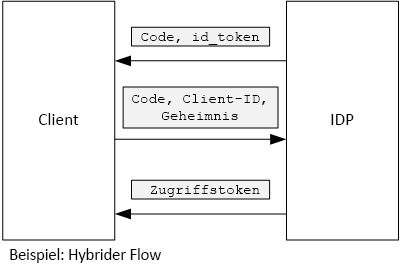

# <a name="use-client-assertion-to-get-access-tokens-from-azure-ad"></a>Abrufen von Zugriffstoken aus Azure AD mithilfe der Clientassertion

[-Beispielcode][sample application]

## <a name="background"></a>Hintergrund

Bei Verwendung des Autorisierungscode- oder Hybridvorgangs in OpenID Connect tauscht der Client einen Autorisierungscode gegen ein Zugriffstoken. In diesem Schritt muss der Client sich beim Server authentifizieren.



Eine Möglichkeit zum Authentifizieren des Clients bietet ein geheimer Clientschlüssel. So ist die [Tailspin Surveys][Surveys]-Anwendung standardmäßig konfiguriert.

In dieser Beispielanforderung fordert der Client vom Identitätsanbieter ein Zugriffstoken an. Beachten Sie den `client_secret` -Parameter.

```http
POST https://login.microsoftonline.com/b9bd2162xxx/oauth2/token HTTP/1.1
Content-Type: application/x-www-form-urlencoded

resource=https://tailspin.onmicrosoft.com/surveys.webapi
  &client_id=87df91dc-63de-4765-8701-b59cc8bd9e11
  &client_secret=i3Bf12Dn...
  &grant_type=authorization_code
  &code=PG8wJG6Y...
```

Der geheime Schlüssel ist nur eine Zeichenfolge, Sie müssen also sicherstellen, dass der Wert nicht versehentlich in falsche Hände gerät. Die beste Methode ist es, den geheimen Clientschlüssel aus der Quellcodeverwaltung herauszuhalten. Wenn Sie die App für Azure bereitstellen, speichern Sie den geheimen Schlüssel in einer [App-Einstellung][configure-web-app].

Allerdings kann jeder Benutzer mit Zugriff auf das Azure-Abonnement die App-Einstellungen anzeigen. Und es gibt immer die Versuchung, geheime Schlüssel in der Quellcodeverwaltung zu verwenden (z.B. in Bereitstellungsskripts), per E-Mail weiterzugeben usw.

Um die Sicherheit zu erhöhen, können Sie die [Clientassertion] anstelle eines geheimen Clientschlüssels verwenden. Bei der Clientassertion verwendet der Client ein X.509-Zertifikat zum Nachweis, dass die Anforderung des Tokens vom Client stammt. Das Clientzertifikat ist auf dem Webserver installiert. Im Allgemeinen ist es einfacher, den Zugriff auf das Zertifikat zu beschränken, anstatt sicherzustellen, dass niemand versehentlich einen geheimen Clientschlüssel preisgibt. Weitere Informationen zum Konfigurieren von Zertifikaten in einer Web-App finden Sie unter [Using Certificates in Azure Websites Applications][using-certs-in-websites] (Verwenden von Zertifikaten in Azure Websites-Anwendungen).

Hier eine Tokenanforderung mit Clientassertion:

```http
POST https://login.microsoftonline.com/b9bd2162xxx/oauth2/token HTTP/1.1
Content-Type: application/x-www-form-urlencoded

resource=https://tailspin.onmicrosoft.com/surveys.webapi
  &client_id=87df91dc-63de-4765-8701-b59cc8bd9e11
  &client_assertion_type=urn:ietf:params:oauth:client-assertion-type:jwt-bearer
  &client_assertion=eyJhbGci...
  &grant_type=authorization_code
  &code= PG8wJG6Y...
```

Beachten Sie, dass der Parameter `client_secret` nicht mehr verwendet wird. Stattdessen enthält der Parameter `client_assertion` ein JWT-Token, das mithilfe des Clientzertifikats signiert wurde. Der Parameter `client_assertion_type` gibt den Typ der Assertion an – in diesen Fall ein JWT-Token. Der Server überprüft das JWT-Token. Wenn das JWT-Token ungültig ist, gibt die Tokenanforderung einen Fehler zurück.

> [!NOTE]
> X.509-Zertifikate sind nicht die einzige Form der Clientassertion, aber wir konzentrieren uns an dieser Stelle darauf, weil diese Zertifikate von Azure AD unterstützt werden.

Zur Laufzeit liest die Webanwendung das Zertifikat aus dem Zertifikatspeicher. Das Zertifikat muss auf dem gleichen Computer wie die Web-App installiert sein.

Die Surveys-Anwendung enthält eine Hilfsklasse, die ein [ClientAssertionCertificate](/dotnet/api/microsoft.identitymodel.clients.activedirectory.clientassertioncertificate) erstellt, das Sie an die [AuthenticationContext.AcquireTokenSilentAsync](/dotnet/api/microsoft.identitymodel.clients.activedirectory.authenticationcontext.acquiretokensilentasync)-Methode übergeben können, um ein Token aus Azure AD abzurufen.

```csharp
public class CertificateCredentialService : ICredentialService
{
    private Lazy<Task<AdalCredential>> _credential;

    public CertificateCredentialService(IOptions<ConfigurationOptions> options)
    {
        var aadOptions = options.Value?.AzureAd;
        _credential = new Lazy<Task<AdalCredential>>(() =>
        {
            X509Certificate2 cert = CertificateUtility.FindCertificateByThumbprint(
                aadOptions.Asymmetric.StoreName,
                aadOptions.Asymmetric.StoreLocation,
                aadOptions.Asymmetric.CertificateThumbprint,
                aadOptions.Asymmetric.ValidationRequired);
            string password = null;
            var certBytes = CertificateUtility.ExportCertificateWithPrivateKey(cert, out password);
            return Task.FromResult(new AdalCredential(new ClientAssertionCertificate(aadOptions.ClientId, new X509Certificate2(certBytes, password))));
        });
    }

    public async Task<AdalCredential> GetCredentialsAsync()
    {
        return await _credential.Value;
    }
}
```

Informationen zum Einrichten einer Clientassertion in der Surveys-Anwendung finden Sie unter [Verwenden von Azure Key Vault zum Schützen von Anwendungsgeheimnissen][key vault].

[**Weiter**][key vault]

<!-- links -->

[configure-web-app]: /azure/app-service-web/web-sites-configure/
[azure-management-portal]: https://portal.azure.com
[Clientassertion]: https://tools.ietf.org/html/rfc7521
[key vault]: key-vault.md
[Setup-KeyVault]: https://github.com/mspnp/multitenant-saas-guidance/blob/master/scripts/Setup-KeyVault.ps1
[Surveys]: tailspin.md
[using-certs-in-websites]: https://azure.microsoft.com/blog/using-certificates-in-azure-websites-applications/

[sample application]: https://github.com/mspnp/multitenant-saas-guidance
