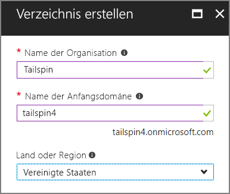
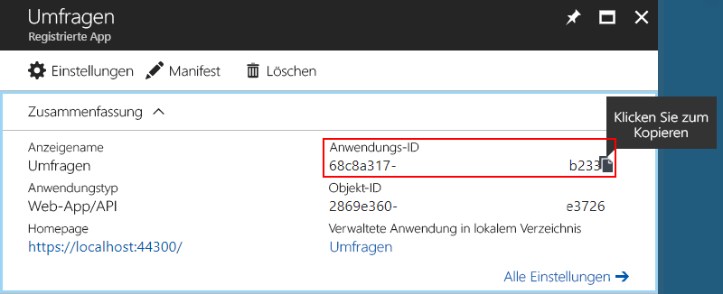
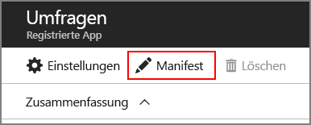
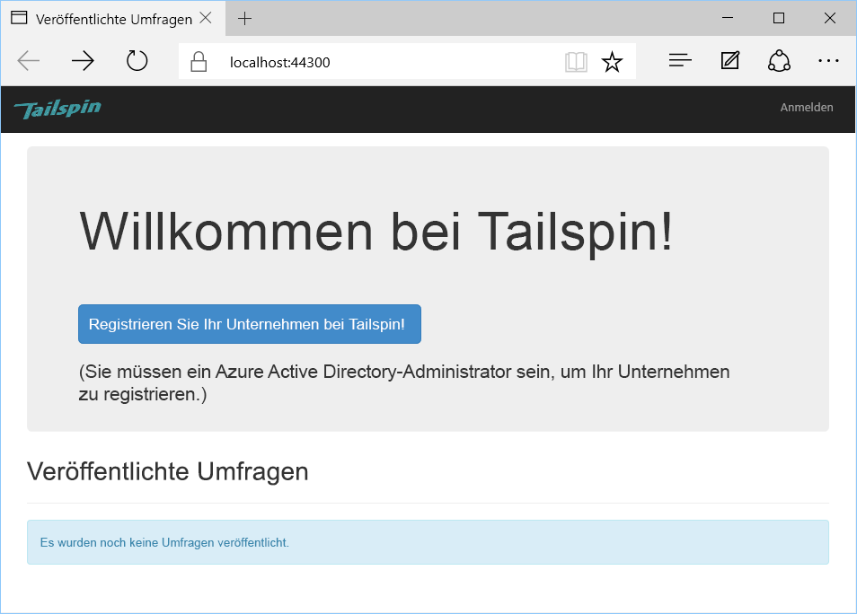
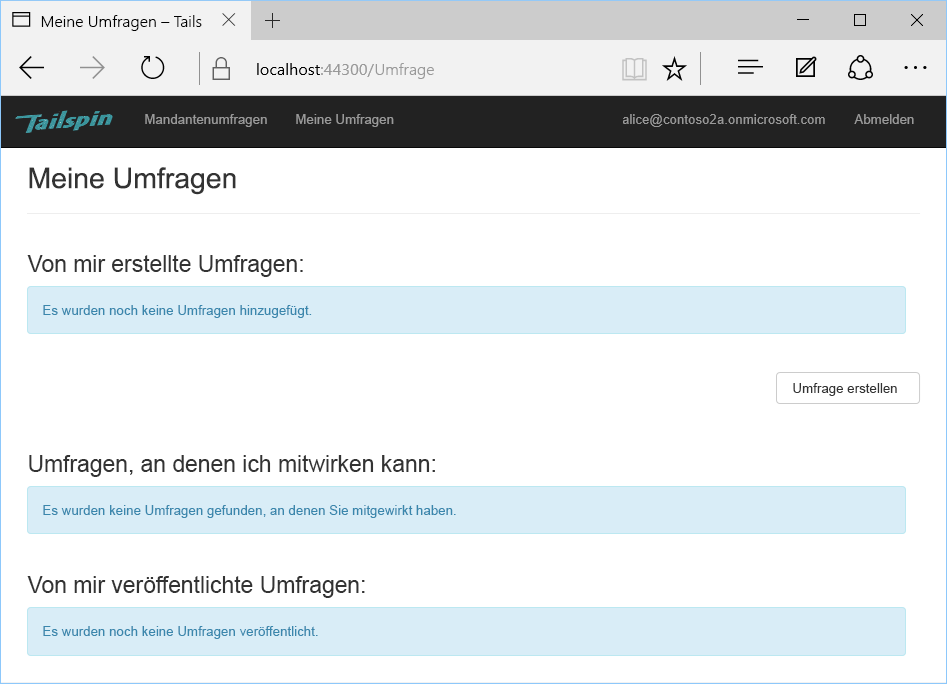

# <a name="run-the-surveys-application"></a><span data-ttu-id="152bc-103">Ausführen der Surveys-Anwendung</span><span class="sxs-lookup"><span data-stu-id="152bc-103">Run the Surveys application</span></span>

<span data-ttu-id="152bc-104">In diesem Artikel wird beschrieben, wie Sie die Anwendung [Tailspin Surveys](./tailspin.md) über Visual Studio lokal ausführen.</span><span class="sxs-lookup"><span data-stu-id="152bc-104">This article describes how to run the [Tailspin Surveys](./tailspin.md) application locally, from Visual Studio.</span></span> <span data-ttu-id="152bc-105">In diesen Schritten wird die Anwendung nicht in Azure bereitgestellt.</span><span class="sxs-lookup"><span data-stu-id="152bc-105">In these steps, you won't deploy the application to Azure.</span></span> <span data-ttu-id="152bc-106">Sie müssen jedoch einige Azure-Ressourcen erstellen: ein Azure AD-Verzeichnis (Azure Active Directory) und einen Redis Cache.</span><span class="sxs-lookup"><span data-stu-id="152bc-106">However, you will need to create some Azure resources &mdash; an Azure Active Directory (Azure AD) directory and a Redis cache.</span></span>

<span data-ttu-id="152bc-107">Zusammenfassung der Schritte:</span><span class="sxs-lookup"><span data-stu-id="152bc-107">Here is a summary of the steps:</span></span>

1. <span data-ttu-id="152bc-108">Erstellen Sie ein Azure AD-Verzeichnis (Mandant) für das fiktive Unternehmen Tailspin.</span><span class="sxs-lookup"><span data-stu-id="152bc-108">Create an Azure AD directory (tenant) for the fictitious Tailspin company.</span></span>
2. <span data-ttu-id="152bc-109">Registrieren Sie die Surveys-Anwendung und die Back-End-Web-API bei Azure AD.</span><span class="sxs-lookup"><span data-stu-id="152bc-109">Register the Surveys application and the backend web API with Azure AD.</span></span>
3. <span data-ttu-id="152bc-110">Erstellen Sie eine Instanz von Azure Redis Cache.</span><span class="sxs-lookup"><span data-stu-id="152bc-110">Create an Azure Redis Cache instance.</span></span>
4. <span data-ttu-id="152bc-111">Konfigurieren Sie die Anwendungseinstellungen, und erstellen Sie eine lokale Datenbank.</span><span class="sxs-lookup"><span data-stu-id="152bc-111">Configure application settings and create a local database.</span></span>
5. <span data-ttu-id="152bc-112">Führen Sie die Anwendung aus, und registrieren Sie einen neuen Mandanten.</span><span class="sxs-lookup"><span data-stu-id="152bc-112">Run the application and sign up a new tenant.</span></span>
6. <span data-ttu-id="152bc-113">Fügen Sie Benutzern Anwendungsrollen hinzu.</span><span class="sxs-lookup"><span data-stu-id="152bc-113">Add application roles to users.</span></span>

## <a name="prerequisites"></a><span data-ttu-id="152bc-114">Voraussetzungen</span><span class="sxs-lookup"><span data-stu-id="152bc-114">Prerequisites</span></span>
-   <span data-ttu-id="152bc-115">[Visual Studio 2017][VS2017]</span><span class="sxs-lookup"><span data-stu-id="152bc-115">[Visual Studio 2017][VS2017]</span></span>
-   <span data-ttu-id="152bc-116">[Microsoft Azure](https://azure.microsoft.com)-Konto</span><span class="sxs-lookup"><span data-stu-id="152bc-116">[Microsoft Azure](https://azure.microsoft.com) account</span></span>

## <a name="create-the-tailspin-tenant"></a><span data-ttu-id="152bc-117">Erstellen des Tailspin-Mandanten</span><span class="sxs-lookup"><span data-stu-id="152bc-117">Create the Tailspin tenant</span></span>

<span data-ttu-id="152bc-118">Tailspin ist das fiktive Unternehmen, das die Surveys-Anwendung hostet.</span><span class="sxs-lookup"><span data-stu-id="152bc-118">Tailspin is the fictitious company that hosts the Surveys application.</span></span> <span data-ttu-id="152bc-119">Tailspin verwendet Azure AD, um anderen Mandanten das Registrieren bei der App zu ermöglichen.</span><span class="sxs-lookup"><span data-stu-id="152bc-119">Tailspin uses Azure AD to enable other tenants to register with the app.</span></span> <span data-ttu-id="152bc-120">Diese Kunden können sich dann mit ihren Azure AD-Anmeldeinformationen bei der App registrieren.</span><span class="sxs-lookup"><span data-stu-id="152bc-120">Those customers can then use their Azure AD credentials to sign into the app.</span></span>

<span data-ttu-id="152bc-121">In diesem Schritt erstellen Sie ein Azure AD-Verzeichnis für Tailspin.</span><span class="sxs-lookup"><span data-stu-id="152bc-121">In this step, you'll create an Azure AD directory for Tailspin.</span></span>

1. <span data-ttu-id="152bc-122">Melden Sie sich beim [Azure-Portal][portal] an.</span><span class="sxs-lookup"><span data-stu-id="152bc-122">Sign into the [Azure portal][portal].</span></span>

2. <span data-ttu-id="152bc-123">Klicken Sie auf **Neu** > **Sicherheit und Identität** > **Azure Active Directory**.</span><span class="sxs-lookup"><span data-stu-id="152bc-123">Click **New** > **Security + Identity** > **Azure Active Directory**.</span></span>

3. <span data-ttu-id="152bc-124">Geben Sie für den Organisationsnamen `Tailspin` ein, und geben Sie einen Domänennamen ein.</span><span class="sxs-lookup"><span data-stu-id="152bc-124">Enter `Tailspin` for the organization name, and enter a domain name.</span></span> <span data-ttu-id="152bc-125">Der Domänenname hat das Format `xxxx.onmicrosoft.com` und muss global eindeutig sein.</span><span class="sxs-lookup"><span data-stu-id="152bc-125">The domain name will have the form `xxxx.onmicrosoft.com` and must be globally unique.</span></span> 

    

4. <span data-ttu-id="152bc-126">Klicken Sie auf **Create**.</span><span class="sxs-lookup"><span data-stu-id="152bc-126">Click **Create**.</span></span> <span data-ttu-id="152bc-127">Die Erstellung des neuen Verzeichnisses kann einige Minuten dauern.</span><span class="sxs-lookup"><span data-stu-id="152bc-127">It may take a few minutes to create the new directory.</span></span>

<span data-ttu-id="152bc-128">Zum Abschließen des End-to-End-Szenarios benötigen Sie ein zweites Azure AD-Verzeichnis, das einen Kunden darstellt, der sich für die Anwendung registriert.</span><span class="sxs-lookup"><span data-stu-id="152bc-128">To complete the end-to-end scenario, you'll need a second Azure AD directory to represent a customer that signs up for the application.</span></span> <span data-ttu-id="152bc-129">Sie können Ihr Azure AD-Standardverzeichnis (nicht Tailspin) verwenden oder für diesen Zweck ein neues Verzeichnis erstellen.</span><span class="sxs-lookup"><span data-stu-id="152bc-129">You can use your default Azure AD directory (not Tailspin), or create a new directory for this purpose.</span></span> <span data-ttu-id="152bc-130">In den Beispielen verwenden wir als fiktiven Kunden Contoso.</span><span class="sxs-lookup"><span data-stu-id="152bc-130">In the examples, we use Contoso as the fictitious customer.</span></span>

## <a name="register-the-surveys-web-api"></a><span data-ttu-id="152bc-131">Registrieren der Surveys-Web-API</span><span class="sxs-lookup"><span data-stu-id="152bc-131">Register the Surveys web API</span></span> 

1. <span data-ttu-id="152bc-132">Wechseln Sie im [Azure-Portal][portal] zu dem neuen Tailspin-Verzeichnis, indem Sie in der rechten oberen Ecke des Portals Ihr Konto auswählen.</span><span class="sxs-lookup"><span data-stu-id="152bc-132">In the [Azure portal][portal], switch to the new Tailspin directory by selecting your account in the top right corner of the portal.</span></span>

2. <span data-ttu-id="152bc-133">Wählen Sie im linken Navigationsbereich **Azure Active Directory** aus.</span><span class="sxs-lookup"><span data-stu-id="152bc-133">In the left-hand navigation pane, choose **Azure Active Directory**.</span></span> 

3. <span data-ttu-id="152bc-134">Klicken Sie auf **App-Registrierungen** > **Registrierung einer neuen Anwendung**.</span><span class="sxs-lookup"><span data-stu-id="152bc-134">Click **App registrations** > **New application registration**.</span></span>

4. <span data-ttu-id="152bc-135">Geben Sie auf dem Blatt **Erstellen** die folgenden Informationen ein:</span><span class="sxs-lookup"><span data-stu-id="152bc-135">In the **Create** blade, enter the following information:</span></span>

   - <span data-ttu-id="152bc-136">**Name**: `Surveys.WebAPI`</span><span class="sxs-lookup"><span data-stu-id="152bc-136">**Name**: `Surveys.WebAPI`</span></span>

   - <span data-ttu-id="152bc-137">**Anwendungstyp:**: `Web app / API`</span><span class="sxs-lookup"><span data-stu-id="152bc-137">**Application type**: `Web app / API`</span></span>

   - <span data-ttu-id="152bc-138">**Anmelde-URL**: `https://localhost:44301/`</span><span class="sxs-lookup"><span data-stu-id="152bc-138">**Sign-on URL**: `https://localhost:44301/`</span></span>
   
    

5. <span data-ttu-id="152bc-139">Klicken Sie auf **Create**.</span><span class="sxs-lookup"><span data-stu-id="152bc-139">Click **Create**.</span></span>

6. <span data-ttu-id="152bc-140">Wählen Sie im Blatt **App-Registrierungen** die neue Anwendung **Surveys.WebAPI** aus.</span><span class="sxs-lookup"><span data-stu-id="152bc-140">In the **App registrations** blade, select the new **Surveys.WebAPI** application.</span></span>
 
7. <span data-ttu-id="152bc-141">Klicken Sie auf **Eigenschaften**.</span><span class="sxs-lookup"><span data-stu-id="152bc-141">Click **Properties**.</span></span>

8. <span data-ttu-id="152bc-142">Geben Sie im Bearbeitungsfeld **App-ID-URI** `https://<domain>/surveys.webapi` ein, wobei `<domain>` der Domänenname des Verzeichnisses ist.</span><span class="sxs-lookup"><span data-stu-id="152bc-142">In the **App ID URI** edit box, enter `https://<domain>/surveys.webapi`, where `<domain>` is the domain name of the directory.</span></span> <span data-ttu-id="152bc-143">Beispiel: `https://tailspin.onmicrosoft.com/surveys.webapi`</span><span class="sxs-lookup"><span data-stu-id="152bc-143">For example: `https://tailspin.onmicrosoft.com/surveys.webapi`</span></span>

    

9. <span data-ttu-id="152bc-145">Legen Sie **Mehrinstanzenfähig** auf **JA** fest.</span><span class="sxs-lookup"><span data-stu-id="152bc-145">Set **Multi-tenanted** to **YES**.</span></span>

10. <span data-ttu-id="152bc-146">Klicken Sie auf **Speichern**.</span><span class="sxs-lookup"><span data-stu-id="152bc-146">Click **Save**.</span></span>

## <a name="register-the-surveys-web-app"></a><span data-ttu-id="152bc-147">Registrieren der Surveys-Web-App</span><span class="sxs-lookup"><span data-stu-id="152bc-147">Register the Surveys web app</span></span> 

1. <span data-ttu-id="152bc-148">Kehren Sie zum Blatt **App-Registrierungen** zurück, und klicken Sie auf **Registrierung einer neuen Anwendung**.</span><span class="sxs-lookup"><span data-stu-id="152bc-148">Navigate back to the **App registrations** blade, and click **New application registration**.</span></span>

2. <span data-ttu-id="152bc-149">Geben Sie auf dem Blatt **Erstellen** die folgenden Informationen ein:</span><span class="sxs-lookup"><span data-stu-id="152bc-149">In the **Create** blade, enter the following information:</span></span>

   - <span data-ttu-id="152bc-150">**Name**: `Surveys`</span><span class="sxs-lookup"><span data-stu-id="152bc-150">**Name**: `Surveys`</span></span>
   - <span data-ttu-id="152bc-151">**Anwendungstyp:**: `Web app / API`</span><span class="sxs-lookup"><span data-stu-id="152bc-151">**Application type**: `Web app / API`</span></span>
   - <span data-ttu-id="152bc-152">**Anmelde-URL**: `https://localhost:44300/`</span><span class="sxs-lookup"><span data-stu-id="152bc-152">**Sign-on URL**: `https://localhost:44300/`</span></span>
   
   <span data-ttu-id="152bc-153">Beachten Sie, dass die Anmelde-URL eine andere Portnummer als die `Surveys.WebAPI`-App im vorherigen Schritt enthält.</span><span class="sxs-lookup"><span data-stu-id="152bc-153">Notice that the sign-on URL has a different port number from the `Surveys.WebAPI` app in the previous step.</span></span>

3. <span data-ttu-id="152bc-154">Klicken Sie auf **Create**.</span><span class="sxs-lookup"><span data-stu-id="152bc-154">Click **Create**.</span></span>
 
4. <span data-ttu-id="152bc-155">Wählen Sie im Blatt **App-Registrierungen** die neue Anwendung **Surveys** aus.</span><span class="sxs-lookup"><span data-stu-id="152bc-155">In the **App registrations** blade, select the new **Surveys** application.</span></span>
 
5. <span data-ttu-id="152bc-156">Kopieren Sie die Anwendungs-ID.</span><span class="sxs-lookup"><span data-stu-id="152bc-156">Copy the application ID.</span></span> <span data-ttu-id="152bc-157">Sie benötigen sie später.</span><span class="sxs-lookup"><span data-stu-id="152bc-157">You will need this later.</span></span>

    

6. <span data-ttu-id="152bc-158">Klicken Sie auf **Eigenschaften**.</span><span class="sxs-lookup"><span data-stu-id="152bc-158">Click **Properties**.</span></span>

7. <span data-ttu-id="152bc-159">Geben Sie im Bearbeitungsfeld **App-ID-URI** `https://<domain>/surveys` ein, wobei `<domain>` der Domänenname des Verzeichnisses ist.</span><span class="sxs-lookup"><span data-stu-id="152bc-159">In the **App ID URI** edit box, enter `https://<domain>/surveys`, where `<domain>` is the domain name of the directory.</span></span> 

    

8. <span data-ttu-id="152bc-161">Legen Sie **Mehrinstanzenfähig** auf **JA** fest.</span><span class="sxs-lookup"><span data-stu-id="152bc-161">Set **Multi-tenanted** to **YES**.</span></span>

9. <span data-ttu-id="152bc-162">Klicken Sie auf **Speichern**.</span><span class="sxs-lookup"><span data-stu-id="152bc-162">Click **Save**.</span></span>

10. <span data-ttu-id="152bc-163">Klicken Sie auf dem Blatt **Einstellungen** auf **Antwort-URLs**.</span><span class="sxs-lookup"><span data-stu-id="152bc-163">In the **Settings** blade, click **Reply URLs**.</span></span>
 
11. <span data-ttu-id="152bc-164">Fügen Sie die folgende Antwort-URL hinzu: `https://localhost:44300/signin-oidc`.</span><span class="sxs-lookup"><span data-stu-id="152bc-164">Add the following reply URL: `https://localhost:44300/signin-oidc`.</span></span>

12. <span data-ttu-id="152bc-165">Klicken Sie auf **Speichern**.</span><span class="sxs-lookup"><span data-stu-id="152bc-165">Click **Save**.</span></span>

13. <span data-ttu-id="152bc-166">Klicken Sie unter **API-ZUGRIFF** auf **Schlüssel**.</span><span class="sxs-lookup"><span data-stu-id="152bc-166">Under **API ACCESS**, click **Keys**.</span></span>

14. <span data-ttu-id="152bc-167">Geben Sie eine Beschreibung ein, z.B. `client secret`.</span><span class="sxs-lookup"><span data-stu-id="152bc-167">Enter a description, such as `client secret`.</span></span>

15. <span data-ttu-id="152bc-168">Wählen Sie in der Dropdownliste **Dauer auswählen** den Eintrag **1 Jahr** aus.</span><span class="sxs-lookup"><span data-stu-id="152bc-168">In the **Select Duration** dropdown, select **1 year**.</span></span> 

16. <span data-ttu-id="152bc-169">Klicken Sie auf **Speichern**.</span><span class="sxs-lookup"><span data-stu-id="152bc-169">Click **Save**.</span></span> <span data-ttu-id="152bc-170">Beim Speichern wird der Schlüssel generiert.</span><span class="sxs-lookup"><span data-stu-id="152bc-170">The key will be generated when you save.</span></span>

17. <span data-ttu-id="152bc-171">Bevor Sie dieses Blatt verlassen, kopieren Sie den Wert des Schlüssels.</span><span class="sxs-lookup"><span data-stu-id="152bc-171">Before you navigate away from this blade, copy the value of the key.</span></span>

    > [!NOTE] 
    > <span data-ttu-id="152bc-172">Nachdem Sie das Blatt verlassen haben, wird der Schlüssel nicht mehr angezeigt.</span><span class="sxs-lookup"><span data-stu-id="152bc-172">The key won't be visible again after you navigate away from the blade.</span></span> 

18. <span data-ttu-id="152bc-173">Klicken Sie unter **API-ZUGRIFF** auf **Erforderliche Berechtigungen**.</span><span class="sxs-lookup"><span data-stu-id="152bc-173">Under **API ACCESS**, click **Required permissions**.</span></span>

19. <span data-ttu-id="152bc-174">Klicken Sie auf **Hinzufügen** > **Hiermit wählen Sie eine API aus**.</span><span class="sxs-lookup"><span data-stu-id="152bc-174">Click **Add** > **Select an API**.</span></span>

20. <span data-ttu-id="152bc-175">Suchen Sie im Suchfeld nach `Surveys.WebAPI`.</span><span class="sxs-lookup"><span data-stu-id="152bc-175">In the search box, search for `Surveys.WebAPI`.</span></span>

    

21. <span data-ttu-id="152bc-177">Wählen Sie `Surveys.WebAPI` aus, und klicken Sie auf **Auswählen**.</span><span class="sxs-lookup"><span data-stu-id="152bc-177">Select `Surveys.WebAPI` and click **Select**.</span></span>

22. <span data-ttu-id="152bc-178">Aktivieren Sie unter **Delegierte Berechtigungen** das Kontrollkästchen **Auf Surveys.WebAPI zugreifen**.</span><span class="sxs-lookup"><span data-stu-id="152bc-178">Under **Delegated Permissions**, check **Access Surveys.WebAPI**.</span></span>

    

23. <span data-ttu-id="152bc-180">Klicken Sie auf **Auswählen** > **Fertig**.</span><span class="sxs-lookup"><span data-stu-id="152bc-180">Click **Select** > **Done**.</span></span>


## <a name="update-the-application-manifests"></a><span data-ttu-id="152bc-181">Aktualisieren des Anwendungsmanifests</span><span class="sxs-lookup"><span data-stu-id="152bc-181">Update the application manifests</span></span>

1. <span data-ttu-id="152bc-182">Kehren Sie zum Blatt **Einstellungen** für die `Surveys.WebAPI`-App zurück.</span><span class="sxs-lookup"><span data-stu-id="152bc-182">Navigate back to the **Settings** blade for the `Surveys.WebAPI` app.</span></span>

2. <span data-ttu-id="152bc-183">Klicken Sie auf **Manifest** > **Bearbeiten**.</span><span class="sxs-lookup"><span data-stu-id="152bc-183">Click **Manifest** > **Edit**.</span></span>

    
 
3. <span data-ttu-id="152bc-184">Fügen Sie dem `appRoles`-Element den folgenden JSON-Code hinzu.</span><span class="sxs-lookup"><span data-stu-id="152bc-184">Add the following JSON to the `appRoles` element.</span></span> <span data-ttu-id="152bc-185">Generieren Sie für die `id`-Eigenschaften neue GUIDs.</span><span class="sxs-lookup"><span data-stu-id="152bc-185">Generate new GUIDs for the `id` properties.</span></span>

   ```json
   {
     "allowedMemberTypes": ["User"],
     "description": "Creators can create surveys",
     "displayName": "SurveyCreator",
     "id": "<Generate a new GUID. Example: 1b4f816e-5eaf-48b9-8613-7923830595ad>",
     "isEnabled": true,
     "value": "SurveyCreator"
   },
   {
     "allowedMemberTypes": ["User"],
     "description": "Administrators can manage the surveys in their tenant",
     "displayName": "SurveyAdmin",
     "id": "<Generate a new GUID>",  
     "isEnabled": true,
     "value": "SurveyAdmin"
   }
   ```

4. <span data-ttu-id="152bc-186">Fügen Sie in der `knownClientApplications`-Eigenschaft die Anwendungs-ID für die Surveys-Webanwendung hinzu, die Sie zuvor beim Registrieren der Surveys-Anwendung erhalten haben.</span><span class="sxs-lookup"><span data-stu-id="152bc-186">In the `knownClientApplications` property, add the application ID for the Surveys web application, which you got when you registered the Surveys application earlier.</span></span> <span data-ttu-id="152bc-187">Beispiel: </span><span class="sxs-lookup"><span data-stu-id="152bc-187">For example:</span></span>

   ```json
   "knownClientApplications": ["be2cea23-aa0e-4e98-8b21-2963d494912e"],
   ```

   <span data-ttu-id="152bc-188">Durch diese Einstellung wird die Surveys-App der Liste der Clients hinzugefügt, die zum Aufrufen der Web-API berechtigt sind.</span><span class="sxs-lookup"><span data-stu-id="152bc-188">This setting adds the Surveys app to the list of clients authorized to call the web API.</span></span>

5. <span data-ttu-id="152bc-189">Klicken Sie auf **Speichern**.</span><span class="sxs-lookup"><span data-stu-id="152bc-189">Click **Save**.</span></span>

<span data-ttu-id="152bc-190">Wiederholen Sie jetzt die gleichen Schritte für die Surveys-App, fügen Sie jedoch keinen Eintrag für `knownClientApplications` hinzu.</span><span class="sxs-lookup"><span data-stu-id="152bc-190">Now repeat the same steps for the Surveys app, except do not add an entry for `knownClientApplications`.</span></span> <span data-ttu-id="152bc-191">Verwenden Sie die gleichen Rollendefinitionen, generieren Sie jedoch für die IDs neue GUIDs.</span><span class="sxs-lookup"><span data-stu-id="152bc-191">Use the same role definitions, but generate new GUIDs for the IDs.</span></span>

## <a name="create-a-new-redis-cache-instance"></a><span data-ttu-id="152bc-192">Erstellen einer neuen Instanz von Redis Cache</span><span class="sxs-lookup"><span data-stu-id="152bc-192">Create a new Redis Cache instance</span></span>

<span data-ttu-id="152bc-193">Die Surveys-Anwendung verwendet zum Zwischenspeichern von OAuth 2-Zugriffstoken Redis.</span><span class="sxs-lookup"><span data-stu-id="152bc-193">The Surveys application uses Redis to cache OAuth 2 access tokens.</span></span> <span data-ttu-id="152bc-194">So erstellen Sie den Cache:</span><span class="sxs-lookup"><span data-stu-id="152bc-194">To create the cache:</span></span>

1.  <span data-ttu-id="152bc-195">Wechseln Sie zum [Azure-Portal](https://portal.azure.com), und klicken Sie auf **Neu** > **Datenbanken** > **Redis Cache**.</span><span class="sxs-lookup"><span data-stu-id="152bc-195">Go to [Azure Portal](https://portal.azure.com) and click **New** > **Databases** > **Redis Cache**.</span></span>

2.  <span data-ttu-id="152bc-196">Geben Sie die erforderlichen Informationen, einschließlich DNS-Name, Ressourcengruppe, Standort und Tarif, ein.</span><span class="sxs-lookup"><span data-stu-id="152bc-196">Fill in the required information, including DNS name, resource group, location, and pricing tier.</span></span> <span data-ttu-id="152bc-197">Sie können eine neue Ressourcengruppe erstellen oder eine vorhandene Ressourcengruppe verwenden.</span><span class="sxs-lookup"><span data-stu-id="152bc-197">You can create a new resource group or use an existing resource group.</span></span>

3. <span data-ttu-id="152bc-198">Klicken Sie auf **Create**.</span><span class="sxs-lookup"><span data-stu-id="152bc-198">Click **Create**.</span></span>

4. <span data-ttu-id="152bc-199">Nachdem der Redis Cache erstellt wurde, navigieren Sie zu der Ressource im Portal.</span><span class="sxs-lookup"><span data-stu-id="152bc-199">After the Resis cache is created, navigate to the resource in the portal.</span></span>

5. <span data-ttu-id="152bc-200">Klicken Sie auf **Zugriffsschlüssel**, und kopieren Sie den Primärschlüssel.</span><span class="sxs-lookup"><span data-stu-id="152bc-200">Click **Access keys** and copy the primary key.</span></span>

<span data-ttu-id="152bc-201">Weitere Informationen über das Erstellen eines Redis Cache finden Sie unter [Verwenden von Azure Redis Cache](/azure/redis-cache/cache-dotnet-how-to-use-azure-redis-cache).</span><span class="sxs-lookup"><span data-stu-id="152bc-201">For more information about creating a Redis cache, see [How to Use Azure Redis Cache](/azure/redis-cache/cache-dotnet-how-to-use-azure-redis-cache).</span></span>

## <a name="set-application-secrets"></a><span data-ttu-id="152bc-202">Festlegen von Anwendungsgeheimnissen</span><span class="sxs-lookup"><span data-stu-id="152bc-202">Set application secrets</span></span>

1.  <span data-ttu-id="152bc-203">Öffnen Sie in Visual Studio die Projektmappe „Tailspin.Surveys“.</span><span class="sxs-lookup"><span data-stu-id="152bc-203">Open the Tailspin.Surveys solution in Visual Studio.</span></span>

2.  <span data-ttu-id="152bc-204">Klicken Sie im Projektmappen-Explorer mit der rechten Maustaste auf das Tailspin.Surveys.Web-Projekt, und wählen Sie **Benutzerschlüssel verwalten**.</span><span class="sxs-lookup"><span data-stu-id="152bc-204">In Solution Explorer, right-click the Tailspin.Surveys.Web project and select **Manage User Secrets**.</span></span>

3.  <span data-ttu-id="152bc-205">Fügen Sie in der Datei „secrets.json“ Folgendes ein:</span><span class="sxs-lookup"><span data-stu-id="152bc-205">In the secrets.json file, paste in the following:</span></span>
    
    ```json
    {
      "AzureAd": {
        "ClientId": "<Surveys application ID>",
        "ClientSecret": "<Surveys app client secret>",
        "PostLogoutRedirectUri": "https://localhost:44300/",
        "WebApiResourceId": "<Surveys.WebAPI app ID URI>"
      },
      "Redis": {
        "Configuration": "<Redis DNS name>.redis.cache.windows.net,password=<Redis primary key>,ssl=true"
      }
    }
    ```
   
    <span data-ttu-id="152bc-206">Ersetzen Sie die Elemente in spitzen Klammern wie folgt:</span><span class="sxs-lookup"><span data-stu-id="152bc-206">Replace the items shown in angle brackets, as follows:</span></span>

    - <span data-ttu-id="152bc-207">`AzureAd:ClientId`: Die Anwendungs-ID der Surveys-App.</span><span class="sxs-lookup"><span data-stu-id="152bc-207">`AzureAd:ClientId`: The application ID of the Surveys app.</span></span>
    - <span data-ttu-id="152bc-208">`AzureAd:ClientSecret`: der Schlüssel, der generiert wurde, als Sie die Surveys-Anwendung in Azure AD registriert haben</span><span class="sxs-lookup"><span data-stu-id="152bc-208">`AzureAd:ClientSecret`: The key that you generated when you registered the Surveys application in Azure AD.</span></span>
    - <span data-ttu-id="152bc-209">`AzureAd:WebApiResourceId`: der App-ID-URI, den Sie angegeben haben, als Sie die Surveys.WebAPI-Anwendung in Azure AD erstellt haben</span><span class="sxs-lookup"><span data-stu-id="152bc-209">`AzureAd:WebApiResourceId`: The App ID URI that you specified when you created the Surveys.WebAPI application in Azure AD.</span></span> <span data-ttu-id="152bc-210">Er muss das Format `https://<directory>.onmicrosoft.com/surveys.webapi` aufweisen.</span><span class="sxs-lookup"><span data-stu-id="152bc-210">It should have the form `https://<directory>.onmicrosoft.com/surveys.webapi`</span></span>
    - <span data-ttu-id="152bc-211">`Redis:Configuration`: Erstellen Sie diese Zeichenfolge aus dem DNS-Namen des Redis Cache und dem primären Zugriffsschlüssel.</span><span class="sxs-lookup"><span data-stu-id="152bc-211">`Redis:Configuration`: Build this string from the DNS name of the Redis cache and the primary access key.</span></span> <span data-ttu-id="152bc-212">Beispiel: „tailspin.redis.cache.windows.net,password=2h5tBxxx,ssl=true“.</span><span class="sxs-lookup"><span data-stu-id="152bc-212">For example, "tailspin.redis.cache.windows.net,password=2h5tBxxx,ssl=true".</span></span>

4.  <span data-ttu-id="152bc-213">Speichern Sie die aktualisierte secrets.json-Datei.</span><span class="sxs-lookup"><span data-stu-id="152bc-213">Save the updated secrets.json file.</span></span>

5.  <span data-ttu-id="152bc-214">Wiederholen Sie diese Schritte für das Projekt „Tailspin.Surveys.WebAPI“, fügen Sie jedoch in „secrets.json“ den folgenden Code ein.</span><span class="sxs-lookup"><span data-stu-id="152bc-214">Repeat these steps for the Tailspin.Surveys.WebAPI project, but paste the following into secrets.json.</span></span> <span data-ttu-id="152bc-215">Ersetzen Sie wie zuvor die Elemente in spitzen Klammern.</span><span class="sxs-lookup"><span data-stu-id="152bc-215">Replace the items in angle brackets, as before.</span></span>

    ```json
    {
      "AzureAd": {
        "WebApiResourceId": "<Surveys.WebAPI app ID URI>"
      },
      "Redis": {
        "Configuration": "<Redis DNS name>.redis.cache.windows.net,password=<Redis primary key>,ssl=true"
      }
    }
    ```

## <a name="initialize-the-database"></a><span data-ttu-id="152bc-216">Initialisieren der Datenbank</span><span class="sxs-lookup"><span data-stu-id="152bc-216">Initialize the database</span></span>

<span data-ttu-id="152bc-217">In diesem Schritt verwenden Sie Entity Framework 7, um mithilfe von LocalDB eine lokale SQL-Datenbank zu erstellen.</span><span class="sxs-lookup"><span data-stu-id="152bc-217">In this step, you will use Entity Framework 7 to create a local SQL database, using LocalDB.</span></span>

1.  <span data-ttu-id="152bc-218">Öffnen Sie ein Befehlsfenster.</span><span class="sxs-lookup"><span data-stu-id="152bc-218">Open a command window</span></span>

2.  <span data-ttu-id="152bc-219">Navigieren Sie zum Projekt „Tailspin.Surveys.Data“.</span><span class="sxs-lookup"><span data-stu-id="152bc-219">Navigate to the Tailspin.Surveys.Data project.</span></span>

3.  <span data-ttu-id="152bc-220">Führen Sie den folgenden Befehl aus:</span><span class="sxs-lookup"><span data-stu-id="152bc-220">Run the following command:</span></span>

    ```
    dotnet ef database update --startup-project ..\Tailspin.Surveys.Web
    ```
    
## <a name="run-the-application"></a><span data-ttu-id="152bc-221">Ausführen der Anwendung</span><span class="sxs-lookup"><span data-stu-id="152bc-221">Run the application</span></span>

<span data-ttu-id="152bc-222">Starten Sie zum Ausführen der Anwendung die Projekte „Tailspin.Surveys.Web“ und „Tailspin.Surveys.WebAPI“.</span><span class="sxs-lookup"><span data-stu-id="152bc-222">To run the application, start both the Tailspin.Surveys.Web and Tailspin.Surveys.WebAPI projects.</span></span>

<span data-ttu-id="152bc-223">Sie können in Visual Studio wie folgt festlegen, dass durch Drücken von F5 beide Projekte automatisch ausgeführt werden:</span><span class="sxs-lookup"><span data-stu-id="152bc-223">You can set Visual Studio to run both projects automatically on F5, as follows:</span></span>

1.  <span data-ttu-id="152bc-224">Klicken Sie im Projektmappen-Explorer mit der rechten Maustaste auf die Projektmappe, und klicken Sie auf **Startprojekte festlegen**.</span><span class="sxs-lookup"><span data-stu-id="152bc-224">In Solution Explorer, right-click the solution and click **Set Startup Projects**.</span></span>
2.  <span data-ttu-id="152bc-225">Wählen Sie **Mehrere Startprojekte** aus.</span><span class="sxs-lookup"><span data-stu-id="152bc-225">Select **Multiple startup projects**.</span></span>
3.  <span data-ttu-id="152bc-226">Legen Sie für die Projekte „Tailspin.Surveys.Web“ und „Tailspin.Surveys.WebAPI“ **Aktion** = **Starten** fest.</span><span class="sxs-lookup"><span data-stu-id="152bc-226">Set **Action** = **Start** for the Tailspin.Surveys.Web and Tailspin.Surveys.WebAPI projects.</span></span>

## <a name="sign-up-a-new-tenant"></a><span data-ttu-id="152bc-227">Registrieren eines neuen Mandanten</span><span class="sxs-lookup"><span data-stu-id="152bc-227">Sign up a new tenant</span></span>

<span data-ttu-id="152bc-228">Da Sie beim Starten der Anwendung nicht angemeldet sind, wird die Homepage angezeigt:</span><span class="sxs-lookup"><span data-stu-id="152bc-228">When the application starts, you are not signed in, so you see the welcome page:</span></span>



<span data-ttu-id="152bc-230">So registrieren Sie eine Organisation:</span><span class="sxs-lookup"><span data-stu-id="152bc-230">To sign up an organization:</span></span>

1. <span data-ttu-id="152bc-231">Klicken Sie auf **Enroll your company in Tailspin** (Registrieren Sie Ihr Unternehmen in Tailspin).</span><span class="sxs-lookup"><span data-stu-id="152bc-231">Click **Enroll your company in Tailspin**.</span></span>
2. <span data-ttu-id="152bc-232">Melden Sie sich mit der Surveys-App bei dem Azure AD-Verzeichnis an, das die Organisation darstellt.</span><span class="sxs-lookup"><span data-stu-id="152bc-232">Sign in to the Azure AD directory that represents the organization using the Surveys app.</span></span> <span data-ttu-id="152bc-233">Sie müssen sich als Administratorbenutzer anmelden.</span><span class="sxs-lookup"><span data-stu-id="152bc-233">You must sign in as an admin user.</span></span>
3. <span data-ttu-id="152bc-234">Stimmen Sie der Zustimmungsaufforderung zu.</span><span class="sxs-lookup"><span data-stu-id="152bc-234">Accept the consent prompt.</span></span>

<span data-ttu-id="152bc-235">Die Anwendung registriert den Mandanten, und anschließend werden Sie abgemeldet. Sie werden von der App abgemeldet, da Sie vor dem Verwenden der Anwendung die Anwendungsrollen in Azure AD einrichten müssen.</span><span class="sxs-lookup"><span data-stu-id="152bc-235">The application registers the tenant, and then signs you out. The app signs you out because you need to set up the application roles in Azure AD, before using the application.</span></span>


## <a name="assign-application-roles"></a><span data-ttu-id="152bc-237">Zuweisen von Anwendungsrollen</span><span class="sxs-lookup"><span data-stu-id="152bc-237">Assign application roles</span></span>

<span data-ttu-id="152bc-238">Wenn sich ein Mandant registriert, muss ein AD-Administrator für den Mandanten Benutzern Anwendungsrollen zuweisen.</span><span class="sxs-lookup"><span data-stu-id="152bc-238">When a tenant signs up, an AD admin for the tenant must assign application roles to users.</span></span>


1. <span data-ttu-id="152bc-239">Wechseln Sie im [Azure-Portal][portal] zu dem Azure AD-Verzeichnis, das Sie zum Registrieren für die Surveys-App verwendet haben.</span><span class="sxs-lookup"><span data-stu-id="152bc-239">In the [Azure portal][portal], switch to the Azure AD directory that you used to sign up for the Surveys app.</span></span> 

2. <span data-ttu-id="152bc-240">Wählen Sie im linken Navigationsbereich **Azure Active Directory** aus.</span><span class="sxs-lookup"><span data-stu-id="152bc-240">In the left-hand navigation pane, choose **Azure Active Directory**.</span></span> 

3. <span data-ttu-id="152bc-241">Klicken Sie auf **Unternehmensanwendungen** > **Alle Anwendungen**.</span><span class="sxs-lookup"><span data-stu-id="152bc-241">Click **Enterprise applications** > **All applications**.</span></span> <span data-ttu-id="152bc-242">Im Portal werden `Survey` und `Survey.WebAPI` aufgelistet.</span><span class="sxs-lookup"><span data-stu-id="152bc-242">The portal will list `Survey` and `Survey.WebAPI`.</span></span> <span data-ttu-id="152bc-243">Wenn dies nicht der Fall ist, stellen Sie sicher, dass Sie den Registrierungsvorgang abgeschlossen haben.</span><span class="sxs-lookup"><span data-stu-id="152bc-243">If not, make sure that you completed the sign up process.</span></span>

4.  <span data-ttu-id="152bc-244">Klicken Sie auf die Surveys-Anwendung.</span><span class="sxs-lookup"><span data-stu-id="152bc-244">Click on the Surveys application.</span></span>

5.  <span data-ttu-id="152bc-245">Klicken Sie auf **Benutzer und Gruppen**.</span><span class="sxs-lookup"><span data-stu-id="152bc-245">Click **Users and Groups**.</span></span>

4.  <span data-ttu-id="152bc-246">Klicken Sie auf **Benutzer hinzufügen**.</span><span class="sxs-lookup"><span data-stu-id="152bc-246">Click **Add user**.</span></span>

5.  <span data-ttu-id="152bc-247">Wenn Sie über Azure AD Premium verfügen, klicken Sie auf **Benutzer und Gruppen**.</span><span class="sxs-lookup"><span data-stu-id="152bc-247">If you have Azure AD Premium, click **Users and groups**.</span></span> <span data-ttu-id="152bc-248">Klicken Sie andernfalls auf **Benutzer**.</span><span class="sxs-lookup"><span data-stu-id="152bc-248">Otherwise, click **Users**.</span></span> <span data-ttu-id="152bc-249">(Zum Zuweisen einer Rolle zu einer Gruppe ist Azure AD Premium erforderlich.)</span><span class="sxs-lookup"><span data-stu-id="152bc-249">(Assigning a role to a group requires Azure AD Premium.)</span></span>

6. <span data-ttu-id="152bc-250">Wählen Sie einen oder mehrere Benutzer aus, und klicken Sie auf **Auswählen**.</span><span class="sxs-lookup"><span data-stu-id="152bc-250">Select one or more users and click **Select**.</span></span>

    

6.  <span data-ttu-id="152bc-252">Wählen Sie die Rolle aus, und klicken Sie auf **Auswählen**.</span><span class="sxs-lookup"><span data-stu-id="152bc-252">Select the role and click **Select**.</span></span>

    

7.  <span data-ttu-id="152bc-254">Klicken Sie auf **Zuweisen**.</span><span class="sxs-lookup"><span data-stu-id="152bc-254">Click **Assign**.</span></span>

<span data-ttu-id="152bc-255">Wiederholen Sie die gleichen Schritte, um Rollen für die Survey.WebAPI-Anwendung zuzuweisen.</span><span class="sxs-lookup"><span data-stu-id="152bc-255">Repeat the same steps to assign roles for the Survey.WebAPI application.</span></span>

> <span data-ttu-id="152bc-256">Wichtig: Ein Benutzer sollte in der Survey-Anwendung und der Survey.WebAPI-Anwendung immer über die gleichen Rollen verfügen.</span><span class="sxs-lookup"><span data-stu-id="152bc-256">Important: A user should always have the same roles in both Survey and Survey.WebAPI.</span></span> <span data-ttu-id="152bc-257">Andernfalls verfügt der Benutzer über nicht übereinstimmende Berechtigungen, was zur Ausgabe des Fehlers 403 (Verboten) durch die Web-API führen kann.</span><span class="sxs-lookup"><span data-stu-id="152bc-257">Otherwise, the user will have inconsistent permissions, which may lead to 403 (Forbidden) errors from the Web API.</span></span>

<span data-ttu-id="152bc-258">Kehren Sie jetzt zur App zurück, und melden Sie sich erneut an.</span><span class="sxs-lookup"><span data-stu-id="152bc-258">Now go back to the app and sign in again.</span></span> <span data-ttu-id="152bc-259">Klicken Sie auf **My Surveys** (Meine Umfragen).</span><span class="sxs-lookup"><span data-stu-id="152bc-259">Click **My Surveys**.</span></span> <span data-ttu-id="152bc-260">Wenn der Benutzer der Rolle SurveyAdmin oder SurveyCreator zugewiesen ist, wird die Schaltfläche **Create Survey** (Umfrage erstellen) angezeigt. Dies bedeutet, dass der Benutzer über Berechtigungen zum Erstellen einer neuen Umfrage verfügt.</span><span class="sxs-lookup"><span data-stu-id="152bc-260">If the user is assigned to the SurveyAdmin or SurveyCreator role, you will see a **Create Survey** button, indicating that the user has permissions to create a new survey.</span></span>




<!-- links -->

[portal]: https://portal.azure.com
[VS2017]: https://www.visualstudio.com/vs/
