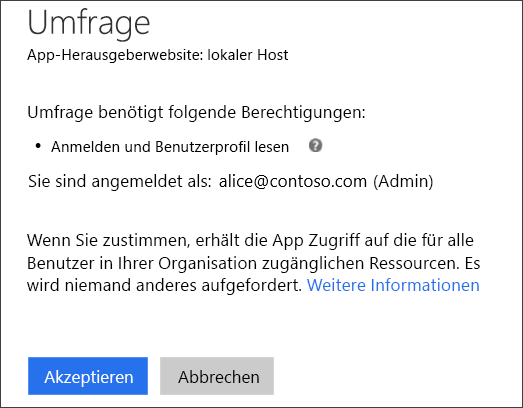
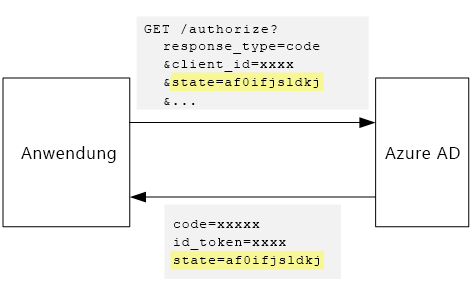

# <a name="tenant-sign-up-and-onboarding"></a>Registrierung und Onboarding von Mandanten

[-Beispielcode][sample application]

In diesem Artikel wird beschrieben, wie ein Prozess für die *Registrierung* bei einer mehrinstanzenfähigen Anwendung implementiert wird, der es einem Kunden ermöglicht, seine Organisation bei Ihrer Anwendung zu registrieren.
Es gibt mehrere Gründe für das Implementieren eines Registrierungsprozesses:

* Ermöglichen, dass ein AD-Administrator seine Zustimmung gibt, dass die gesamte Organisation des Kunden die Anwendung nutzt.
* Erfassen von Kreditkartenzahlungs- oder anderen Kundeninformationen.
* Durchführen der pro Mandant einmal erforderlichen Einrichtung für Ihre Anwendung.

## <a name="admin-consent-and-azure-ad-permissions"></a>Zustimmung des Administrators und Azure AD-Berechtigungen
Für die Authentifizierung bei Azure AD benötigt eine Anwendung Zugriff auf das Verzeichnis des Benutzers. Die Anwendung benötigt mindestens die Leseberechtigung für das Profil des Benutzers. Bei der ersten Anmeldung zeigt Azure AD eine Zustimmungsseite mit einer Auflistung der angeforderten Berechtigungen. Durch Klicken auf **Annehmen**erteilt der Benutzer die Zugriffsberechtigung für die Anwendung.

Die Zustimmung wird standardmäßig benutzerbezogen gegeben. Jedem Benutzer, der sich anmeldet, wird die Zustimmungsseite angezeigt. Azure AD unterstützt jedoch auch die *Zustimmung des Administrators*, wodurch ein AD-Administrator für eine gesamte Organisation zustimmen kann.

Bei Wahl der Zustimmung des Administrators besagt die Zustimmungsseite, dass der AD-Administrator die Berechtigung für den gesamten Mandanten erteilt:



Nachdem der Administrator auf **Annehmen** geklickt hat, können sich andere Benutzern in demselben Mandanten anmelden, und der Zustimmungsbildschirm wird in Azure AD nicht mehr angezeigt.

Nur ein AD-Administrator kann die Zustimmung des Administrators erteilen, da die Berechtigung für die gesamte Organisation gewährt wird. Wenn ein Nichtadministrator die Authentifizierung mittels Zustimmung des Administrators versucht, zeigt Azure AD eine Fehlermeldung:


Wenn die Anwendung zu einem späteren Zeitpunkt zusätzliche Berechtigungen erfordert, muss sich der Kunde erneut registrieren und den aktualisierten Berechtigungen zustimmen.  

## <a name="implementing-tenant-sign-up"></a>Implementieren der Registrierung von Mandanten
Für die Anwendung [Tailspin Surveys][Tailspin] wurden mehrere Anforderungen an den Registrierungsvorgang definiert:

* Ein Mandant muss sich registrieren, bevor sich Benutzer anmelden können.
* Für die Registrierung ist die Zustimmung des Administrators erforderlich.
* Bei der Registrierung wird der Mandant des Benutzers der Anwendungsdatenbank hinzugefügt.
* Nachdem sich ein Mandant registriert ist, zeigt die Anwendung eine Onboardingseite.

In diesem Abschnitt durchlaufen wir unsere Implementierung des Registrierungsprozesses.
Wichtig ist es, beim Anwendungskonzept den Unterschied zwischen „registrieren“ und „anmelden“ zu verstehen. Während der Authentifizierung weiß Azure AD eigentlich nicht, ob der Benutzer dabei ist, sich zu registrieren. Das Nachverfolgen des Kontexts obliegt der Anwendung.

Wenn ein anonymer Benutzer die Tailspin-Anwendung „Surveys“ besucht, werden dem Benutzer zwei Schaltflächen angezeigt: eine zum Anmelden und eine zum Registrieren des Unternehmens.


Diese Schaltflächen lösen Aktionen in der `AccountController`-Klasse aus.

Die `SignIn` -Aktion gibt ein **ChallegeResult**zurück, was bewirkt, dass die OpenID Connect-Middleware zum Authentifizierungsendpunkt umgeleitet wird. Dies ist die Standardmethode zum Auslösen der Authentifizierung in ASP.NET Core.  

```csharp
[AllowAnonymous]
public IActionResult SignIn()
{
    return new ChallengeResult(
        OpenIdConnectDefaults.AuthenticationScheme,
        new AuthenticationProperties
        {
            IsPersistent = true,
            RedirectUri = Url.Action("SignInCallback", "Account")
        });
}
```

Vergleichen Sie dies nun mit der `SignUp` -Aktion:

```csharp
[AllowAnonymous]
public IActionResult SignUp()
{
    var state = new Dictionary<string, string> { { "signup", "true" }};
    return new ChallengeResult(
        OpenIdConnectDefaults.AuthenticationScheme,
        new AuthenticationProperties(state)
        {
            RedirectUri = Url.Action(nameof(SignUpCallback), "Account")
        });
}
```

Die `SignUp`-Aktion gibt wie die `SignIn`-Aktion ein `ChallengeResult` zurück. Aber dieses Mal fügen wir den `AuthenticationProperties` in the `ChallengeResult`einige Zustandsinformationen hinzu:

* signup: Ein boolesches Flag, das angibt, dass der Benutzer den Registrierungsprozess gestartet hat.

Die Zustandsinformationen in `AuthenticationProperties` werden dem OpenID Connect-Parameter [Status] hinzugefügt, der per Roundtrips den Authentifizierungsvorgang durchläuft.



Nachdem der Benutzer in Azure AD authentifiziert und zur Anwendung umgeleitet wurde, enthält das Authentifizierungsticket den Zustand. Wir nutzen diese Tatsache, um sicherzustellen, dass der Wert von „signup“ sich im gesamten Authentifizierungsablauf nicht ändert.

## <a name="adding-the-admin-consent-prompt"></a>Hinzufügen der Aufforderung zur Administratorzustimmung
In Azure AD wird der Vorgang zur Administratorzustimmung ausgelöst, indem in der Authentifizierungsanforderung der Abfragezeichenfolge ein „prompt“-Parameter hinzugefügt wird:

```
/authorize?prompt=admin_consent&...
```

Die Tailspin-Anwendung „Surveys“ fügt die Aufforderung während des `RedirectToAuthenticationEndpoint` -Ereignisses hinzu. Dieses Ereignis wird aufgerufen, unmittelbar bevor die Middleware an den Authentifizierungsendpunkt umgeleitet wird.

```csharp
public override Task RedirectToAuthenticationEndpoint(RedirectContext context)
{
    if (context.IsSigningUp())
    {
        context.ProtocolMessage.Prompt = "admin_consent";
    }

    _logger.RedirectToIdentityProvider();
    return Task.FromResult(0);
}
```

Durch Festlegen von` ProtocolMessage.Prompt` wird die Middleware aufgefordert, den „prompt“-Parameter der Authentifizierungsanforderung hinzuzufügen.

Beachten Sie, dass die Aufforderung nur während der Registrierung erforderlich ist. In der regulären Anmeldung darf sie nicht enthalten sein. Um sie zu unterscheiden, prüfen wir, ob der `signup` -Wert im Authentifizierungsstatus enthalten ist. Die folgende Erweiterungsmethode überprüft diese Bedingung:

```csharp
internal static bool IsSigningUp(this BaseControlContext context)
{
    Guard.ArgumentNotNull(context, nameof(context));

    string signupValue;
    // Check the HTTP context and convert to string
    if ((context.Ticket == null) ||
        (!context.Ticket.Properties.Items.TryGetValue("signup", out signupValue)))
    {
        return false;
    }

    // We have found the value, so see if it's valid
    bool isSigningUp;
    if (!bool.TryParse(signupValue, out isSigningUp))
    {
        // The value for signup is not a valid boolean, throw                
        throw new InvalidOperationException($"'{signupValue}' is an invalid boolean value");
    }

    return isSigningUp;
}
```

## <a name="registering-a-tenant"></a>Registrieren eines Mandanten
Die Tailspin-Anwendung „Surveys“ speichert Informationen zu jedem Mandanten und Benutzer in der Datenbank.


In der Tabelle „Tenant“ ist „IssuerValue“ der Wert des Ausstelleranspruchs für den Mandanten. Bei Azure AD ist dies `https://sts.windows.net/<tentantID>` , ein für jeden Mandanten eindeutiger Wert.

Wenn sich ein neuer Mandant registriert, schreibt die Tailspin-Anwendung „Surveys“ einen Mandantendatensatz in die Datenbank. Dies geschieht im `AuthenticationValidated` -Ereignis. (Führen Sie diesen Schritt nicht vor diesem Ereignis aus, da das ID-Token noch nicht auf Gültigkeit geprüft wurde und Sie deshalb den Anspruchswerten nicht vertrauen können. Siehe [Authentifizierung].)

Hier der entsprechende Code in der Tailspin-Anwendung „Surveys“:

```csharp
public override async Task TokenValidated(TokenValidatedContext context)
{
    var principal = context.AuthenticationTicket.Principal;
    var userId = principal.GetObjectIdentifierValue();
    var tenantManager = context.HttpContext.RequestServices.GetService<TenantManager>();
    var userManager = context.HttpContext.RequestServices.GetService<UserManager>();
    var issuerValue = principal.GetIssuerValue();
    _logger.AuthenticationValidated(userId, issuerValue);

    // Normalize the claims first.
    NormalizeClaims(principal);
    var tenant = await tenantManager.FindByIssuerValueAsync(issuerValue)
        .ConfigureAwait(false);

    if (context.IsSigningUp())
    {
        if (tenant == null)
        {
            tenant = await SignUpTenantAsync(context, tenantManager)
                .ConfigureAwait(false);
        }

        // In this case, we need to go ahead and set up the user signing us up.
        await CreateOrUpdateUserAsync(context.Ticket, userManager, tenant)
            .ConfigureAwait(false);
    }
    else
    {
        if (tenant == null)
        {
            _logger.UnregisteredUserSignInAttempted(userId, issuerValue);
            throw new SecurityTokenValidationException($"Tenant {issuerValue} is not registered");
        }

        await CreateOrUpdateUserAsync(context.Ticket, userManager, tenant)
            .ConfigureAwait(false);
    }
}
```

Im Code werden folgende Schritte ausgeführt:

1. Überprüfen Sie, ob der „issuer“-Wert des Mandanten bereits in der Datenbank vorhanden ist. Wenn sich der Mandant nicht registriert hat, gibt `FindByIssuerValueAsync` NULL zurück.
2. Wenn sich der Benutzer registriert:
   1. Fügen Sie den Mandanten der Datenbank hinzu (`SignUpTenantAsync`).
   2. Fügen Sie den authentifizierten Benutzer der Datenbank hinzu (`CreateOrUpdateUserAsync`).
3. Führen Sie andernfalls den normalen Anmeldungsvorgang aus:
   1. Wenn der Aussteller des Mandanten nicht in der Datenbank gefunden wurde, bedeutet dies, dass der Mandant nicht registriert ist und sich der Kunde registrieren muss. Lösen Sie in diesem Fall eine Ausnahme aus, damit die Authentifizierung misslingt.
   2. Erstellen Sie andernfalls einen Datenbankeintrag für diesen Benutzer, falls noch nicht erfolgt (`CreateOrUpdateUserAsync`).

Hier ist die `SignUpTenantAsync`-Methode, die den Mandanten zur Datenbank hinzufügt.

```csharp
private async Task<Tenant> SignUpTenantAsync(BaseControlContext context, TenantManager tenantManager)
{
    Guard.ArgumentNotNull(context, nameof(context));
    Guard.ArgumentNotNull(tenantManager, nameof(tenantManager));

    var principal = context.Ticket.Principal;
    var issuerValue = principal.GetIssuerValue();
    var tenant = new Tenant
    {
        IssuerValue = issuerValue,
        Created = DateTimeOffset.UtcNow
    };

    try
    {
        await tenantManager.CreateAsync(tenant)
            .ConfigureAwait(false);
    }
    catch(Exception ex)
    {
        _logger.SignUpTenantFailed(principal.GetObjectIdentifierValue(), issuerValue, ex);
        throw;
    }

    return tenant;
}
```

Es folgt eine Zusammenfassung des gesamten Registrierungsprozesses in der Tailspin-Anwendung „Surveys“:

1. Der Benutzer klickt auf die Schaltfläche **Registrieren** .
2. Die `AccountController.SignUp` -Aktion gibt ein Abfrageergebnis zurück.  Der Authentifizierungsstatus enthält den „signup“-Wert.
3. Fügen Sie im `RedirectToAuthenticationEndpoint`-Ereignis die `admin_consent`-Eingabeaufforderung hinzu.
4. Die OpenID Connect-Middleware wird zu Azure AD umgeleitet, der Benutzer wird authentifiziert.
5. Suchen Sie im `AuthenticationValidated` -Ereignis nach dem Status „signup“.
6. Fügen Sie den Mandanten der Datenbank hinzu.

[**Weiter**][app roles]

<!-- Links -->
[app roles]: app-roles.md
[Tailspin]: tailspin.md

[Status]: https://openid.net/specs/openid-connect-core-1_0.html#AuthRequest
[Authentifizierung]: authenticate.md
[sample application]: https://github.com/mspnp/multitenant-saas-guidance
