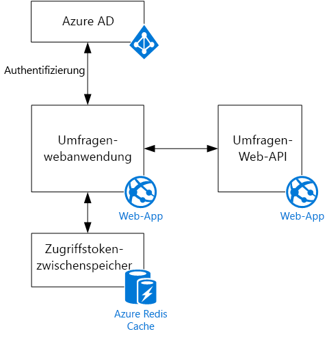

# Das Tailspin-SzenarioThe Tailspin scenario

[-Beispielcode][sample application][ Sample code][sample application]

Tailspin ist ein fiktives Unternehmen, das eine SaaS-Anwendung mit dem Namen „Surveys“ entwickelt.Tailspin is a fictitious company that is developing a SaaS application named Surveys. Diese Anwendung ermöglicht Organisationen das Erstellen und Veröffentlichen von Online-Umfragen.This application enables organizations to create and publish online surveys.

* Eine Organisation kann sich für die Anwendung registrieren.An organization can sign up for the application.
* Nach der Registrierung der Organisation können sich Benutzer bei der Anwendung mit ihren Organisationsanmeldeinformationen anmelden.After the organization is signed up, users can sign into the application with their organizational credentials.
* Benutzer können Umfragen erstellen, bearbeiten und veröffentlichen.Users can create, edit, and publish surveys.

> [!NOTE]
> Informationen zu den ersten Schritten mit der Anwendung finden Sie unter [Ausführen der Surveys-Anwendung].To get started with the application, see [Run the Surveys application].

## Benutzer können Umfragen erstellen, bearbeiten und anzeigenUsers can create, edit, and view surveys

Ein authentifizierter Benutzer kann alle Umfragen anzeigen, die er erstellt hat oder für die er über Rechte vom Typ „Mitwirkender“ besitzt, und neue Umfragen erstellen.An authenticated user can view all the surveys that he or she has created or has contributor rights to, and create new surveys. Beachten Sie, dass der Benutzer mit seiner Organisationsidentität angemeldet ist: `bob@contoso.com`.Notice that the user is signed in with his organizational identity, `bob@contoso.com`.

Dieser Screenshot zeigt die Seite „Edit Survey“:This screenshot shows the Edit Survey page:

Benutzer können innerhalb desselben Mandanten auch alle von anderen Benutzern erstellten Umfragen anzeigen.Users can also view any surveys created by other users within the same tenant.

## Besitzer von Umfragen können Mitwirkende einladenSurvey owners can invite contributors

Wenn ein Benutzer eine Umfrage erstellt, kann er andere Personen als Teilnehmer zur Umfrage einladen.When a user creates a survey, he or she can invite other people to be contributors on the survey. Teilnehmer können die Umfrage bearbeiten, sie aber nicht löschen oder bereitstellen.Contributors can edit the survey, but cannot delete or publish it.

Ein Benutzer kann Teilnehmer aus anderen Mandanten hinzufügen, was die mandantenübergreifende Freigabe von Ressourcen ermöglicht.A user can add contributors from other tenants, which enables cross-tenant sharing of resources. In diesem Screenshot fügt Bob (`bob@contoso.com`) die Benutzerin Alice (`alice@fabrikam.com`) einer von Bob erstellten Umfrage als Mitwirkende hinzu.In this screenshot, Bob (`bob@contoso.com`) is adding Alice (`alice@fabrikam.com`) as a contributor to a survey that Bob created.

Wenn sich Alice anmeldet, sieht sie die Umfrage unter „Surveys I can contribute to“.When Alice logs in, she sees the survey listed under "Surveys I can contribute to".

Beachten Sie, dass sich Alice an Ihrem eigenen Mandanten und nicht als Gast des Contoso-Mandanten anmeldet.Note that Alice signs into her own tenant, not as a guest of the Contoso tenant. Alice verfügt nur für diese Umfrage über eine Berechtigung vom Typ „Mitwirkender“ und kann keine anderen Umfragen des Contoso-Mandanten anzeigen.Alice has contributor permissions only for that survey &mdash; she cannot view other surveys from the Contoso tenant.

## ArchitectureArchitecture

Die Anwendung „Surveys“ besteht aus einem Web-Front-End und einem Web-API-Back-End.The Surveys application consists of a web front end and a web API backend. Beide werden mit [ASP.NET Core] implementiert.Both are implemented using [ASP.NET Core].

Die Webanwendung nutzt Azure Active Directory (Azure AD) zum Authentifizieren von Benutzern.The web application uses Azure Active Directory (Azure AD) to authenticate users. Die Webanwendung ruft auch Azure AD auf, um OAuth 2-Zugriffstoken für die Web-API zu erhalten.The web application also calls Azure AD to get OAuth 2 access tokens for the Web API. Zugriffstoken werden im Azure Redis Cache zwischengespeichert.Access tokens are cached in Azure Redis Cache. Mit diesem Cache können mehrere Instanzen denselben Tokencache gemeinsam nutzen (z.B. in einer Serverfarm).The cache enables multiple instances to share the same token cache (e.g., in a server farm).

[**Weiter**][authentication][**Next**][authentication]

<!-- links -->

[authentication]: authenticate.md

[Ausführen der Surveys-Anwendung]: ./run-the-app.md
[Run the Surveys application]: ./run-the-app.md
[ASP.NET Core]: /aspnet/core
[sample application]: https://github.com/mspnp/multitenant-saas-guidance
