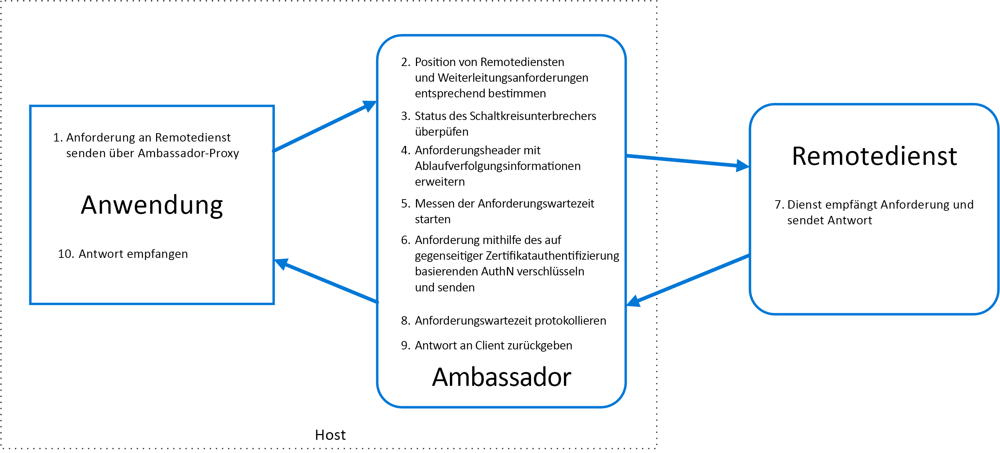

# Botschaftermuster

Erstellen Sie Hilfsdienste, die im Auftrag von Consumerdiensten oder -anwendungen Netzwerkanforderungen senden. Ein Botschafterdienst ist ein Proxy außerhalb eines Prozesses, der sich am gleichen Ort befindet wie der Client.

Dieses Muster kann hilfreich sein, um allgemeine Clientkonnektivitätstasks sprachunabhängig auszulagern, beispielsweise Überwachung, Protokollierung, Routing, Sicherheit (z.B. TLS) sowie [Resilienzmuster][resiliency-patterns]. Es wird häufig mit älteren Anwendungen oder anderen Anwendungen verwendet, die sich nicht einfach ändern lassen, um die Netzwerkfunktionen dieser Anwendungen zu erweitern. Es kann es einem Spezialistenteam auch ermöglichen, diese Features zu implementieren.

## Kontext und Problem

Resiliente cloudbasierte Anwendungen erfordern Features wie [Sicherung](./circuit-breaker.md), Routing, Messung und Überwachung sowie die Fähigkeit, netzwerkbezogene Konfigurationsupdates durchzuführen. Es kann schwierig oder sogar unmöglich sein, ältere Anwendungen oder vorhandene Codebibliotheken zu aktualisieren und diese Features hinzuzufügen, weil der Code nicht mehr verwaltet wird oder durch das Entwicklungsteam nicht einfach geändert werden kann.

Netzwerkaufrufe erfordern möglicherweise auch einen hohen Konfigurationsaufwand hinsichtlich Verbindung, Authentifizierung und Autorisierung. Wenn diese Aufrufe über mehrere Anwendungen hinweg verwendet werden, die mit verschiedenen Sprachen und Frameworks erstellt wurden, müssen die Aufrufe für jede dieser Instanzen konfiguriert werden. Darüber hinaus müssen möglicherweise Netzwerk- und Sicherheitsfunktionen durch ein zentrales Team in Ihrer Organisation verwaltet werden. Bei einer umfangreichen Codebasis kann es riskant sein, wenn das Team Anwendungscode aktualisieren soll, mit dem es nicht vertraut ist.

## Lösung

Platzieren Sie Clientframeworks und -bibliotheken in einen externen Prozess, der als Proxy zwischen Ihrer Anwendung und externen Diensten fungiert. Stellen Sie den Proxy in der gleichen Hostumgebung bereit wie Ihre Anwendung, um Routing-, Resilienz- und Sicherheitsfeatures steuern zu können und um Zugriffseinschränkungen aufgrund des Hosts zu verhindern. Sie können das Botschaftermuster auch zum Standardisieren und Erweitern der Instrumentierung verwenden. Der Proxy kann Leistungsmetriken wie Latenz und Ressourcennutzung überwachen. Diese Überwachung erfolgt in der gleichen Hostumgebung, in der sich auch die Anwendung befindet.

Features, die in den Botschafter ausgelagert werden, können unabhängig von der Anwendung verwaltet werden. Sie können den Botschafter aktualisieren und ändern, ohne die Legacyfunktionen der Anwendung zu beeinträchtigen. Das Muster ermöglicht es separaten Spezialistenteams auch, Sicherheits-, Netzwerk- oder Authentifizierungsfeatures zu implementieren und zu verwalten, die in den Botschafter verschoben wurden.

Botschafterdienste können als [Sidecar](./sidecar.md) bereitgestellt werden, um den Lebenszyklus einer konsumierenden Anwendung oder eines konsumierenden Diensts zu begleiten. Alternativ dazu kann ein Botschafter auch als Daemon oder Windows-Dienst bereitgestellt werden, wenn er von mehreren separaten Prozessen auf einem gemeinsamen Host verwendet wird. Wenn der konsumierende Dienst in Form von Containern bereitgestellt wurde, sollte der Botschafter als separater Container auf dem gleichen Host erstellt werden. Für die Kommunikation müssen die geeigneten Links konfiguriert werden.

## Probleme und Überlegungen

- Durch den Proxy entsteht ein gewisser Latenzoverhead. Überlegen Sie, ob eine Clientbibliothek, die direkt von der Anwendung aufgerufen wird, möglicherweise ein besserer Ansatz ist.
- Berücksichtigen Sie die möglichen Auswirkungen der Einbindung von generalisierten Features in den Proxy. Der Botschafter kann z.B. Wiederholungsversuche verarbeiten, dies ist aber möglicherweise keine sichere Vorgehensweise, sofern nicht alle Vorgänge idempotent sind.
- Ziehen Sie einen Mechanismus in Betracht, mit dem ein bestimmter Kontext vom Client an den Proxy und zurück an den Client übergeben werden kann. Schließen Sie z.B. HTTP-Anforderungsheader ein, um Wiederholungen zu deaktivieren oder die maximale Anzahl von Wiederholungsversuchen anzugeben.
- Planen Sie, wie Sie den Proxy packen und bereitstellen werden.
- Entscheiden Sie, ob Sie eine einzige, gemeinsam genutzte Instanz für alle Clients oder eine Instanz pro Client verwenden möchten.

## Verwendung dieses Musters

Verwenden Sie dieses Muster in folgenden Fällen:

- Sie müssen einen gemeinsamen Satz von Konnektivitätsfeatures für mehrere Sprachen oder Frameworks erstellen.
- Sie müssen übergreifende Fragen der Clientkonnektivität an Infrastrukturentwickler oder andere Spezialistenteams auslagern.
- Sie müssen Anforderungen an die Cloud- oder Clusterkonnektivität in einer älteren oder schwer zu ändernden Anwendung unterstützen.

Dieses Muster ist in folgenden Fällen möglicherweise nicht geeignet:

- Die Latenz von Netzwerkanforderungen ist von kritischer Bedeutung. Durch einen Proxy entsteht ein gewisser Overhead – wenn auch nur minimal –, und in einigen Fällen kann dies die Anwendung beeinträchtigen.
- Clientkonnektivitätsfeatures werden nur von einer einzigen Sprache genutzt. In diesem Fall wäre es besser, eine Clientbibliothek zu verwenden, die als Paket an die Entwicklungsteams verteilt wird.
- Konnektivitätsfeatures lassen sich nicht generalisieren und erfordern einer tiefer gehende Integration in die Clientanwendung.

## Beispiel

Das folgende Diagramm zeigt eine Anwendung, die über einen Botschafterproxy eine Anforderung an einen Remotedienst sendet. Der Botschafter sorgt für Routing, Sicherung und Protokollierung. Er ruft den Remotedienst auf und gibt die Antwort an die Clientanwendung zurück:

## Verwandte Leitfäden

- [Sidecar-Muster](./sidecar.md)

<!-- links -->

[resiliency-patterns]: ./category/resiliency.md
