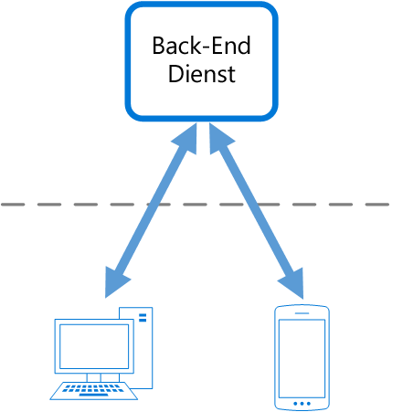
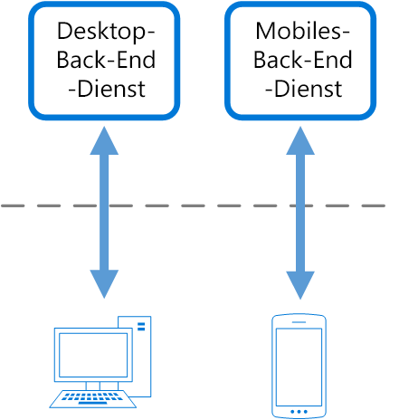

# Muster „Back-Ends für Front-Ends“

Erstellen Sie separate Back-End-Dienste zur Nutzung durch bestimmte Front-End-Anwendungen oder -Schnittstellen. Dieses Muster ist hilfreich, wenn Sie vermeiden möchten, dass ein einzelnes Back-End für mehrere Schnittstellen angepasst werden muss. Dieses Muster wurde von Sam Newman erstmals beschrieben.

## Kontext und Problem

Eine Anwendung kann ursprünglich auf eine Desktop-Webbenutzeroberfläche ausgerichtet sein. Normalerweise wird ein Back-End-Dienst parallel entwickelt, mit dem die für die Benutzeroberfläche benötigten Features bereitgestellt werden. Wenn die Benutzerbasis der Anwendung wächst, wird eine mobile Anwendung entwickelt, die mit demselben Back-End interagieren muss. Der Back-End-Dienst wird zu einem Back-End für allgemeine Zwecke, mit dem die Anforderungen der Desktopbenutzeroberfläche und mobilen Benutzeroberfläche erfüllt werden.

Die Funktionen eines mobilen Geräts unterscheiden sich aber erheblich von einem Desktopbrowser in Bezug auf die Bildschirmgröße, Leistung und Anzeigebeschränkungen. Die Anforderungen für das Back-End einer mobilen Anwendung unterscheiden sich von der Desktop-Webbenutzeroberfläche. 

Diese Unterschiede führen zu konkurrierenden Anforderungen für das Back-End. Für das Back-End sind regelmäßige und signifikante Änderungen erforderlich, damit es sowohl für die Desktop-Webbenutzeroberfläche als auch für die mobile Anwendung genutzt werden kann. Häufig arbeiten separate Benutzeroberflächenteams an den einzelnen Front-Ends, sodass das Back-End im Entwicklungsprozess zu einem Engpass wird. In Konflikt stehende Updateanforderungen und die Notwendigkeit, dass der Dienst für beide Front-Ends betriebsbereit gehalten werden muss, kann dazu führen, dass für eine einzelne bereitstellbare Ressource hoher Aufwand entsteht.

 

Da die Entwicklungsaktivitäten auf den Back-End-Dienst ausgerichtet sind, kann ggf. ein separates Team zusammengestellt werden, um das Back-End zu verwalten und zu warten. Dies führt letztendlich zu einer Trennung zwischen den Teams für die Entwicklung der Benutzeroberfläche und des Back-Ends, und das Back-End-Team muss die konkurrierenden Anforderungen der verschiedenen Benutzeroberflächenteams ausgleichen. Wenn ein Benutzeroberflächenteam Änderungen des Back-Ends fordert, müssen diese Änderungen von anderen Benutzeroberflächenteams überprüft werden, bevor sie in das Back-End integriert werden können. 

## Lösung

Erstellen Sie ein Back-End pro Benutzeroberfläche. Optimieren Sie das Verhalten und die Leistung jedes Back-Ends, um die Anforderungen der Front-End-Umgebung bestmöglich zu erfüllen, ohne sich Gedanken darüber machen zu müssen, dass andere Front-End-Umgebungen betroffen sind.

 

Da jedes Back-End spezifisch für eine Benutzeroberfläche gilt, kann es für diese Schnittstelle optimiert werden. Das Ergebnis ist, dass es kleiner, weniger komplex und meist auch schneller als ein generisches Back-End ist, mit dem versucht wird, die Anforderungen aller Benutzeroberflächen zu erfüllen. Jedes Benutzeroberflächenteam kann das eigene Back-End selbst steuern und ist nicht von einem zentralen Back-End-Entwicklungsteam abhängig. So kann das Benutzeroberflächenteam in den Bereichen Sprachwahl, Release-Rhythmus, Priorisierung der Workload und Featureintegration auf seinem Back-End jeweils flexibel vorgehen.

Weitere Informationen finden Sie unter [Muster: Back-Ends für Front-Ends](http://samnewman.io/patterns/architectural/bff/).

## Probleme und Überlegungen

- Berücksichtigen Sie, wie viele Back-Ends bereitgestellt werden sollen.
- Wenn verschiedene Oberflächen (z.B. mobile Clients) die gleichen Anforderungen senden, sollten Sie prüfen, ob die Implementierung eines Back-Ends für jede Oberfläche erforderlich ist oder ob ein einzelnes Back-End ausreicht.
- Die Codeduplizierung über Dienste hinweg ist sehr wahrscheinlich, wenn dieses Muster implementiert wird.
- Auf das Front-End ausgerichtete Back-End-Dienste sollten nur clientspezifische Logik und das entsprechende Verhalten aufweisen. Die allgemeine Geschäftslogik und andere globale Features sollten an einem anderen Ort Ihrer Anwendung verwaltet werden.
- Überlegen Sie, wie dieses Muster in Bezug auf die Zuständigkeiten eines Entwicklungsteams widergespiegelt wird.
- Machen Sie sich Gedanken darüber, wie lange es dauert, dieses Muster zu implementieren. Führt der Aufwand für die Erstellung der neuen Back-Ends zu „technischen Schulden“, während Sie weiterhin das vorhandene generische Back-End unterstützen?

## Verwendung dieses Musters

Verwenden Sie dieses Muster in folgenden Fällen:

- Ein freigegebener bzw. universeller Back-End-Dienst muss gewartet werden, und hierfür fällt ein erheblicher Mehraufwand bei der Entwicklung an.
- Sie möchten das Back-End für die Anforderungen bestimmter Clientoberfläche optimieren.
- Anpassungen werden für ein Allzweck-Back-End vorgenommen, um mehrere Oberflächen abzudecken.
- Eine Alternativsprache ist für das Back-End einer anderen Benutzeroberfläche besser geeignet.

Dieses Muster ist in folgenden Fällen unter Umständen nicht geeignet:

- Wenn Benutzeroberflächen die gleichen oder ähnliche Anforderungen an das Back-End senden.
- Wenn nur eine Benutzeroberfläche für die Interaktion mit dem Back-End verwendet wird.

## Verwandte Anweisungen

- [Muster „Gatewayaggregation“](./gateway-aggregation.md)
- [Muster „Gatewayabladung“](./gateway-offloading.md)
- [Muster „Gatewayrouting“](./gateway-routing.md)

