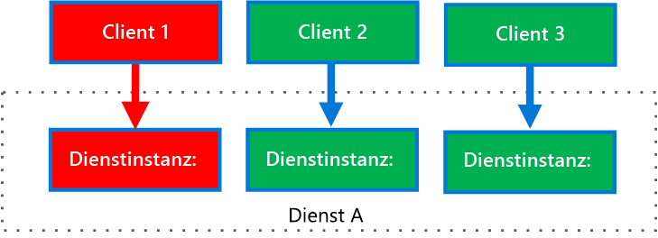

# <a name="bulkhead-pattern"></a>Bulkhead-Muster

Isolieren Sie Elemente einer Anwendung in Pools, sodass die anderen Elemente beim Ausfall eines Elements weiterhin ausgeführt werden.

Dieses Muster wird als *Bulkhead* (Schottwand) bezeichnet, da die Partitionen den Schottwänden eines Schiffs ähneln. Wenn eine Schottwand eines Schiffs beschädigt ist, füllt sich nur der beschädigte Abschnitt mit Wasser, sodass das Schiff nicht sinkt. 

## <a name="context-and-problem"></a>Kontext und Problem

Eine cloudbasierte Anwendung kann mehrere Dienste umfassen, von denen jeder einen oder mehrere Consumer aufweist. Eine übermäßige Last oder ein Fehler in einem Dienst wirkt sich auf alle Consumer des Diensts aus.

Außerdem kann ein Consumer Anforderungen an mehrere Dienste gleichzeitig senden und für jede Anforderung Ressourcen nutzen. Wenn der Consumer eine Anforderung an einen Dienst sendet, der falsch konfiguriert ist oder nicht mehr reagiert, werden die für die Anforderung des Clients genutzten Ressourcen möglicherweise nicht rechtzeitig freigegeben. Da die an den Dienst gesendeten Anforderungen bestehen bleiben, werden diese Ressourcen möglicherweise erschöpft. Beispielsweise kann der Verbindungspool des Clients erschöpft sein. Dies beeinträchtigt Anforderungen des Consumers an andere Dienste. Schließlich kann der Consumer nicht nur an den ursprünglich nicht mehr reagierenden Dienst, sondern auch an andere Dienste keine Anforderungen mehr senden.

Das gleiche Problem der Ressourcenauslastung wirkt sich auf Dienste mit mehreren Consumern aus. Eine große Anzahl von Anforderungen eines Clients erschöpft möglicherweise die im Dienst verfügbaren Ressourcen. Andere Consumer können den Dienst nicht mehr nutzen, was einen kaskadierenden Fehler verursacht.

## <a name="solution"></a>Lösung

Unterteilen Sie Dienstinstanzen in unterschiedliche Gruppen, abhängig von den Anforderungen an Consumerlast und Verfügbarkeit. Dieser Entwurf unterstützt das Isolieren von Fehlern und ermöglicht es Ihnen, auch während eines Fehlers die Dienstfunktionalität für einige Consumer aufrechtzuerhalten.

Ein Consumer kann ebenfalls Ressourcen partitionieren, um sicherzustellen, dass Ressourcen, die zum Aufrufen eines Diensts genutzt werden, die zum Aufrufen anderer Dienste genutzten Ressourcen nicht beeinträchtigen. Beispielsweise kann einem Consumer, der mehrere Dienste aufruft, für jeden Dienst ein Verbindungspool zugewiesen werden. Wenn ein Dienst auszufallen beginnt, wirkt sich dies nur auf den Verbindungspool aus, der für diesen Dienst zugewiesen ist, sodass der Consumer die anderen Dienste weiter verwenden kann.

Vorteile dieses Musters:

- Consumer und Dienste werden von kaskadierenden Fehlern isoliert. Ein Problem, das sich auf einen Consumer oder Dienst auswirkt, kann innerhalb des eigenen Bulkheads isoliert werden, um zu verhindern, dass die gesamte Lösung ausfällt.
- Sie können bei einem Dienstausfall einen Teil der Funktionalität bewahren. Andere Dienste und Features der Anwendung werden weiterhin ausgeführt.
- Sie können Dienste bereitstellen, die für Consumeranwendungen eine andere Dienstqualität bieten. Es kann ein Consumerpool hoher Priorität für die Verwendung von Diensten hoher Priorität konfiguriert werden. 

Im folgenden Diagramm sind Bulkheads dargestellt, die Verbindungspools umgeben, die einzelne Dienste aufrufen. Wenn Dienst A ausfällt oder ein anderes Problem verursacht, wird der Verbindungspool isoliert, sodass nur Workloads betroffen sind, die den Dienst A zugewiesenen Threadpool verwenden. Workloads, die Dienst B und C verwenden, sind nicht betroffen und können ohne Unterbrechung fortgesetzt werden.

 

Im nächsten Diagramm werden mehrere Clients gezeigt, die einen einzelnen Dienst aufgerufen. Jedem Client ist eine eigene Dienstinstanz zugewiesen. Client 1 hat zu viele Anforderungen gesendet und die zugewiesene Dienstinstanz überlastet. Da jede Dienstinstanz von den anderen isoliert ist, können alle anderen Clients weiterhin Aufrufe senden.


     
## <a name="issues-and-considerations"></a>Probleme und Überlegungen

- Definieren Sie Partitionen entsprechend den geschäftlichen und technischen Anforderungen der Anwendung.
- Wenn Sie Dienste oder Consumer in Bulkheads unterteilen, berücksichtigen Sie den Grad der von der Technologie gebotenen Isolation sowie den Mehraufwand an Kosten, Leistung und Verwaltbarkeit.
- Möglicherweise empfiehlt es sich, Bulkheads mit Wiederholungs-, Trennschalter- und Drosselungsmustern zu kombinieren, um eine differenziertere Fehlerbehandlung zu ermöglichen.
- Wenn Sie Consumer in Bulkheads unterteilen, sollten Sie möglicherweise Prozesse, Threadpools und Semaphore verwenden. Projekte wie [Netflix Hystrix] [hystrix] und [Polly][polly] bieten ein Framework zum Erstellen von Consumerbulkheads.
- Wenn Sie Dienste in Bulkheads unterteilen, empfiehlt es sich, sie in jeweils eigenen virtuellen Computern, Containern oder Prozessen bereitzustellen. Container bieten eine gut ausgewogene Ressourcenisolation mit relativ geringem Mehraufwand.
- Dienste, die mithilfe asynchroner Nachrichten kommunizieren, können mithilfe unterschiedlicher Gruppen von Warteschlangen isoliert werden. Für jede Warteschlange kann eine dedizierte Gruppe von Instanzen vorhanden sein, die Nachrichten in der Warteschlange verarbeiten, oder eine einzelne Gruppe von Instanzen, die mit einem Algorithmus Nachrichten aus der Warteschlange entfernen und die Verarbeitung disponieren.
- Bestimmen Sie den Grad der Granularität für die Bulkheads. Wenn Sie beispielsweise Mandanten auf Partitionen verteilen möchten, können Sie jeden Mandanten in einer eigenen Partition anordnen oder mehrere Mandanten in einer Partition anordnen.
- Überwachen Sie die Leistung und SLA jeder Partition.

## <a name="when-to-use-this-pattern"></a>Verwendung dieses Musters

Verwendung Sie dieses Muster für folgende Zwecke:

- Isolieren von Ressourcen, die für die Nutzung eines Satzes von Back-End-Diensten verwendet werden, insbesondere wenn die Anwendung den gleich Grad an Funktionalität auch dann bereitstellen kann, wenn einer der Dienste nicht mehr reagiert.
- Isolieren kritischer Consumer von Standardconsumern.
- Schützen der Anwendung vor kaskadierenden Fehlern.

Dieses Muster ist in folgenden Fällen möglicherweise nicht geeignet:

- Eine weniger effiziente Nutzung von Ressourcen ist im Projekt nicht tolerierbar.
- Die zusätzliche Komplexität ist nicht erforderlich.

## <a name="example"></a>Beispiel

Die folgende Kubernetes-Konfigurationsdatei erstellt einen isolierten Container zum Ausführen eines einzelnen Diensts, mit eigenen CPU- und Arbeitsspeicherressourcen und eigenen CPU- und Arbeitsspeicherlimits.

```yml
apiVersion: v1
kind: Pod
metadata:
  name: drone-management
spec:
  containers:
  - name: drone-management-container
    image: drone-service
    resources:
      requests:
        memory: "64Mi"
        cpu: "250m"
      limits:
        memory: "128Mi"
        cpu: "1"
```

## <a name="related-guidance"></a>Verwandte Leitfäden

- [Trennschalter-Muster](./circuit-breaker.md)
- [Entwickeln robuster Anwendungen für Azure](../resiliency/index.md)
- [Wiederholungsmuster](./retry.md)
- [Drosselungsmuster](./throttling.md)


<!-- links -->

[hystrix]: https://github.com/Netflix/Hystrix
[polly]: https://github.com/App-vNext/Polly