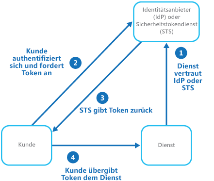
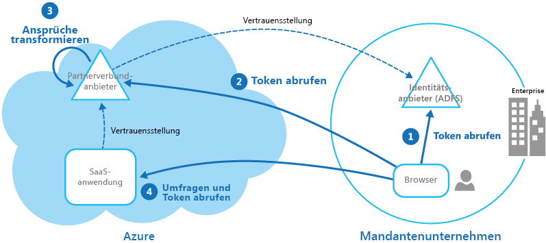

# Identitätsverbundmuster

[!INCLUDE [header](../_includes/header.md)]

Delegieren Sie die Authentifizierung an einen externen Identitätsanbieter. Dies kann die Entwicklung vereinfachen, die Anforderungen an die Benutzerverwaltung minimieren und die Benutzerfreundlichkeit der Anwendung verbessern.

## Kontext und Problem

In der Regel müssen Benutzer mit mehreren Anwendungen arbeiten, die von verschiedenen Organisationen bereitgestellt und gehostet werden, zu denen sie eine Geschäftsbeziehung haben. Diese Benutzer müssen möglicherweise für jede Anwendung spezifische (und unterschiedliche) Anmeldeinformationen verwenden. Dies kann zu folgenden Problemen führen:

- **Uneinheitliches Benutzererlebnis:** Benutzer vergessen häufig ihre Anmeldeinformationen, wenn sie über viele verschiedene Konten verfügen.

- **Sicherheitsrisiken:** Wenn ein Benutzer das Unternehmen verlässt, muss das Konto sofort deaktiviert werden. Dies kann in großen Organisationen schnell übersehen werden.

- **Komplizierte Benutzerverwaltung:** Administratoren müssen Anmeldeinformationen für alle Benutzer verwalten und zusätzliche Aufgaben wie die Bereitstellung von Kennworterinnerungen erledigen.

Benutzer ziehen es in der Regel vor, die gleichen Anmeldeinformationen für alle diese Anwendungen zu verwenden.

## Lösung

Implementieren Sie einen Authentifizierungsmechanismus, der Verbundidentität verwenden kann. Trennen Sie die Benutzerauthentifizierung vom Anwendungscode, und delegieren Sie die Authentifizierung an einen vertrauenswürdigen Identitätsanbieter. Dies kann die Entwicklung vereinfachen und Benutzern die Authentifizierung über eine größere Anzahl an Identitätsanbietern (IdP) ermöglichen, während gleichzeitig der Verwaltungsaufwand minimiert wird. Sie können außerdem auf diese Weise die Authentifizierung eindeutig von der Autorisierung entkoppeln.

Zu den vertrauenswürdigen Identitätsanbietern gehören Unternehmensverzeichnisse, lokale Verbunddienste, von Geschäftspartnern bereitgestellte andere Sicherheitstokendienste (STS) und Identitätsanbieter sozialer Netzwerke, die Benutzer authentifizieren können, die beispielsweise ein Konto bei Microsoft, Google, Yahoo! oder Facebook besitzen.

Die Abbildung zeigt das Verbundidentitätsmuster, wenn eine Clientanwendung auf einen Dienst zugreifen muss, für den eine Authentifizierung erforderlich ist. Die Authentifizierung erfolgt durch einen IdP, der zusammen mit einem STS funktioniert. Der IdP stellt Sicherheitstoken aus, die Informationen zu dem authentifizierten Benutzer bereitstellen. Diese als „Ansprüche“ bezeichneten Informationen schließen die Identität des Benutzers und möglicherweise auch andere Informationen wie z.B. Rollenmitgliedschaften und genauer abgestufte Zugriffsrechte ein.

Dieses Modell wird oft als anspruchsbasierte Zugriffssteuerung bezeichnet. Anwendungen und Dienste autorisieren den Zugriff auf Features und Funktionen anhand der im Token enthaltenen Ansprüche. Der Dienst, der eine Authentifizierung anfordert, muss dem IdP vertrauen. Die Clientanwendung kontaktiert den IdP, der die Authentifizierung durchführt. Wenn die Authentifizierung erfolgreich ist, gibt der IdP ein Token mit Ansprüchen zurück, die den Benutzer beim STS authentifizieren. (Beachten Sie, dass es sich beim IdP und dem STS um denselben Dienst handeln kann.) Der STS kann die Ansprüche im Token anhand vordefinierter Regeln transformieren und erweitern, bevor er dieses an den Client zurückgibt. Die Clientanwendung kann dieses Token dann zum Nachweis der Identität an den Dienst übergeben.

> In der Vertrauenskette sind möglicherweise zusätzliche Sicherheitstokendienste vorhanden. Beispielsweise vertraut im weiter unten beschriebenen Szenario ein lokaler STS einem anderen STS, der für den Zugriff auf einen Identitätsanbieter zur Authentifizierung des Benutzers verantwortlich ist. Dieser Ansatz ist in Unternehmensszenarien mit einem lokalen STS und einem Verzeichnis verbreitet.

Verbundauthentifizierung bietet eine standardbasierte Windows-Lösung für das Problem, Identitäten über unterschiedliche Domänen hinweg zu vertrauen, und kann einmaliges Anmelden unterstützen. Sie ist für alle Arten von Anwendungen zunehmend verbreitet, vor allem bei in der Cloud gehosteten Anwendungen, da sie einmaliges Anmelden unterstützt, ohne eine direkte Netzwerkverbindung mit Identitätsanbietern zu erfordern. Der Benutzer muss nicht für jede Anwendung Anmeldeinformationen eingeben. Dies erhöht die Sicherheit, da es verhindert, dass für den Zugriff auf viele unterschiedliche Anwendungen Anmeldeinformationen erstellt werden, und außerdem die Anmeldeinformationen des Benutzers vor allen Diensten bis auf den ursprünglichen Identitätsanbieter verbirgt. Anwendungen erfahren nur die authentifizierten Identitätsinformationen, die im Token enthalten sind.

Verbundidentität hat auch den wichtigen Vorteil, dass die Verwaltung der Identität und der Anmeldeinformationen in der Verantwortung des Identitätsanbieters liegt. Die Anwendung oder ein Dienst muss keine Features für die Identitätsverwaltung bereitstellen. Darüber hinaus benötigt in Unternehmensszenarien das Unternehmensverzeichnis keine Informationen über die Benutzer, sofern es dem Identitätsanbieter vertraut. Dadurch wird der gesamte administrative Mehraufwand der Verwaltung der Benutzeridentität im Verzeichnis entfernt.

## Probleme und Überlegungen

Beachten Sie Folgendes, wenn Sie Anwendungen entwerfen, die Verbundauthentifizierung implementieren:

- Authentifizierung kann ein Single Point of Failure sein. Wenn Sie Ihre Anwendung in mehreren Rechenzentren bereitstellen, ziehen Sie in Betracht, Ihren Identitätsverwaltungsmechanismus in denselben Rechenzentren bereitzustellen, um Zuverlässigkeit und Verfügbarkeit für Anwendungen zu gewährleisten.

- Authentifizierungstools ermöglichen das Konfigurieren der Zugriffssteuerung basierend auf den im Authentifizierungstoken enthaltenen Rollenansprüchen. Dies wird häufig als rollenbasierte Zugriffssteuerung (RBAC) bezeichnet und ermöglicht eine feiner abgestufte Steuerung des Zugriffs auf Features und Ressourcen.

- Im Gegensatz zu einem Unternehmensverzeichnis werden bei der anspruchsbasierten Authentifizierung mithilfe von Identitätsanbietern sozialer Netzwerke normalerweise keine Informationen zum authentifizierten Benutzer bereitgestellt, die über seine E-Mail-Adresse und ggf. einen Namen hinausgehen. Einige Identitätsanbieter sozialer Netzwerke, z.B. ein Microsoft-Konto, bietet nur eine eindeutige ID. Die Anwendung muss in der Regel einige Informationen zu registrierten Benutzern verwalten und in der Lage sein, diese Informationen mit dem in den Ansprüchen im Token enthaltenen Anbietern abzugleichen. Normalerweise erfolgt dies über die Registrierung beim ersten Zugriff des Benutzers auf die Anwendung, und die Informationen werden dann als zusätzliche Ansprüche nach jeder Authentifizierung in das Token eingefügt.

- Wenn mehrere Identitätsanbieter für den STS konfiguriert sind, muss ermittelt werden, an welchen Identitätsanbieter der Benutzer zur Authentifizierung umgeleitet werden soll. Dieser Vorgang wird als „Startbereichsermittlung“ bezeichnet. Der STS kann dies eventuell automatisch erledigen. Dazu wird eine vom Benutzer angegebene E-Mail-Adresse oder ein Benutzername, eine Unterdomäne der Anwendung, auf die der Benutzer zugreift, der IP-Adressbereich des Benutzers oder der Inhalt eines im Browser des Benutzers gespeicherten Cookies verwendet. Wenn der Benutzer beispielsweise eine E-Mail-Adresse in der Microsoft-Domäne eingegeben hat (z.B. user@live.com), leitet der STS den Benutzer an die Microsoft-Anmeldeseite weiter. Bei späteren Besuchen kann der STS mithilfe eines Cookies angeben, dass die letzte Anmeldung mit einem Microsoft-Konto stattfand. Wenn die automatische Ermittlung den Startbereich nicht ermitteln kann, zeigt der STS eine Seite zur Startbereichsermittlung an, auf der die vertrauenswürdigen Identitätsanbieter aufgeführt werden, und der Benutzer muss den gewünschten auswählen.

## Verwendung dieses Musters

Dieses Muster ist für Szenarien wie die folgenden nützlich:

- **Einmaliges Anmelden im Unternehmen:** In diesem Szenario müssen Sie Mitarbeiter für Unternehmensanwendungen authentifizieren, die in der Cloud außerhalb der Grenzen der Unternehmenssicherheit gehostet werden, ohne dass diese sich bei jedem Besuch einer Anwendung anmelden müssen. Für den Benutzer unterscheidet sich dieser Vorgang nicht von der Verwendung lokaler Anwendungen, bei denen er sich durch Anmelden bei einem Unternehmensnetzwerk authentifiziert und danach Zugriff auf alle relevanten Anwendungen hat, ohne sich erneut anmelden zu müssen.

- **Verbundidentität mit mehreren Partnern:** In diesem Szenario müssen Sie sowohl Mitarbeiter authentifizieren als auch Geschäftspartner, die nicht über Konten im Unternehmensverzeichnis verfügen. Dies ist häufig bei B2B-Anwendungen oder Anwendungen mit Integration in Drittanbieterdienste der Fall sowie wenn Unternehmen mit unterschiedlichen IT-Systemen fusioniert sind oder ihre Ressourcen geteilt haben.

- **Verbundidentität in SaaS-Anwendungen:** In diesem Szenario bieten unabhängige Softwareanbieter einen sofort verwendbaren Dienst für mehrere Clients oder Mandanten an. Jeder Mandant wird über einen geeigneten Identitätsanbieter authentifiziert. Beispielsweise verwenden Geschäftsbenutzer ihre Unternehmensanmeldeinformationen, während Consumer und Clients des Mandanten ihre Anmeldeinformationen für soziale Netzwerke verwenden.

Dieses Muster ist in den folgenden Situationen eventuell nicht nützlich:

- Alle Benutzer der Anwendung können über denselben Identitätsanbieter authentifiziert werden, und es ist keine Authentifizierung mit einem anderen Identitätsanbieter erforderlich. Dies ist in Geschäftsanwendungen verbreitet, die mithilfe eines VPN oder (in einem Szenario mit Cloudhosting) über eine virtuelle Netzwerkverbindung zwischen dem lokalen Verzeichnis und der Anwendung ein Unternehmensverzeichnis (auf das in der Anwendung zugegriffen werden kann) für die Authentifizierung verwenden.

- Die Anwendung wurde ursprünglich mit einem anderen Authentifizierungsmechanismus erstellt, etwa mit benutzerdefinierten Benutzerspeichern, oder sie verfügt nicht über die Möglichkeit, die Aushandlungsstandards zu verarbeiten, die auf anspruchsbasierte Technologien verwenden. Eine nachträgliche Implementierung einer auf Ansprüchen basierenden Authentifizierung und Zugriffsteuerung in vorhandene Anwendungen kann komplex sein und ist wahrscheinlich nicht kosteneffizient.

## Beispiel

Eine Organisation hostet eine mehrinstanzenfähige SaaS-Anwendung (Software-as-a-Service) in Microsoft Azure. Die Anwendung schließt eine Website ein, mit der Mandanten die Anwendung für ihre eigenen Benutzer verwalten können. Mandanten können über die Anwendung mithilfe eines Identitätsverbunds, der von AD FS (Active Directory Federation Services) generiert wird, wenn ein Benutzer durch das eigene Active Directory einer Organisation authentifiziert wurde, auf die Website zugreifen.

Die Abbildung zeigt, wie sich Mandanten mit ihrem eigenen Identitätsanbieter authentifizieren (Schritt 1), in diesem Fall AD FS. Nach einer erfolgreichen Authentifizierung eines Mandanten gibt AD FS ein Token aus. Der Clientbrowser leitet dieses Token an den Verbundanbieter der SaaS-Anwendung weiter, der dem vom AD FS des Mandanten ausgestellten Token vertraut. Anschließend erhält er ein Token, das für den Verbundanbieter der SaaS-Anwendung gültig ist (Schritt 2). Bei Bedarf wandelt der Verbundanbieter der SaaS-Anwendung die Ansprüche im Token in Ansprüche um, die die Anwendung erkennt (Schritt 3), bevor das neue Token an den Clientbrowser zurückgegeben wird. Die Anwendung vertraut den vom Verbundanbieter der SaaS-Anwendung ausgestellten Token und wendet mithilfe der Ansprüche im Token Autorisierungsregeln an (Schritt 4).

Mandanten müssen keine separaten Anmeldeinformationen für den Zugriff auf die Anwendung speichern, und ein Administrator im Unternehmen des Mandanten kann im eigenen AD FS die Liste der Benutzer, die auf die Anwendung zugreifen können, konfigurieren.

## Verwandte Anweisungen

- [Microsoft Azure Active Directory](https://azure.microsoft.com/services/active-directory/)
- [Active Directory Domain Services](https://msdn.microsoft.com/library/bb897402.aspx)
- [Active Directory-Verbunddienste (AD FS)](https://msdn.microsoft.com/library/bb897402.aspx)
- [Identitätsverwaltung für mehrinstanzenfähige Anwendungen in Microsoft Azure](https://azure.microsoft.com/documentation/articles/guidance-multitenant-identity/)
- [Mehrinstanzenfähige Anwendungen in Azure](https://azure.microsoft.com/documentation/articles/dotnet-develop-multitenant-applications/)
