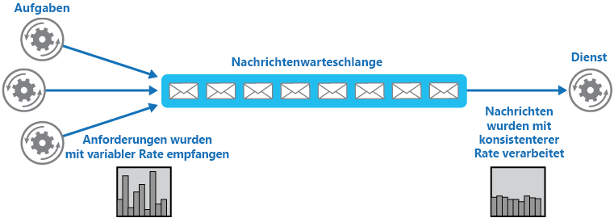
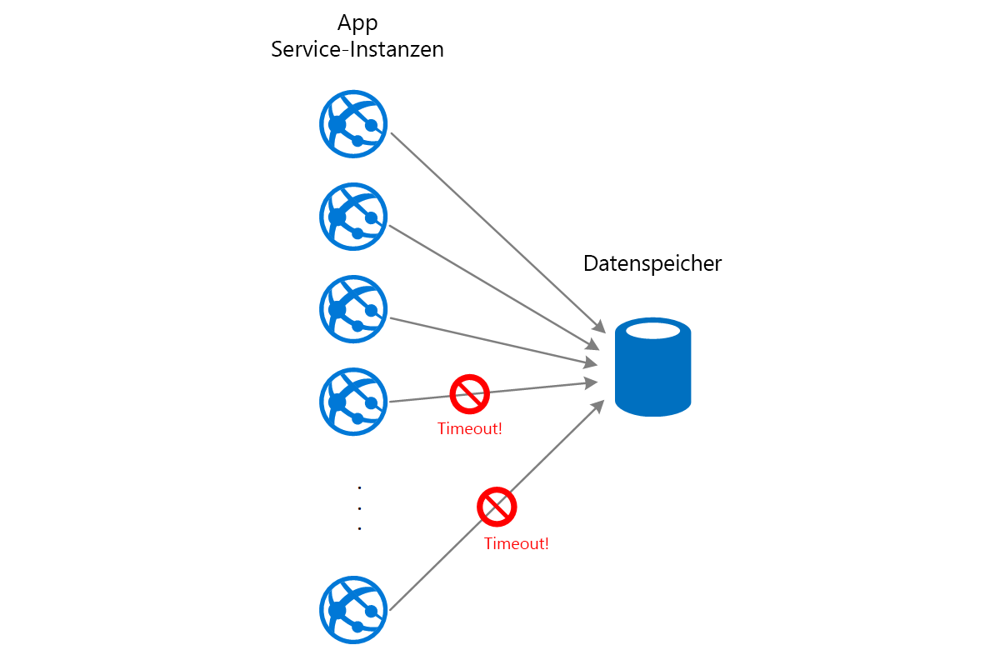

# Warteschlangenbasiertes Lastenausgleichsmuster

[!INCLUDE [header](../_includes/header.md)]

Verwenden Sie eine Warteschlange, die als Puffer zwischen einem Task und einem von ihm aufgerufenen Dienst fungiert, um unregelmäßig auftretende hohe Lasten aufzufangen, die den Ausfall des Diensts oder eine Zeitüberschreitung des Tasks verursachen können. Dies kann dazu beitragen, die Auswirkungen von Bedarfsspitzen auf die Verfügbarkeit und Reaktionsfähigkeit von Task und Dienst zu minimieren.

## Kontext und Problem

Viele Lösungen in der Cloud beinhalten das Ausführen von Tasks, die Dienste aufrufen. Wenn in dieser Umgebung ein Dienst zeitweilig starken Lasten ausgesetzt ist, kann dies Probleme bei der Leistung oder Zuverlässigkeit verursachen.

Ein Dienst kann in derselben Lösung enthalten sein wie die Tasks, die ihn verwenden, oder es kann sich um einen Drittanbieterdienst handeln, der Zugriff auf häufig genutzte Ressourcen bietet, z.B. ein Cache oder Speicherdienst. Wenn derselbe Dienst von mehreren gleichzeitig ausgeführten Tasks verwendet wird, ist die Menge der zu einem bestimmten Zeitpunkt an den Dienst gesendeten Anforderungen eventuell schwierig vorherzusagen.

Bei einem Dienst können Bedarfsspitzen auftreten, die dazu führen, dass der Dienst überlastet ist und nicht zeitgerecht auf Anforderungen reagieren kann. Die Belastung eines Diensts durch eine große Anzahl gleichzeitiger Anforderungen kann auch zum Ausfall des Diensts führen, wenn er die durch diese Anforderungen verursachten Konflikte nicht bewältigen kann.

## Lösung

Gestalten Sie die Lösung um, und setzen Sie zwischen den Task und den Dienst eine Warteschlange. Der Task und der Dienst werden asynchron ausgeführt. Der Task sendet eine Nachricht mit den für den Dienst erforderlichen Daten an die Warteschlange. Die Warteschlange fungiert als Puffer, der die Nachricht speichert, bis sie vom Dienst abgerufen wird. Der Dienst empfängt die Nachrichten aus der Warteschlange und verarbeitet sie. Anforderungen von mehreren Tasks, die mit einer stark schwankenden Rate generiert werden können, können über dieselbe Nachrichtenwarteschlange an den Dienst übergeben werden. In dieser Abbildung wird die Verwendung einer Warteschlange zum Ausgleichen der Last für einen Dienst gezeigt.

Die Warteschlange entkoppelt die Tasks vom Dienst, und der Dienst kann die Nachrichten mit der ihm angemessenen Geschwindigkeit behandeln, unabhängig von der Menge der Anforderungen von gleichzeitigen Tasks. Zudem wird ein Task nicht verzögert, wenn der Dienst zu dem Zeitpunkt, zu dem der Task eine Nachricht an die Warteschlange sendet, nicht verfügbar ist.

Dieses Muster bietet folgende Vorteile:

- Es kann zum Erhöhen der Verfügbarkeit beitragen, da Verzögerungen in Diensten keine unverzügliche und direkte Auswirkung auf die Anwendung haben. Diese kann weiter Nachrichten an die Warteschlange senden, selbst wenn der Dienst nicht verfügbar ist oder Nachrichten nicht parallel verarbeitet.
- Es kann zum Erhöhen der Skalierbarkeit beitragen, da sowohl die Anzahl der Warteschlangen als auch die Anzahl der Dienste an den Bedarf angepasst werden können.
- Es kann zur Kontrolle der Kosten beitragen, da die Anzahl der bereitgestellten Dienstinstanzen nur der durchschnittlichen Last und nicht der Spitzenlast entsprechen muss.

    >  Manche Dienste implementieren Drosselung, wenn der Bedarf einen Schwellenwert erreicht, nach dessen Überschreiten das System ausfallen kann. Durch die Drosselung kann die verfügbare Funktionalität reduziert werden. Sie können für diese Dienste Lastenausgleich implementieren, um zu verhindern, dass dieser Schwellenwert erreicht wird.

## Probleme und Überlegungen

Beachten Sie die folgenden Punkte bei der Entscheidung, wie dieses Muster implementiert werden soll:

- Es muss Anwendungslogik implementiert werden, mit der die Rate der Verarbeitung von Nachrichten durch Dienste gesteuert wird, um eine Überlastung der Zielressource zu verhindern. Reichen Sie Bedarfsspitzen nicht an die nächste Stufe im System weiter. Testen Sie das System unter Last, um sicherzustellen, dass es den erforderlichen Ausgleich bietet, und passen Sie die Anzahl der Warteschlangen und die Anzahl der Dienstinstanzen, die Nachrichten verarbeiten, entsprechend an.
- Nachrichtenwarteschlangen sind ein unidirektionaler Kommunikationsmechanismus. Wenn ein Task eine Antwort von einem Dienst erwartet, muss möglicherweise ein Mechanismus implementiert werden, den der Dienst zum Senden einer Antwort verwenden kann. Weitere Informationen finden Sie unter [Einführung in asynchrone Nachrichten](https://msdn.microsoft.com/library/dn589781.aspx).
- Gehen Sie vorsichtig vor, wenn Sie die automatische Skalierung auf Dienste anwenden, die auf Anforderungen in der Warteschlange lauschen. Dies kann die Konflikte um Ressourcen erhöhen, die von diesen Diensten gemeinsam genutzt werden, und die Effektivität der Verwendung der Warteschlange für den Lastenausgleich verringern.

## Verwendung dieses Musters

Dieses Muster ist für jede Anwendung hilfreich, die Dienste verwendet, die Überlastung ausgesetzt sind.

Dieses Muster ist nicht hilfreich, wenn die Anwendung eine Antwort vom Dienst mit minimaler Wartezeit erwartet.

## Beispiel

Eine Microsoft Azure-Webrolle speichert Daten mit einem eigenen Speicherdienst. Wenn eine große Anzahl von Instanzen der Webrolle gleichzeitig ausgeführt wird, kann der Speicherdienst möglicherweise nicht schnell genug auf Anforderungen reagieren, um zu verhindern, dass für diese Anforderungen eine Zeitüberschreitung auftritt oder dass sie fehlschlagen. In dieser Abbildung wird ein Dienst veranschaulicht, der durch eine große Anzahl gleichzeitiger Anforderungen von Instanzen einer Webrolle überlastet wird.

Zum Beheben dieses Problems können Sie eine Warteschlange für den Lastenausgleich zwischen den Webrolleninstanzen und dem Speicherdienst verwenden. Der Speicherdienst ist jedoch zum Akzeptieren synchroner Anforderungen konzipiert und kann nicht problemlos geändert werden, um Nachrichten zu lesen und den Durchsatz zu bewältigen. Sie können eine Workerrolle einführen, die als Proxydienst fungiert, der Anforderungen aus der Warteschlange empfängt und an den Speicherdienst weiterleitet. Die Anwendungslogik in der Workerrolle kann die Rate steuern, mit der Anforderungen an den Speicherdienst übergeben werden, um eine Überlastung des Speicherdiensts zu verhindern. In dieser Abbildung wird die Verwendung einer Warteschlange und einer Workerrolle für den Lastenausgleich zwischen Instanzen der Webrolle und des Diensts veranschaulicht.

## Zugehörige Muster und Anleitungen

Die folgenden Muster und Anleitungen können ebenfalls relevant sein, wenn dieses Muster implementiert wird:

- [Einführung in asynchrone Nachrichten](https://msdn.microsoft.com/library/dn589781.aspx). Nachrichtenwarteschlangen sind grundsätzlich asynchron. Möglicherweise muss die Anwendungslogik in einem Task neu entworfen werden, wenn dieser nicht mehr direkt mit einem Dienst kommuniziert, sondern eine Nachrichtenwarteschlange verwendet. Ebenso kann es erforderlich sein, einen Dienst umzugestalten, damit er Anforderungen aus einer Nachrichtenwarteschlange akzeptiert. Alternativ kann möglicherweise ein Proxydienst implementiert werden, wie im Beispiel beschrieben.
- [Muster „Konkurrierende Consumer“](competing-consumers.md). Möglicherweise können mehrere Instanzen eines Diensts ausgeführt werden, von denen jede als Consumer von Nachrichten aus der Warteschlange für den Lastenausgleich fungiert. Sie können diesen Ansatz verwenden, um die Rate anzupassen, mit der Nachrichten empfangen und an einen Dienst übergeben werden.
- [Drosselungsmuster](throttling.md). Eine einfache Möglichkeit zum Implementieren von Drosselung für einen Dienst ist die Verwendung von warteschlangenbasiertem Lastenausgleich und die Weiterleitung aller Anforderungen an einen Dienst über eine Nachrichtenwarteschlange. Der Dienst kann Anforderungen mit einer Rate verarbeiten, die sicherstellt, dass die für den Dienst erforderlichen Ressourcen nicht erschöpft werden, und mit der die möglicherweise auftretenden Konflikte reduziert werden.
- [Konzepte des Warteschlangendiensts](https://msdn.microsoft.com/library/azure/dd179353.aspx). Informationen zum Auswählen eines Nachrichten- und Warteschlangenmechanismus in Azure-Anwendungen.
