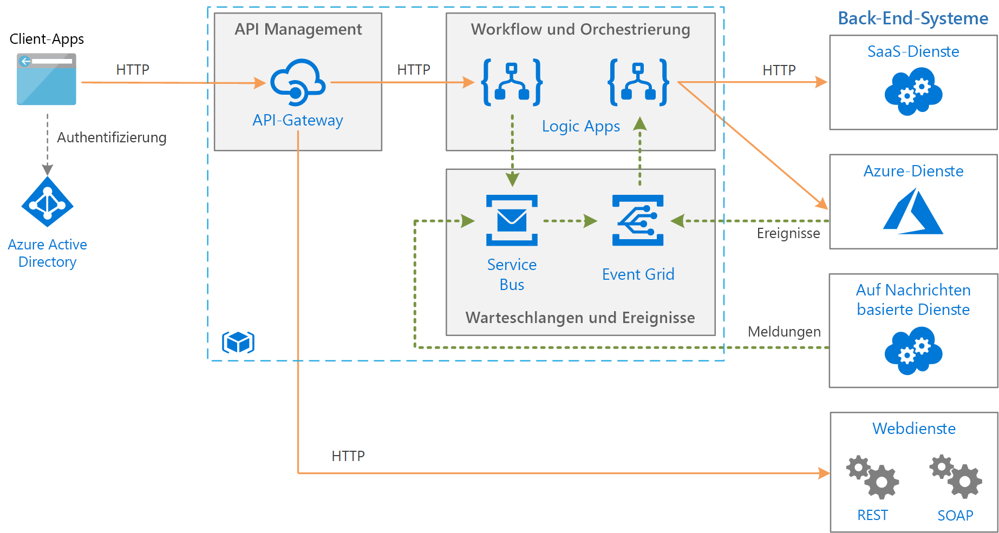

# Unternehmensintegration in Azure mithilfe von Nachrichtenwarteschlangen und Ereignissen

Diese Referenzarchitektur integriert Back-End-Systeme von Unternehmen mithilfe von Nachrichtenwarteschlangen und Ereignissen, um eine Entkoppelung der Dienste und damit eine bessere Skalierbarkeit und Zuverlässigkeit zu erreichen. Die Back-End-Systeme können SaaS-Systeme (Software-as-a-Service), Azure-Dienste und vorhandene Webdienste in Ihrem Unternehmen enthalten.

## Architecture

Die hier gezeigte Architektur basiert auf der einfacheren Architektur aus [Einfache Unternehmensintegration][basic-enterprise-integration]. Diese Architektur verwendet [Logic Apps][logic-apps] zum Orchestrieren von Workflows und [API Management][apim] zum Erstellen von API-Katalogen.

Bei der vorliegenden Version der Architektur werden zwei Komponenten hinzugefügt, um das System zuverlässiger und besser skalierbar zu machen:

- **[Azure Service Bus][service-bus]**: Service Bus ist ein sicherer und zuverlässiger Nachrichtenbroker.

- **[Azure Event Grid][event-grid]**: Event Grid ist ein Ereignisroutingdienst. Er verwendet ein Ereignismodell vom Typ [Veröffentlichen/Abonnieren](../../patterns/publisher-subscriber.md).

Die asynchrone Kommunikation über einen Nachrichtenbroker bietet zahlreiche Vorteile gegenüber synchronen Direktaufrufen für Back-End-Dienste:

- Lastenausgleich zur Bewältigung von Workloadspitzen mithilfe des [warteschlangenbasierten Lastenausgleichsmusters](../../patterns/queue-based-load-leveling.md)
- Zuverlässige Nachverfolgung des Status von Workflows mit langer Laufzeit, die mehrere Schritte oder Anwendungen umfassen
- Entkoppelung von Anwendungen
- Integration in vorhandene nachrichtenbasierte Systeme
- Möglichkeit, Aufgaben einer Warteschlange hinzuzufügen, wenn ein Back-End-System nicht verfügbar ist

Event Grid ermöglicht es den verschiedenen Komponenten im System, auf Ereignisse zu reagieren, sobald diese eintreten. Dadurch sind sie nicht auf Abfragen oder geplante Aufgaben angewiesen. Diese trägt genau wie eine Nachrichtenwarteschlange zur Entkoppelung von Anwendungen und Diensten bei. Eine Anwendung oder ein Dienst kann Ereignisse veröffentlichen, und alle interessierten Abonnenten werden benachrichtigt. Neu Abonnenten können hinzugefügt werden, ohne den Sender zu aktualisieren.

Das Senden von Ereignissen an Event Grid wird von zahlreichen Azure-Diensten unterstützt. So kann beispielsweise eine Logik-App auf ein Ereignis lauschen, wenn einem Blobspeicher neue Dateien hinzugefügt werden. Dieses Muster ermöglicht reaktive Workflows, bei denen das Hochladen einer Datei oder das Platzieren einer Nachricht in einer Warteschlange eine Reihe von Prozessen auslöst. Die Prozesse können parallel oder in einer bestimmten Reihenfolge ausgeführt werden.

## Empfehlungen

Die Empfehlungen aus [Einfache Unternehmensintegration][basic-enterprise-integration] gelten auch für diese Architektur. Es gibt allerdings noch weitere Empfehlungen:

### Service Bus

Service Bus verfügt über zwei Übermittlungsmodi: *Pull* und *Push*. Bei Verwendung des Pull-Modell fragt der Empfänger kontinuierlich ab, ob neue Nachrichten vorhanden sind. Abrufe können ineffizient sein – insbesondere, wenn Sie über viele Warteschlangen verfügen, die jeweils nur einige wenige Nachrichten empfangen, oder wenn die Nachrichten zeitlich weit auseinander liegen. Bei Verwendung des Push-Modells sendet Service Bus ein Ereignis über Event Grid, wenn neue Nachrichten vorhanden sind. Der Empfänger abonniert das Ereignis. Wenn das Ereignis ausgelöst wird, pullt der Empfänger den nächsten Nachrichtenstapel von Service Bus.

Wenn Sie eine Logik-App erstellen, um Service Bus-Nachrichten zu nutzen, empfiehlt es sich, das Push-Modell mit Event Grid-Integration zu verwenden. Da die Logik-App keine Abfragen an Service Bus richten muss, ist es meistens kosteneffizienter. Weitere Informationen finden Sie in der [Übersicht über die Integration von Azure Service Bus in Event Grid](/azure/service-bus-messaging/service-bus-to-event-grid-integration-concept). Für Event Grid-Benachrichtigungen wird derzeit der [Premium-Tarif](https://azure.microsoft.com/pricing/details/service-bus/) von Service Bus benötigt.

Verwenden Sie [PeekLock](/azure/service-bus-messaging/service-bus-messaging-overview#queues), um auf eine Gruppe von Nachrichten zuzugreifen. Mit PeekLock kann die Logik-App dann Schritte ausführen, um die einzelnen Nachrichten zu überprüfen, bevor sie abgeschlossen oder verworfen werden. Dieser Ansatz schützt vor versehentlichem Nachrichtenverlust.

### Event Grid

Wenn ein Event Grid-Trigger ausgelöst wird, bedeutet das, dass *mindestens ein* Ereignis eingetreten ist. Wenn also beispielsweise eine Logik-App einen Event Grid-Trigger für eine Service Bus-Nachricht erhält, ist davon auszugehen, dass unter Umständen mehrere Nachrichten zur Verarbeitung vorliegen.

Event Grid verwendet ein serverloses Modell. Die Abrechnung erfolgt auf Basis der Anzahl der Vorgänge (Ereignisausführungen). Weitere Informationen finden Sie unter [Event Grid-Preise](https://azure.microsoft.com/pricing/details/event-grid/). Für Event Grid gibt es derzeit keine Überlegungen zu den Tarifen.

## Überlegungen zur Skalierbarkeit

Mit dem Service Bus-Premium-Tarif lässt sich die Anzahl von Nachrichteneinheiten horizontal skalieren, um eine höhere Skalierbarkeit zu erreichen. Premium-Tarif-Konfigurationen können über eine, zwei oder vier Nachrichteneinheiten verfügen. Weitere Informationen zum Skalieren von Service Bus finden Sie unter [Bewährte Methoden für Leistungsoptimierungen mithilfe von Service Bus Messaging](/azure/service-bus-messaging/service-bus-performance-improvements).

## Überlegungen zur Verfügbarkeit

Lesen Sie die SLA für jeden Dienst:

- [SLA für API Management][apim-sla]
- [SLA für Event Grid][event-grid-sla]
- [SLA für Logic Apps][logic-apps-sla]
- [SLA für Service Bus][sb-sla]

Erwägen Sie die Implementierung einer georedundanten Notfallwiederherstellung im Service Bus-Premium-Tarif, um bei einem schwerwiegenden Ausfall ein Failover sicherzustellen. Weitere Informationen finden Sie unter [Georedundante Notfallwiederherstellung in Azure Service Bus](/azure/service-bus-messaging/service-bus-geo-dr).

## Sicherheitshinweise

Sichern Sie Service Bus mithilfe von Shared Access Signature (SAS). Mit der [SAS-Authentifizierung](/azure/service-bus-messaging/service-bus-sas) können Sie einem Benutzer Zugriff auf Service Bus-Ressourcen mit spezifischen Rechten gewähren. Weitere Informationen finden Sie unter [Service Bus-Authentifizierung und -Autorisierung](/azure/service-bus-messaging/service-bus-authentication-and-authorization).

Wenn Sie eine Service Bus-Warteschlange als HTTP-Endpunkt verfügbar machen müssen, beispielsweise zum Veröffentlichen neuer Nachrichten, verwenden Sie API Management zum Sichern der Warteschlange, indem der Endpunkt verfügbar gemacht wird. Anschließend können Sie den Endpunkt mit Zertifikaten oder OAuth-Authentifizierung sichern. Ein Endpunkt lässt sich am einfachsten durch die Verwendung einer Logik-App mit einem Anforderung-/Antwort-HTTP-Trigger als Zwischenstufe schützen.

Der Event Grid-Dienst sichert die Ereignisübermittlung durch einen Validierungscode. Wenn Sie Logic Apps verwenden, um das Ereignis abzurufen, wird die Validierung automatisch ausgeführt. Weitere Informationen finden Sie unter [Event Grid – Sicherheit und Authentifizierung](/azure/event-grid/security-authentication).

[apim]: /azure/api-management
[apim-sla]: https://azure.microsoft.com/support/legal/sla/api-management/
[event-grid]: /azure/event-grid/
[event-grid-sla]: https://azure.microsoft.com/support/legal/sla/event-grid
[logic-apps]: /azure/logic-apps/logic-apps-overview
[logic-apps-sla]: https://azure.microsoft.com/support/legal/sla/logic-apps
[sb-sla]: https://azure.microsoft.com/support/legal/sla/service-bus/
[service-bus]: /azure/service-bus-messaging/
[basic-enterprise-integration]: ./basic-enterprise-integration.md
