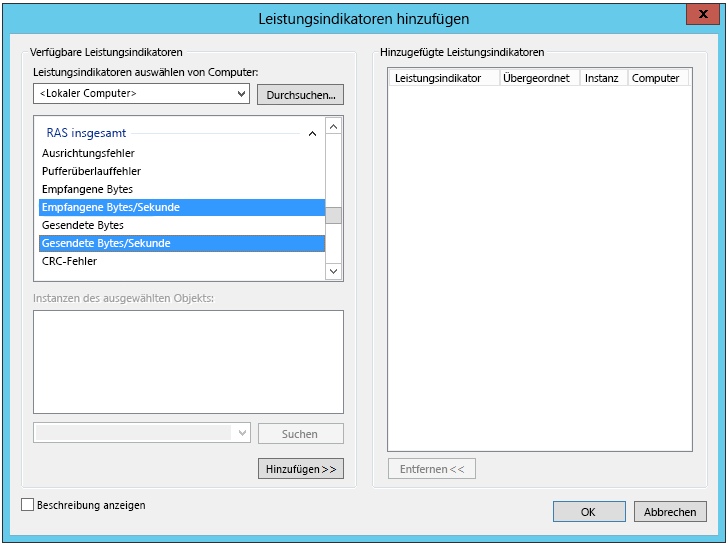
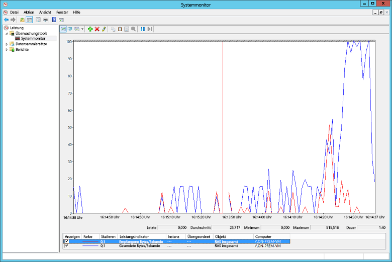

# <a name="troubleshoot-a-hybrid-vpn-connection"></a>Behandeln von Problemen mit einer VPN-Hybridverbindung

Dieser Artikel enthält einige Tipps zur Behandlung von Problemen mit einer VPN-Gatewayverbindung zwischen einem lokalen Netzwerk und Azure. Allgemeine Informationen zur Behandlung gängiger Fehler im Zusammenhang mit einem VPN finden Sie im Blogbeitrag [Troubleshooting common VPN related errors][troubleshooting-vpn-errors] (Problembehandlung bei gängigen VPN-bezogenen Fehlern).

## <a name="verify-the-vpn-appliance-is-functioning-correctly"></a>Überprüfen, ob das VPN-Gerät ordnungsgemäß funktioniert

Die folgenden Empfehlungen sind nützlich, um festzustellen, ob Ihr lokales VPN-Gerät ordnungsgemäß funktioniert.

**Überprüfen Sie die vom VPN-Gerät generierten Protokolldateien auf Fehler oder Ausfälle.** Dies hilft Ihnen festzustellen, ob das VPN-Gerät ordnungsgemäß funktioniert. Der Speicherort dieser Informationen variiert abhängig von Ihrer Anwendung. Wenn Sie beispielsweise RRAS unter Windows Server 2012 verwenden, können Sie den folgenden PowerShell-Befehl verwenden, um Fehlerereignisinformationen für den RRAS-Dienst anzuzeigen:

```PowerShell
Get-EventLog -LogName System -EntryType Error -Source RemoteAccess | Format-List -Property *
```

Die *Message*-Eigenschaft jedes Eintrags enthält eine Beschreibung des Fehlers. Hier einige typische Beispiele:

- Es kann keine Verbindung hergestellt werden (wahrscheinlich, weil in der RRAS-VPN-Netzwerkschnittstellenkonfiguration eine falsche IP-Adresse für das Azure-VPN-Gateway angegeben wurde).

  ```console
  EventID            : 20111
  MachineName        : on-premises-vm
  Data               : {41, 3, 0, 0}
  Index              : 14231
  Category           : (0)
  CategoryNumber     : 0
  EntryType          : Error
  Message            : RoutingDomainID- {00000000-0000-0000-0000-000000000000}: A demand dial connection to the remote
                          interface AzureGateway on port VPN2-4 was successfully initiated but failed to complete
                          successfully because of the  following error: The network connection between your computer and
                          the VPN server could not be established because the remote server is not responding. This could
                          be because one of the network devices (for example, firewalls, NAT, routers, and so on) between your computer
                          and the remote server is not configured to allow VPN connections. Please contact your
                          Administrator or your service provider to determine which device may be causing the problem.
  Source             : RemoteAccess
  ReplacementStrings : {{00000000-0000-0000-0000-000000000000}, AzureGateway, VPN2-4, The network connection between
                          your computer and the VPN server could not be established because the remote server is not
                          responding. This could be because one of the network devices (for example, firewalls, NAT, routers, and so on)
                          between your computer and the remote server is not configured to allow VPN connections. Please
                          contact your Administrator or your service provider to determine which device may be causing the
                          problem.}
  InstanceId         : 20111
  TimeGenerated      : 3/18/2016 1:26:02 PM
  TimeWritten        : 3/18/2016 1:26:02 PM
  UserName           :
  Site               :
  Container          :
  ```

- In der RRAS-VPN-Netzwerkschnittstellenkonfiguration wurde der falsche gemeinsam verwendete Schlüssel angegeben.

  ```console
  EventID            : 20111
  MachineName        : on-premises-vm
  Data               : {233, 53, 0, 0}
  Index              : 14245
  Category           : (0)
  CategoryNumber     : 0
  EntryType          : Error
  Message            : RoutingDomainID- {00000000-0000-0000-0000-000000000000}: A demand dial connection to the remote
                          interface AzureGateway on port VPN2-4 was successfully initiated but failed to complete
                          successfully because of the  following error: Internet key exchange (IKE) authentication credentials are unacceptable.

  Source             : RemoteAccess
  ReplacementStrings : {{00000000-0000-0000-0000-000000000000}, AzureGateway, VPN2-4, IKE authentication credentials are
                          unacceptable.
                          }
  InstanceId         : 20111
  TimeGenerated      : 3/18/2016 1:34:22 PM
  TimeWritten        : 3/18/2016 1:34:22 PM
  UserName           :
  Site               :
  Container          :
  ```

Sie können auch Ereignisprotokollinformationen zu Verbindungsversuchen über den RRAS-Dienst mithilfe des folgenden PowerShell-Befehls abrufen:

```powershell
Get-EventLog -LogName Application -Source RasClient | Format-List -Property *
```

Bei einem Verbindungsfehler enthält dieses Protokoll Fehler, die wie folgt aussehen:

```console
EventID            : 20227
MachineName        : on-premises-vm
Data               : {}
Index              : 4203
Category           : (0)
CategoryNumber     : 0
EntryType          : Error
Message            : CoId={B4000371-A67F-452F-AA4C-3125AA9CFC78}: The user SYSTEM dialed a connection named
                        AzureGateway that has failed. The error code returned on failure is 809.
Source             : RasClient
ReplacementStrings : {{B4000371-A67F-452F-AA4C-3125AA9CFC78}, SYSTEM, AzureGateway, 809}
InstanceId         : 20227
TimeGenerated      : 3/18/2016 1:29:21 PM
TimeWritten        : 3/18/2016 1:29:21 PM
UserName           :
Site               :
Container          :
```

## <a name="verify-connectivity"></a>Überprüfen der Konnektivität

**Überprüfen Sie die Konnektivität und Weiterleitung im gesamten VPN-Gateway.** Das VPN-Gerät leitet möglicherweise den Datenverkehr nicht ordnungsgemäß durch das Azure-VPN-Gateway weiter. Verwenden Sie ein Tool wie[PsPing][psping], um die Konnektivität und Weiterleitung im gesamten VPN-Gateway zu überprüfen. Um beispielsweise die Konnektivität eines lokalen Computers mit einem Webserver im VNet zu testen, führen Sie den folgenden Befehl aus (ersetzen Sie `<<web-server-address>>` durch die Adresse des Webservers):

```console
PsPing -t <<web-server-address>>:80
```

Wenn der lokale Rechner Datenverkehr an den Webserver weiterleiten kann, sollten Sie eine Ausgabe ähnlich der folgenden sehen:

```console
D:\PSTools>psping -t 10.20.0.5:80

PsPing v2.01 - PsPing - ping, latency, bandwidth measurement utility
Copyright (C) 2012-2014 Mark Russinovich
Sysinternals - www.sysinternals.com

TCP connect to 10.20.0.5:80:
Infinite iterations (warmup 1) connecting test:
Connecting to 10.20.0.5:80 (warmup): 6.21ms
Connecting to 10.20.0.5:80: 3.79ms
Connecting to 10.20.0.5:80: 3.44ms
Connecting to 10.20.0.5:80: 4.81ms

    Sent = 3, Received = 3, Lost = 0 (0% loss),
    Minimum = 3.44ms, Maximum = 4.81ms, Average = 4.01ms
```

Wenn der lokale Computer nicht mit dem angegebenen Ziel kommunizieren kann, werden Meldungen wie diese angezeigt:

```console
D:\PSTools>psping -t 10.20.1.6:80

PsPing v2.01 - PsPing - ping, latency, bandwidth measurement utility
Copyright (C) 2012-2014 Mark Russinovich
Sysinternals - www.sysinternals.com

TCP connect to 10.20.1.6:80:
Infinite iterations (warmup 1) connecting test:
Connecting to 10.20.1.6:80 (warmup): This operation returned because the timeout period expired.
Connecting to 10.20.1.6:80: This operation returned because the timeout period expired.
Connecting to 10.20.1.6:80: This operation returned because the timeout period expired.
Connecting to 10.20.1.6:80: This operation returned because the timeout period expired.
Connecting to 10.20.1.6:80:
    Sent = 3, Received = 0, Lost = 3 (100% loss),
    Minimum = 0.00ms, Maximum = 0.00ms, Average = 0.00ms
```

**Stellen Sie sicher, dass die lokale Firewall VPN-Datenverkehr passieren lässt und die richtigen Ports geöffnet sind.**

**Prüfen Sie, ob das lokale VPN-Gerät eine Verschlüsselungsmethode verwendet, die mit dem Azure-VPN-Gateway kompatibel ist.** Für richtlinienbasiertes Routing unterstützt das Azure-VPN-Gateway die Verschlüsselungsalgorithmen AES256, AES128 und 3DES. Routenbasierte Gateways unterstützen AES256 und 3DES. Weitere Informationen finden Sie unter [Informationen zu VPN-Geräten und IPsec-/IKE-Parametern für VPN-Gatewayverbindungen zwischen Standorten][vpn-appliance].

## <a name="check-for-problems-with-the-azure-vpn-gateway"></a>Überprüfen, ob Probleme mit dem Azure-VPN-Gateway vorliegen

Die folgenden Empfehlungen sind nützlich, um festzustellen, ob ein Problem mit dem Azure-VPN-Gateway vorliegt:

**Untersuchen Sie Diagnoseprotokolle für das Azure-VPN-Gateway auf potenzielle Probleme.** Weitere Informationen finden Sie unter [Step-by-Step: Capturing Azure Resource Manager (ARM) VNET Gateway Diagnostic Logs][gateway-diagnostic-logs] (Schritt für Schritt: Erfassen von ARM-VNET-Gatewaydiagnoseprotokollen).

**Stellen Sie sicher, dass das Azure-VPN-Gateway und das lokale VPN-Gerät mit demselben gemeinsam genutzten Authentifizierungsschlüssel konfiguriert sind.** Sie können den vom Azure-VPN-Gateway gespeicherten gemeinsamen Schlüssel mithilfe des folgenden Azure CLI-Befehls einsehen:

```azurecli
azure network vpn-connection shared-key show <<resource-group>> <<vpn-connection-name>>
```

Verwenden Sie den Befehl entsprechend Ihrem lokalen VPN-Gerät, um den gemeinsam genutzten Schlüssel anzuzeigen, der für dieses Gerät konfiguriert wurde.

Vergewissern Sie sich, dass das Subnetz *GatewaySubnet*, in dem sich das Azure-VPN-Gateway befindet, keiner Netzwerksicherheitsgruppe zugeordnet ist.

Sie können die Details des Subnetzes mit dem folgenden Azure CLI-Befehl einsehen:

```azurecli
azure network vnet subnet show -g <<resource-group>> -e <<vnet-name>> -n GatewaySubnet
```

Vergewissern Sie sich, dass kein Datenfeld mit dem Namen *Network Security Group ID* vorhanden ist. Das folgende Beispiel zeigt die Ergebnisse für eine Instanz von *GatewaySubnet*, der eine Netzwerksicherheitsgruppe (*VPN-Gateway-Group*) zugewiesen ist. Wenn für diese Netzwerksicherheitsgruppe Regeln definiert sind, kann dies das ordnungsgemäße Funktionieren des Gateways verhindern.

```console
C:\>azure network vnet subnet show -g profx-prod-rg -e profx-vnet -n GatewaySubnet
    info:    Executing command network vnet subnet show
    + Looking up virtual network "profx-vnet"
    + Looking up the subnet "GatewaySubnet"
    data:    Id                              : /subscriptions/########-####-####-####-############/resourceGroups/profx-prod-rg/providers/Microsoft.Network/virtualNetworks/profx-vnet/subnets/GatewaySubnet
    data:    Name                            : GatewaySubnet
    data:    Provisioning state              : Succeeded
    data:    Address prefix                  : 10.20.3.0/27
    data:    Network Security Group id       : /subscriptions/########-####-####-####-############/resourceGroups/profx-prod-rg/providers/Microsoft.Network/networkSecurityGroups/VPN-Gateway-Group
    info:    network vnet subnet show command OK
```

**Vergewissern Sie sich, dass die virtuellen Computer im Azure VNet so konfiguriert sind, dass sie Datenverkehr von außerhalb des VNet zulassen.** Überprüfen Sie jegliche NSG-Regeln, die mit Subnetzen verknüpft sind, die diese virtuellen Computer enthalten. Sie können alle NSG-Regeln mit dem folgenden Azure CLI-Befehl einsehen:

```azurecli
azure network nsg show -g <<resource-group>> -n <<nsg-name>>
```

**Stellen Sie sicher, dass das Azure-VPN-Gateway verbunden ist.** Mit dem folgenden Azure PowerShell-Befehl können Sie den aktuellen Status der Azure-VPN-Verbindung überprüfen. Der Parameter `<<connection-name>>` ist der Name der Azure-VPN-Verbindung, die das virtuelle Netzwerkgateway mit dem lokalen Gateway verknüpft.

```powershell
Get-AzureRmVirtualNetworkGatewayConnection -Name <<connection-name>> - ResourceGroupName <<resource-group>>
```

In den folgenden Codeausschnitte ist die Ausgabe hervorgehoben, die erzeugt wird, wenn das Gateway verbunden (das erste Beispiel) und getrennt (das zweite Beispiel) ist:

```powershell
PS C:\> Get-AzureRmVirtualNetworkGatewayConnection -Name profx-gateway-connection -ResourceGroupName profx-prod-rg

AuthorizationKey           :
VirtualNetworkGateway1     : Microsoft.Azure.Commands.Network.Models.PSVirtualNetworkGateway
VirtualNetworkGateway2     :
LocalNetworkGateway2       : Microsoft.Azure.Commands.Network.Models.PSLocalNetworkGateway
Peer                       :
ConnectionType             : IPsec
RoutingWeight              : 0
SharedKey                  : ####################################
ConnectionStatus           : Connected
EgressBytesTransferred     : 55254803
IngressBytesTransferred    : 32227221
ProvisioningState          : Succeeded
...
```

```powershell
PS C:\> Get-AzureRmVirtualNetworkGatewayConnection -Name profx-gateway-connection2 -ResourceGroupName profx-prod-rg

AuthorizationKey           :
VirtualNetworkGateway1     : Microsoft.Azure.Commands.Network.Models.PSVirtualNetworkGateway
VirtualNetworkGateway2     :
LocalNetworkGateway2       : Microsoft.Azure.Commands.Network.Models.PSLocalNetworkGateway
Peer                       :
ConnectionType             : IPsec
RoutingWeight              : 0
SharedKey                  : ####################################
ConnectionStatus           : NotConnected
EgressBytesTransferred     : 0
IngressBytesTransferred    : 0
ProvisioningState          : Succeeded
...
```

## <a name="miscellaneous-issues"></a>Sonstige Probleme

Die folgenden Empfehlungen sind nützlich, um festzustellen, ob es Probleme mit der Host-VM-Konfiguration, der Auslastung von Netzwerkbandbreite oder der Anwendungsleistung gibt:

**Überprüfen Sie die Firewallkonfiguration.** Vergewissern Sie sich, dass die Firewall in dem Gastbetriebssystem, das auf den virtuellen Azure-Computern im Subnetz ausgeführt wird, ordnungsgemäß konfiguriert ist, um zulässigen Datenverkehr aus den lokalen IP-Adressbereichen zuzulassen.

**Stellen Sie sicher, dass das Datenverkehrsvolumen nicht nahe an der Grenze der Bandbreite liegt, die dem Azure-VPN-Gateway zur Verfügung steht.** Wie Sie dies überprüfen können, hängt vom VPN-Gerät ab, das lokal ausgeführt wird. Wenn Sie z.B. RRAS unter Windows Server 2012 verwenden, können Sie mit Systemmonitor die Menge der Daten verfolgen, die über die VPN-Verbindung empfangen und übertragen werden. Wählen Sie unter Verwendung des Objekts *RAS insgesamt* die Leistungsindikatoren *Empfangene Bytes/Sek.* und *Übertragene Bytes/Sek.*:



Vergleichen Sie die Ergebnisse mit der Bandbreite, die dem VPN-Gateway zur Verfügung steht (von 100 MBit/s für die Basic-SKU bis 1,25 GBit/s für die VpnGw3-SKU):



**Vergewissern Sie sich, dass Sie die richtige Anzahl und Größe von VMs für Ihre Anwendungslast bereitgestellt haben.** Stellen Sie fest, ob virtuelle Computer im Azure VNet langsam arbeiten. Falls ja, können sie überlastet sein, es können zu wenige sein, um die Last zu bewältigen, oder die Load Balancer sind möglicherweise nicht richtig konfiguriert. Um dies zu ermitteln, [müssen Sie Diagnoseinformationen aufzeichnen und analysieren][azure-vm-diagnostics]. Sie können die Ergebnisse im Azure-Portal einsehen. Es stehen aber auch viele Tools von Drittanbietern zur Verfügung, die detaillierte Einblicke in die Leistungsdaten ermöglichen.

**Vergewissern Sie sich, dass die Anwendung Cloudressourcen effizient nutzt.** Instrumentieren Sie Anwendungscode, der auf jeder VM ausgeführt wird, um festzustellen, ob Anwendungen Ressourcen optimal nutzen. Dafür können Sie Tools wie [Application Insights][application-insights] verwenden.

<!-- links -->

[application-insights]: /azure/application-insights/app-insights-overview-usage
[azure-vm-diagnostics]: https://azure.microsoft.com/blog/windows-azure-virtual-machine-monitoring-with-wad-extension/
[gateway-diagnostic-logs]: https://blogs.technet.microsoft.com/keithmayer/2016/10/12/step-by-step-capturing-azure-resource-manager-arm-vnet-gateway-diagnostic-logs/
[psping]: https://technet.microsoft.com/sysinternals/jj729731.aspx
[troubleshooting-vpn-errors]: https://blogs.technet.microsoft.com/rrasblog/2009/08/12/troubleshooting-common-vpn-related-errors/
[vpn-appliance]: /azure/vpn-gateway/vpn-gateway-about-vpn-devices
