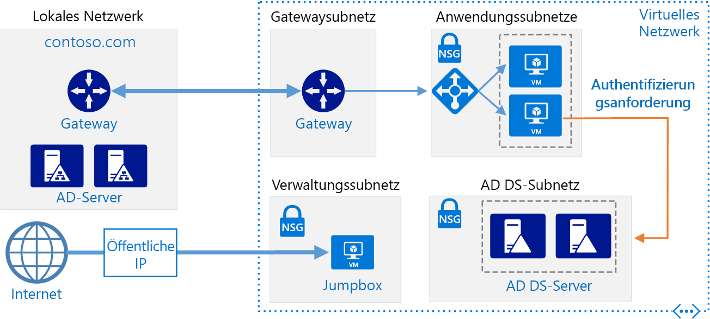
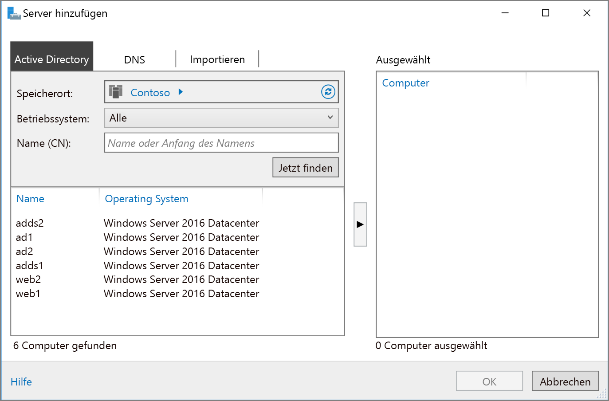

# <a name="extend-active-directory-domain-services-ad-ds-to-azure"></a>Erweitern von Active Directory Domain Services (AD DS) auf Azure

Diese Referenzarchitektur zeigt, wie Sie Ihre Active Directory-Umgebung nach Azure erweitern, um verteilte Authentifizierungsdienste mit Active Directory Domain Services (AD DS) bereitzustellen. [**Stellen Sie diese Lösung bereit**](#deploy-the-solution).



*Laden Sie eine [Visio-Datei][visio-download] mit dieser Architektur herunter.*

AD DS dient zum Authentifizieren von Benutzern, Computern, Anwendungen oder anderen Identitäten in einer Sicherheitsdomäne. Ein lokales Hosting ist zwar möglich, aber wenn Ihre Anwendung teilweise lokal und teilweise in Azure gehostet wird, ist es möglicherweise effizienter, diese Funktionalität in Azure zu replizieren. Dies kann Verzögerungen verringern, die durch das Senden der Authentifizierung und von lokalen Autorisierungsanforderungen aus der Cloud zurück in die lokale AD DS-Instanz auftreten.

Diese Architektur wird häufig verwendet, wenn das lokale Netzwerk und das virtuelle Azure-Netzwerk über eine VPN- oder ExpressRoute-Verbindung miteinander verbunden sind. Diese Architektur unterstützt auch die bidirektionale Replikation, sodass Änderungen sowohl lokal als auch in der Cloud vorgenommen werden können und dabei beide Quellen konsistent bleiben. Typische Einsatzfälle für diese Architektur sind Hybridanwendungen, bei denen die Funktionalität lokal und in Azure bereitgestellt wird und Anwendungen und Dienste die Authentifizierung mit Active Directory durchführen.

Weitere Überlegungen finden Sie unter [Auswählen einer Lösung für die Integration einer lokalen Active Directory-Instanz in Azure][considerations].

## <a name="architecture"></a>Architecture

Diese Architektur erweitert die in [DMZ zwischen Azure und dem Internet][implementing-a-secure-hybrid-network-architecture-with-internet-access] gezeigte Architektur. Sie enthält die folgenden Komponenten.

- **Lokales Netzwerk**. Das lokale Netzwerk enthält lokale Active Directory-Server, die Authentifizierung und Autorisierung für lokale Komponenten ausführen können.
- **Active Directory-Server**. Hierbei handelt es sich um Domänencontroller, die Verzeichnisdienste (AD DS) implementieren und als virtuelle Computer in der Cloud ausgeführt werden. Diese Server führen die Authentifizierung von Komponenten durch, die in Ihrem virtuellen Azure-Netzwerk ausgeführt werden.
- **Active Directory-Subnetz**. Die AD DS-Server werden in einem separaten Subnetz gehostet. NSG-Regeln (Netzwerksicherheitsgruppe) schützen die AD DS-Server und stellen eine Firewall für Datenverkehr von unerwarteten Quellen dar.
- **Azure-Gateway und Active Directory-Synchronisierung**. Das Azure-Gateway stellt eine Verbindung zwischen Ihrem lokalen Netzwerk und dem virtuellen Azure-Netzwerk her. Dabei kann es sich um eine [VPN-Verbindung][azure-vpn-gateway] oder um [Azure ExpressRoute][azure-expressroute] handeln. Alle Synchronisierungsanforderungen zwischen den Active Directory-Servern in der Cloud und den lokalen Servern werden über das Gateway weitergeleitet. Benutzerdefinierte Routen (UDRs) verarbeiten das Routing für den lokalen Datenverkehr, der zu Azure übertragen wird. Datenverkehr zu und von Active Directory-Servern wird in diesem Szenario nicht über virtuelle Netzwerkgeräte (NVAs) übermittelt.

Weitere Informationen zum Konfigurieren von UDRs und NVAs finden Sie unter [Implementieren einer sicheren Hybrid-Netzwerkarchitektur in Azure][implementing-a-secure-hybrid-network-architecture].

## <a name="recommendations"></a>Empfehlungen

Die folgenden Empfehlungen gelten für die meisten Szenarios. Sofern Sie keine besonderen Anforderungen haben, die Vorrang haben, sollten Sie diese Empfehlungen befolgen.

### <a name="vm-recommendations"></a>Empfehlungen für virtuelle Computer

Sie bestimmen die Anforderungen an die [VM-Größe][vm-windows-sizes] anhand der erwarteten Menge von Authentifizierungsanforderungen. Nutzen Sie die Spezifikationen des Computers, auf dem AD DS lokal ausgeführt wird, als Ausgangspunkt, und passen Sie die Azure-VM-Größen entsprechend an. Nach der Bereitstellung überwachen Sie die Auslastung und führen anhand der tatsächlichen Last auf den virtuellen Computern eine zentrale Hoch- oder Herunterskalierung durch. Weitere Informationen zum Ändern der Größe von AD DS-Domänencontrollern finden Sie unter [Kapazitätsplanung für Active Directory Domain Services][capacity-planning-for-adds].

Erstellen Sie einen separaten virtuellen Datenträger zum Speichern der Datenbank, der Protokolle und von SYSVOL für Active Directory. Speichern Sie diese Elemente nicht auf demselben Datenträger wie das Betriebssystem. Standardmäßig verwenden die Datenträger, die an eine VM angefügt sind, einen Durchschreibcache (Write-Through Caching). Allerdings kann diese Form des Cachings zu Konflikten mit den Anforderungen von AD DS führen. Legen Sie daher unter *Hostcacheeinstellungen* für den Datenträger *Keine* fest. Weitere Informationen finden Sie unter [Richtlinien zum Bereitstellen von Windows Server Active Directory auf Azure Virtual Machines][adds-data-disks].

Stellen Sie mindestens zwei virtuelle Computer mit AD DS als Domänencontroller bereit, und fügen Sie sie einer [Verfügbarkeitsgruppe][availability-set] hinzu.

### <a name="networking-recommendations"></a>Netzwerkempfehlungen

Konfigurieren Sie die Netzwerkschnittstelle (NIC) der VM für jeden AD DS-Server für vollständige DNS-Unterstützung (Domain Name Service) mit einer statischen privaten IP-Adresse. Weitere Informationen finden Sie unter [Einrichten einer statischen privaten IP-Adresse im Azure-Portal][set-a-static-ip-address].

> [!NOTE]
> Konfigurieren Sie nicht die VM-NIC für AD DS-Instanzen mit einer öffentlichen IP-Adresse. Weitere Informationen finden Sie unter [Überlegungen zur Sicherheit][security-considerations].
>

Die NSG für das Active Directory-Subnetz erfordert Regeln zum Zulassen von eingehendem Datenverkehr aus lokalen Quellen. Ausführliche Informationen zu den Ports, die AD DS verwendet, finden Sie unter [Portanforderungen für Active Directory und Active Directory Domain Services][ad-ds-ports]. Stellen Sie außerdem sicher, dass die UDR-Tabellen AD DS-Datenverkehr nicht über die in dieser Architektur verwendeten NVAs leiten.

### <a name="active-directory-site"></a>Active Directory-Standort

In AD DS stellt ein Standort einen physischen Standort, ein Netzwerk oder eine Sammlung von Geräten dar. AD DS-Standorte dienen zum Verwalten der AD DS-Datenbankreplikation durch das Gruppieren von AD DS-Objekten, die sich nah beieinander befinden und über ein Hochgeschwindigkeitsnetzwerk verbunden sind. AD DS enthält Logik zum Auswählen der besten Strategie für das Replizieren der AD DS-Datenbank zwischen Standorten.

Es wird empfohlen, dass Sie einen AD DS-Standort einschließlich der Subnetze, die für Ihre Anwendung in Azure definiert wurden, erstellen. Konfigurieren Sie dann eine Standortverknüpfung zwischen Ihren lokalen AD DS-Standorten. AD DS führt daraufhin automatisch die effizienteste Datenbankreplikation durch. Beachten Sie, dass diese Datenbankreplikation die Erstkonfiguration etwas erweitert.

### <a name="active-directory-operations-masters"></a>Active Directory-Betriebsmaster

Zur Unterstützung der Konsistenzüberprüfung zwischen Instanzen replizierter AD DS-Datenbanken kann die Betriebsmasterrolle auch AD DS-Domänencontrollern zugewiesen werden. Es gibt fünf Betriebsmasterrollen: Schemamaster, Domänennamenmaster RID-Master, Masteremulator für den primären Domänencontroller und Infrastrukturmaster. Weitere Informationen zu diesen Rollen finden Sie unter [Was sind Betriebsmaster?][ad-ds-operations-masters].

Es wird empfohlen, den in Azure bereitgestellten Domänencontrollern keine Betriebsmasterrollen zuzuweisen.

### <a name="monitoring"></a>Überwachung

Überwachen Sie die Ressourcen der Domänencontroller-VMs sowie die AD DS-Dienste, und erstellen Sie einen Plan zum schnellen Beheben eventuell auftretender Probleme. Weitere Informationen finden Sie unter [Überwachen von Active Directory][monitoring_ad]. Sie können auch Tools wie [Microsoft Systems Center][microsoft_systems_center] auf dem Überwachungsserver installieren (siehe Architekturdiagramm), um diese Aufgaben auszuführen.

## <a name="scalability-considerations"></a>Überlegungen zur Skalierbarkeit

AD DS ist auf Skalierbarkeit ausgelegt. Sie müssen keinen Lastenausgleich und keine Datenverkehrssteuerung konfigurieren, um Anforderungen an AD DS-Domänencontroller umzuleiten. Den einzigen Skalierungsaspekt stellt die Konfiguration der virtuellen Computer, auf denen AD DS ausgeführt wird, mit der richtigen Größe für die Lastanforderungen Ihres Netzwerks dar. Dazu überwachen Sie die Last auf den virtuellen Computern und skalieren nach Bedarf zentral hoch oder herunter.

## <a name="availability-considerations"></a>Überlegungen zur Verfügbarkeit

Stellen Sie die virtuellen Computer mit AD DS in einer [Verfügbarkeitsgruppe][availability-set] bereit. Erwägen Sie dabei auch, die Rolle des [Standby-Betriebsmasters][standby-operations-masters] mindestens einem Server (je nach Ihren Anforderungen auch mehr) zuzuweisen. Ein Standby-Betriebsmaster ist eine aktive Kopie des Betriebsmasters, die anstelle des primären Betriebsmasterservers während des Failovers verwendet werden kann.

## <a name="manageability-considerations"></a>Überlegungen zur Verwaltbarkeit

Führen Sie regelmäßige Sicherungen von AD DS durch. Kopieren Sie nicht einfach die VHD-Dateien der Domänencontroller, anstatt regelmäßige Sicherungen auszuführen, da die AD DS-Datenbankdatei auf der VHD möglicherweise beim Kopieren nicht konsistent ist. Dies könnte dazu führen, dass die Datenbank nicht mehr neu gestartet werden kann.

Fahren Sie Domänencontroller-VMs nicht über das Azure-Portal herunter. Führen Sie die Vorgänge zum Herunterfahren und Neustarten stattdessen im Gastbetriebssystem durch. Beim Herunterfahren über das Portal wird die Zuordnung des virtuellen Computers aufgehoben und dadurch sowohl die `VM-GenerationID` als auch die `invocationID` des Active Directory-Repositorys zurückgesetzt. Damit werden der RID-Pool (relative ID) von AD DS verworfen und SYSVOL als nicht autorisierend markiert. Als Folge müsste der Domänencontroller neu konfiguriert werden.

## <a name="security-considerations"></a>Sicherheitshinweise

AD DS-Server stellen Authentifizierungsdienste bereit und sind damit ein attraktives Ziel für Angriffe. Wenn Sie sie schützen möchten, müssen Sie direkte Internetverbindungen verhindern, indem Sie die AD DS-Server in einem separaten Subnetz mit einer NSG, die als Firewall fungiert, platzieren. Schließen Sie alle Ports auf den AD DS-Servern mit Ausnahme derjenigen, die für die Authentifizierung, Autorisierung und Serversynchronisierung erforderlich sind. Weitere Informationen finden Sie unter [Portanforderungen für Active Directory und Active Directory Domain Services][ad-ds-ports].

Erwägen Sie auch die Implementierung zusätzlicher Sicherheitsperimeter um die Server durch ein Paar von Subnetzen und NVAs. Eine Beschreibung finden Sie unter [Implementieren einer sichere Hybrid-Netzwerkarchitektur mit Internetzugriff in Azure][implementing-a-secure-hybrid-network-architecture-with-internet-access].

Verwenden Sie BitLocker oder Azure Disk Encryption, um den Datenträger, auf dem die AD DS-Datenbank gehostet wird, zu verschlüsseln.

## <a name="deploy-the-solution"></a>Bereitstellen der Lösung

Eine Bereitstellung für diese Architektur ist auf [GitHub][github] verfügbar. Beachten Sie, dass die gesamte Bereitstellung bis zu zwei Stunden dauern kann, was das Erstellen des VPN-Gateways und die Ausführung der Skripts beinhaltet, die AD DS konfigurieren.

### <a name="prerequisites"></a>Voraussetzungen

1. Führen Sie das Klonen, Forken oder Herunterladen der ZIP-Datei für das [GitHub-Repository](https://github.com/mspnp/identity-reference-architectures) durch.

2. Installieren Sie [Azure CLI 2.0](/cli/azure/install-azure-cli?view=azure-cli-latest).

3. Installieren Sie das npm-Paket mit den [Azure Bausteinen](https://github.com/mspnp/template-building-blocks/wiki/Install-Azure-Building-Blocks).

   ```bash
   npm install -g @mspnp/azure-building-blocks
   ```

4. Melden Sie sich über eine Eingabeaufforderung, eine Bash-Eingabeaufforderung oder die PowerShell-Eingabeaufforderung folgendermaßen bei Ihrem Azure-Konto an:

   ```bash
   az login
   ```

### <a name="deploy-the-simulated-on-premises-datacenter"></a>Bereitstellen des simulierten lokalen Rechenzentrums

1. Navigieren Sie zum Ordner `identity/adds-extend-domain` des GitHub-Repositorys.

2. Öffnen Sie die Datei `onprem.json` . Suchen Sie nach Instanzen von `adminPassword` und `Password`, und fügen Sie Werte für die Kennwörter hinzu.

3. Führen Sie den folgenden Befehl aus, und warten Sie, bis die Bereitstellung abgeschlossen ist:

    ```bash
    azbb -s <subscription_id> -g <resource group> -l <location> -p onprem.json --deploy
    ```

### <a name="deploy-the-azure-vnet"></a>Bereitstellen von Azure VNet

1. Öffnen Sie die Datei `azure.json` .  Suchen Sie nach Instanzen von `adminPassword` und `Password`, und fügen Sie Werte für die Kennwörter hinzu.

2. Suchen Sie in der gleichen Datei nach Instanzen von `sharedKey`, und geben Sie gemeinsam verwendete Schlüssel für die VPN-Verbindung ein.

    ```json
    "sharedKey": "",
    ```

3. Führen Sie den folgenden Befehl aus, und warten Sie, bis die Bereitstellung abgeschlossen ist.

    ```bash
    azbb -s <subscription_id> -g <resource group> -l <location> -p azure.json --deploy
    ```

   Führen Sie die Bereitstellung in der gleichen Ressourcengruppe durch, in der das lokale VNet bereitgestellt ist.

### <a name="test-connectivity-with-the-azure-vnet"></a>Testen der Konnektivität mit Azure VNet

Nach Abschluss der Bereitstellung können Sie die Konnektivität zwischen der simulierten lokalen Umgebung und dem virtuellen Azure-Netzwerk testen.

1. Navigieren Sie im Azure-Portal zu der Ressourcengruppe, die Sie erstellt haben.

2. Suchen Sie den virtuellen Computer mit dem Namen `ra-onpremise-mgmt-vm1`.

3. Klicke Sie auf `Connect`, um eine Remotedesktopsitzung mit der VM zu öffnen. Der Benutzername ist `contoso\testuser`, und das Kennwort entspricht dem, das Sie in der `onprem.json`-Parameterdatei angegeben haben.

4. Öffnen Sie von der Remotedesktopsitzung aus eine andere Remotedesktopsitzung mit 10.0.4.4, der IP-Adresse des virtuellen Computers mit dem Namen `adds-vm1`. Der Benutzername ist `contoso\testuser`, und das Kennwort entspricht dem, das Sie in der `azure.json`-Parameterdatei angegeben haben.

5. Wechseln Sie innerhalb der Remotedesktopsitzung für `adds-vm1` zum **Server-Manager**, und klicken Sie auf **Weitere zu verwaltende Server hinzufügen**.

6. Klicken Sie auf der Registerkarte **Active Directory** auf **Jetzt suchen**. Daraufhin sollte eine Liste der AD-, AD DS- und Web-VMs angezeigt werden.

   

## <a name="next-steps"></a>Nächste Schritte

- Informieren Sie sich über bewährte Methoden für das [Erstellen einer AD DS-Ressourcengesamtstruktur][adds-resource-forest] in Azure.
- Informieren Sie sich über bewährte Methoden für das [Erstellen einer Infrastruktur für Active Directory-Verbunddienste (AD FS)][adfs] in Azure.

<!-- links -->

[adds-resource-forest]: adds-forest.md
[adfs]: adfs.md
[azure-cli-2]: /azure/install-azure-cli
[azbb]: https://github.com/mspnp/template-building-blocks/wiki/Install-Azure-Building-Blocks
[implementing-a-secure-hybrid-network-architecture]: ../dmz/secure-vnet-hybrid.md
[implementing-a-secure-hybrid-network-architecture-with-internet-access]: ../dmz/secure-vnet-dmz.md

[adds-data-disks]: https://msdn.microsoft.com/en-us/library/mt674703.aspx
[ad-ds-operations-masters]: https://technet.microsoft.com/library/cc779716(v=ws.10).aspx
[ad-ds-ports]: https://technet.microsoft.com/library/dd772723(v=ws.11).aspx
[availability-set]: /azure/virtual-machines/virtual-machines-windows-create-availability-set
[azure-expressroute]: /azure/expressroute/expressroute-introduction
[azure-vpn-gateway]: /azure/vpn-gateway/vpn-gateway-about-vpngateways
[capacity-planning-for-adds]: https://social.technet.microsoft.com/wiki/contents/articles/14355.capacity-planning-for-active-directory-domain-services.aspx
[considerations]: ./considerations.md
[GitHub]: https://github.com/mspnp/identity-reference-architectures/tree/master/adds-extend-domain
[microsoft_systems_center]: https://www.microsoft.com/download/details.aspx?id=50013
[monitoring_ad]: https://msdn.microsoft.com/library/bb727046.aspx
[security-considerations]: #security-considerations
[set-a-static-ip-address]: /azure/virtual-network/virtual-networks-static-private-ip-arm-pportal
[standby-operations-masters]: https://technet.microsoft.com/library/cc794737(v=ws.10).aspx
[visio-download]: https://archcenter.blob.core.windows.net/cdn/identity-architectures.vsdx
[vm-windows-sizes]: /azure/virtual-machines/virtual-machines-windows-sizes

[0]: ./images/adds-extend-domain.png "Schützen einer Hybrid-Netzwerkarchitektur mit Active Directory"
