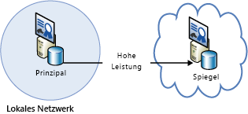

[!INCLUDE [header](../_includes/header.md)]
# Technischer Leitfaden zur Resilienz in Azure: Wiederherstellung eines lokalen Rechenzentrums in Azure
Azure bietet eine Reihe von Diensten, mit denen sich ein lokales Datencenter auf Azure ausweiten lässt, um hohe Verfügbarkeit und Notfallwiederherstellung zu ermöglichen:

* **Netzwerk**: Mit einem virtuellen privaten Netzwerk können Sie Ihr lokales Netzwerk sicher in die Cloud erweitern.
* **Compute**: Kunden, die Hyper-V lokal verwenden, können vorhandene virtuelle Computer ganz einfach per „Lift&amp;amp;Shift“ nach Azure verlagern.
* **Speicher**: StorSimple erweitert Ihr Dateisystem in Azure Storage. Der Azure Backup-Dienst ermöglicht die Sicherung von Dateien und SQL-Datenbanken in Azure Storage.
* **Datenbankreplikation**: Mit Verfügbarkeitsgruppen in SQL Server 2014 (oder höher) können Sie eine hohe Verfügbarkeit und Notfallwiederherstellung für Ihre lokalen Daten implementieren.

## Netzwerk
Azure Virtual Network ermöglicht die Erstellung eines logisch isolierten Bereichs in Azure, den Sie über eine IPsec-Verbindung sicher mit Ihrem lokalen Datencenter oder mit einem einzelnen Clientcomputer verbinden können. Mit Virtual Network profitieren Sie von den Vorteilen der skalierbaren bedarfsgesteuerten Infrastruktur in Azure und können gleichzeitig eine Verbindung mit lokalen Daten und Anwendungen bereitstellen – einschließlich Systemen, die unter Windows Server, Mainframes und UNIX ausgeführt werden. Weitere Informationen finden Sie in der [Azure-Netzwerkdokumentation](/azure/virtual-network/virtual-networks-overview/) .

## Compute
Wenn Sie Hyper-V lokal verwenden, können Sie vorhandene virtuelle Computer per „Lift&Shift“ nach Azure sowie an Dienstanbieter unter Windows Server 2012 (oder höher) verlagern, ohne Änderungen am virtuellen Computer vornehmen oder Formate für virtuelle Computer konvertieren zu müssen. Weitere Informationen finden Sie unter [Informationen zu Festplatten und VHDs für virtuelle Azure-Computer](/azure/virtual-machines/virtual-machines-linux-about-disks-vhds/?toc=%2fazure%2fvirtual-machines%2flinux%2ftoc.json).

## Azure Site Recovery
Wenn Sie DRaaS (Disaster Recovery as a Service) einrichten möchten, nutzen Sie [Azure Site Recovery](https://azure.microsoft.com/services/site-recovery/). Azure Site Recovery bietet umfassenden Schutz für VMware-Server, Hyper-V-Server und physische Server. Mit Azure Site Recovery können Sie einen anderen lokalen Server oder Azure als Wiederherstellungsstandort nutzen. Weitere Informationen zu Azure Site Recovery finden Sie in der [Dokumentation zu Azure Site Recovery](https://azure.microsoft.com/documentation/services/site-recovery/).

## Speicher
Es gibt verschiedene Möglichkeiten, Azure als Sicherungsstandort für lokale Daten zu nutzen.

### StorSimple
StorSimple integriert Cloudspeicher für lokale Anwendungen sicher und transparent. Darüber hinaus bietet die Lösung eine einzelne Appliance mit hochleistungsfähigem, gestaffeltem Speicher (lokal und cloudbasiert), Livearchivierung, cloudbasiertem Datenschutz cloudbasierter Notfallwiederherstellung. Weitere Informationen finden Sie auf der [StorSimple-Produktseite](https://azure.microsoft.com/services/storsimple/).

### Azure Backup
Azure Backup ermöglicht Cloudsicherungen mithilfe der vertrauten Tools in Windows Server 2012 (oder höher), Windows Server 2012 Essentials (oder höher) und System Center 2012 Data Protection Manager (oder höher). Diese Tools stellen einen Workflow für die Sicherungsverwaltung bereit, der unabhängig vom Speicherort der Sicherungen ist – egal, ob es sich um einen lokalen Datenträger oder Azure Storage handelt. Nachdem die Daten in der Cloud gesichert wurden, können autorisierte Benutzer die Sicherungen ohne weiteres auf jedem beliebigen Server wiederherstellen.

Bei inkrementellen Sicherungen werden nur Änderungen an Dateien in die Cloud übertragen. Dies trägt zu einer effizienten Speichernutzung bei, reduziert die Bandbreitenauslastung und unterstützt die Point-in-Time-Wiederherstellung mehrerer Datenversionen. Sie können auch zusätzliche Funktionen nutzen, wie etwa Datenaufbewahrungsrichtlinien, Datenkomprimierung und Drosselung von Datenübertragungen. Die Verwendung von Azure als Speicherort für Sicherungen bietet den offensichtlichen Vorteil, dass die Sicherungen automatisch außerhalb des Standorts gespeichert werden. Damit entfallen zusätzliche Anforderungen zum Sichern und Schützen der lokalen Sicherungsmedien.

Weitere Informationen finden Sie unter [Was ist Azure Backup ?](/azure/backup/backup-introduction-to-azure-backup/) sowie unter [Konfigurieren von Azure Backup für DPM-Daten](https://technet.microsoft.com/library/jj728752.aspx).

## Datenbank
Sie können eine Notfallwiederherstellungslösung für Ihre SQL Server-Datenbanken in einer IT-Hybridumgebung mit AlwaysOn-Verfügbarkeitsgruppen, Datenbankspiegelung, Protokollversand und Sicherung/Wiederherstellung mit Azure-Blobspeicher nutzen. All diese Lösungen verwenden SQL Server auf Azure Virtual Machines.

AlwaysOn-Verfügbarkeitsgruppen können in hybriden IT-Umgebungen verwenden werden, in denen Datenbankreplikate sowohl lokal als auch in der Cloud existieren. Dies wird im folgenden Diagramm veranschaulicht:

Die Datenbankspiegelung kann in einer zertifikatbasierten Konfiguration auch lokale Server und die Cloud umfassen. Das folgende Diagramm veranschaulicht dieses Konzept.

Der Protokollversand kann verwendet werden, um eine lokale Datenbank mit einer SQL-Server-Datenbank auf einem virtuellen Azure-Computer zu synchronisieren.

Und schließlich können Sie eine lokale Datenbank direkt in einem Azure-Blobspeicher sichern.

Weitere Informationen finden Sie unter [Hohe Verfügbarkeit und Notfallwiederherstellung für SQL Server auf virtuellen Azure-Computern](/azure/virtual-machines/windows/sql/virtual-machines-windows-sql-high-availability-dr/) und[ Sicherung und Wiederherstellung für SQL Server auf virtuellen Azure-Computern](/azure/virtual-machines/windows/sql/virtual-machines-windows-sql-backup-recovery/).

## Prüflisten für die lokale Wiederherstellung in Microsoft Azure
### Netzwerk
1. Lesen Sie den Netzwerkabschnitt in diesem Dokument.
2. Verwenden Sie Virtual Network, um eine sichere Verbindung zwischen dem lokalen System und der Cloud herzustellen.

### Compute
1. Lesen Sie den Abschnitt zu Compute in diesem Dokument.
2. Verschieben Sie virtuelle Computer zwischen Hyper-V und Azure.

### Speicher
1. Lesen Sie den Abschnitt zu Storage in diesem Dokument.
2. Nutzen Sie StorSimple-Dienste für Cloudspeicher.
3. Verwenden Sie den Azure Backup-Dienst.

### Datenbank
1. Lesen Sie den Abschnitt zur Datenbank in diesem Dokument.
2. Verwenden Sie ggf. SQL Server auf virtuellen Azure-Computern als Sicherung.
3. Richten Sie AlwaysOn-Verfügbarkeitsgruppen ein.
4. Konfigurieren Sie die zertifikatbasierte Datenbankspiegelung.
5. Nutzen Sie den Protokollversand.
6. Sichern Sie die lokale Datenbank in einem Azure-Blobspeicher.

